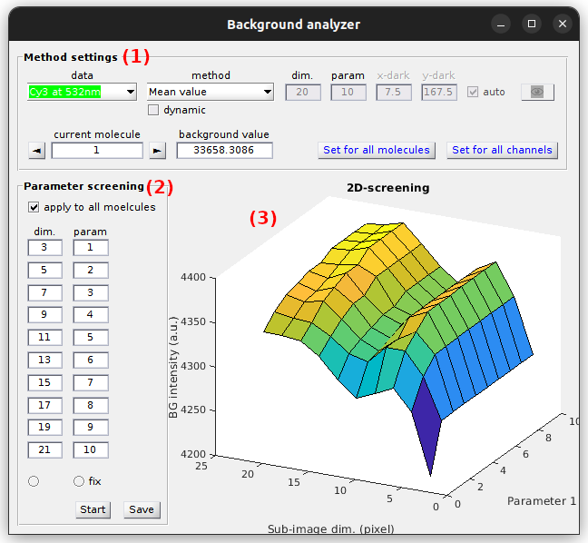
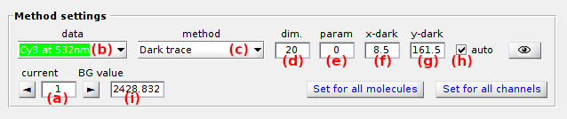
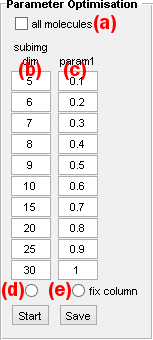
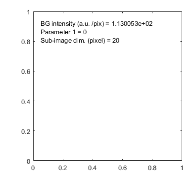
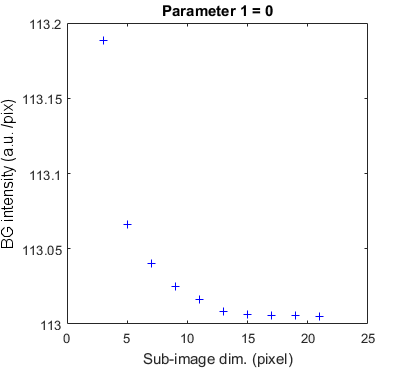
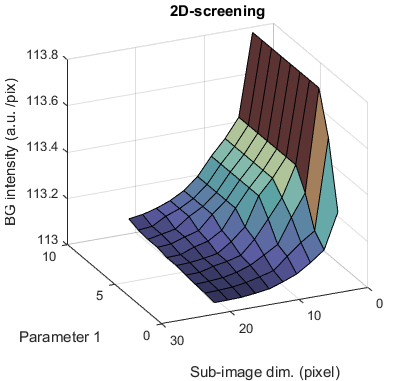

# Use Background analyzer
{: .no_toc }

The background analyzer allows to screen parameter settings for background estimation.

It is accessed by pressing 
 in the 
[Background correction](../components/panel-background-correction.html) panel of module Trace processing.

Background analyzer is used to evaluate the performances of background estimation methods on simulated data, *i.e.*, in the frame of algorithm testing.

Background analyzer window is divided into two panels **(1-2)** and one visualization area **(3)**.

## Window components
{: .no_toc .text-delta }

1. TOC
{:toc}

---

## Method settings

Use this panel to set the background estimation method.

Background estimation methods are configured for individual intensity-time traces.

Select the molecule by using 
 and 
, or by setting the molecule index in **(a)**, and the intensity time trace in list **(b)**.

MASH includes seven background estimation methods that can be selected in list **(b)**.
After selecting a method, set parameters **(d - i)** according to the detailed description given in the table below.

| filter |description | default parameters |
| ------ | -----------| ------------------ |
| `Mean value` | The background intensity is estimated as *I*high + **(d)** &#215; *HWHM*high, with *I*high and *HWHM*high the respective mean and half-width at half-maximum of the high intensity distribution, high intensities being higher than *I*mean + **(d)** &#215; *&#963;*I, with *I*mean and *&#963;*I the respective mean and standard deviation of the intensity distribution in the sub-image of dimensions **(e)**-by-**(e)** pixels. | **(d)** = 0, **(e)** = 20 |
| `Most frequent` | The background intensity is estimated as the most frequent value in the sub-image of dimensions **(e)**-by-**(e)** pixels and considering a binning interval of (*I*max-*I*min) / **(d)**. | **(d)** = 100, **(e)** = 20 |
| `Median value` | The background intensity is estimated in the sub image of dimension **(e)**-by-**(e)**, either as the median of median pixels in the row dimension if **(d)** = 1, or as an average between the medians of median pixels in the row dimension and in the column dimension if **(d)** = 2 | **(d)** = 2, **(e)** = 20 |
| `Histothresh` | The background intensity is estimated as the intensity corresponding to a probability **(d)** in the cumulative distribution of intensities in the sub-image of dimensions **(e)**-by-**(e)** pixels. | **(d)** = 0.5, **(e)** = 20 |
| `<N median values>` | The background intensity is estimated as the average of median pixels in each columns of the sub-image of dimensions **(e)**-by-**(e)** pixels | **(e)** = 20 |
| `Dark trace` | The background trace is calculated from a dark pixel located at position x=**(f)** and y=**(g)** that can be detected automatically in a **(e)**-by-**(e)** sub-image if **(h)** is activated. The trace is smoothed with an average window size of **(d)** frames prior being subtracted. The smoothed background intensity-time trace can be viewed by pressing . |  **(d)** = 10, **(e)** = 20, **(f)** = 0, **(g)** = 0, **(h)** activated  |
| `Manual` | The background intensity in estimated by the user and set in **(i)** | **(i)** = 0 |

After method configuration, the same settings can be applied to all intensity-time traces of the current molecule by pressing 
, and to all molecules by pressing 
.

The calculated background intensity is given in **(i)** in image counts or counts per second according to intensity units defined in menu `Units` of the 
[menu bar](../../Getiing_started.html#interface).

**Note:** *As the method `Dark trace` calculates a background trajectory and not an intensity, the mean value of the dark trace is taken for point estimate of the background intensity*

---

## Parameter screening

Use this panel to define the parameter ranges to be screened.

Parameter screening can be applied to the current molecule only or to all molecules by respectively deactivating or activating the option in **(a)**.

If allowed by the background estimation method used in 
[Method settings](#method-settings), one or both of the parameters `dim` and `param` can be varied up to ten different values. 

To screen parameter `dim` and/or `param`, deactivate the respective option in **(d)** and or **(e)**, and set the screening values in **(b)** and/or **(c)** respectively.

Start background estimation with parameter screening by pressing 
; after completion, the 
[Visualization area](#visualization-area) is automatically updated with screening results for the current molecule. 

Results of uni- or multidimensional background estimations can be exported to 
[.bga files](../../output-files/bga-background-analyzer.html) by pressing 
.

---

## Visualization area

Use this area to visualize screening results.

Any graphics in MASH-FRET can be exported to an image file by left-clicking on the axes and selecting `Export graph`.

### no screening
{: .no_toc }

When both parameters `dim` and `param` are fixed, the background estimate is written in the axes together with the parameter values.

### 1-parameter screening
{: .no_toc }

When one of the two parameters `dim` or `param` is screened, the variation of background estimates is plotted as a 2D scatter plot titled with the fixed parameter value.

### 2-parameters screening
{: .no_toc }

When both parameters `dim` or `param` are screened, the variation of background estimates is plotted as a 3D surface.

