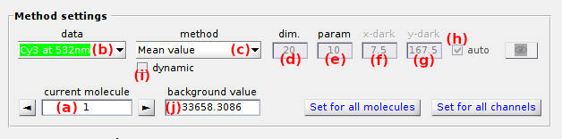

# Use Background analyzer
{: .no_toc }

The background analyzer allows to screen parameter settings for background estimation and is accessed by pressing 
 in the 
[Background correction](../panels/panel-background-correction.html) panel of module Trace processing.
It is used to evaluate the performances of background estimation methods on simulated data.

Background analyzer window is divided into two panels and one visualization area.

## Window components
{: .no_toc .text-delta }

1. TOC
{:toc}

---

## Method settings

Set the methods for background estimation.

Background estimation methods are configured for individual intensity-time traces.
Select the molecule by using 
 and 
, or by setting the molecule index in **(a)**, and the intensity time trace in list **(b)**.
After method configuration, the same settings can be applied to all intensity-time traces of the current molecule by pressing 
, and to all molecules by pressing 
.

MASH includes six background estimation methods that can be selected in list **(b)**.
To configure a method, set parameters **(d - i)** according to the detailed description given in the table below.

| filter                                            | description                                                                                                                                                                                                                                                                                                                                                                                                                                                                                                                   | default parameters                                                        |
| ------------------------------------------------- | ----------------------------------------------------------------------------------------------------------------------------------------------------------------------------------------------------------------------------------------------------------------------------------------------------------------------------------------------------------------------------------------------------------------------------------------------------------------------------------------------------------------------------- | ------------------------------------------------------------------------- |
| `Mean value`                                      | The background intensity is estimated as *I*high + **(c)** &#215; *HWHM*high, with *I*high and *HWHM*high the respective mean and half-width at half-maximum of the high intensity distribution, high intensities being higher than *I*mean + **(d)** &#215; *&#963;*I, with *I*mean and *&#963;*I the respective mean and standard deviation of the intensity distribution in the sub-image of dimensions **(d)**-by-**(d)** pixels. | **(c)** = 0, **(d)** = 20                                                 |
| `Most frequent`                                   | The background intensity is estimated as the most frequent value in the sub-image of dimensions **(d)**-by-**(d)** pixels and considering a binning interval of (*I*max-*I*min) / **(c)**.                                                                                                                                                                                                                                                                                                              | **(c)** = 100, **(d)** = 20                                               |
| `Median value`                                    | The background intensity is estimated in the sub image of dimension **(d)**-by-**(d)**, either as the median of median pixels in the row dimension if **(c)** = 1, or as an average between the medians of median pixels in the row dimension and in the column dimension if **(c)** = 2                                                                                                                                                                                                                                      | **(c)** = 2, **(d)** = 20                                                 |
| `Histothresh`                                     | The background intensity is estimated as the intensity corresponding to a probability **(c)** in the cumulative distribution of intensities in the sub-image of dimensions **(d)**-by-**(d)** pixels.                                                                                                                                                                                                                                                                                                                         | **(c)** = 0.5, **(d)** = 20                                               |
| `<N median values>`                               | The background intensity is estimated as the average of median pixels in each columns of the sub-image of dimensions **(d)**-by-**(d)** pixels                                                                                                                                                                                                                                                                                                                                                                                | **(d)** = 20                                                              |
| `Dark trace`                                      | The background trace is calculated from a dark pixel located at position x=**(f)** and y=**(g)** that can be detected automatically in a **(d)**-by-**(d)** sub-image if **(h)** is activated. The trace is smoothed with an average window size of **(c)** frames prior being subtracted                                                                                                                                                                                                                                     |  **(c)** = 10, **(d)** = 20, **(e)** = 0, **(f)** = 0, **(g)** activated  |
| `Manual`                                          | The background intensity in estimated by the user and set in [Background intensity](#background-intensity)                                                                                                                                                                                                                                                                                                                                                                                                                    |                                                                           |

**Note:** *As the method `Dark trace` calculates a background trajectory and not an intensity, the mean value of the dark trace is taken for point estimate of the background intensity*

---

## Parameter screening

Defines the parameter ranges to be screened.

Parameter screening can be applied only to the current molecule or to all molecules by respectively deactivating or activating the box in **(a)**.

If allowed by the background estimation method set in 
[Method settings](#method-settings), one or both of the parameters "dim" and "param" can be varied up to ten different values. 
To screen parameter "dim" and/or "param", deactivate the respective option in **(d)** and or **(e)**, and set the screening values in respective fields **(b)** and/or **(c)**.

Background estimation with parameter screening is started by pressing 
; after completion, the 
[Visualization area](#visualization-area) is automatically updated with screening results for the current molecule. 
Results of uni- or multidimensional background estimations can be exported to 
[.bga files](../../output-files/bga-background-analyzer.html) by pressing 
.

---

## Visualization area

Display screening results.

Any graphics in MASH can be exported to an image file by left-clicking on the axes and selecting `Export graph`.

### no screening
{: .no_toc }

When both parameters "dim" and "param" are fixed, the only one background estimate is written in the axes together with the used parameter values.

### 1-parameter screening
{: .no_toc }

When one of the two parameters "dim" or "param" is screened, variation of background estimates is plotted as a 2D scatter plot in the axes with the axes title being updated with the fixed parameter value.

### 2-parameters screening
{: .no_toc }

When both parameters "dim" or "param" are screened, variation of background estimates is plotted as a 3D surface plot in the axes.

