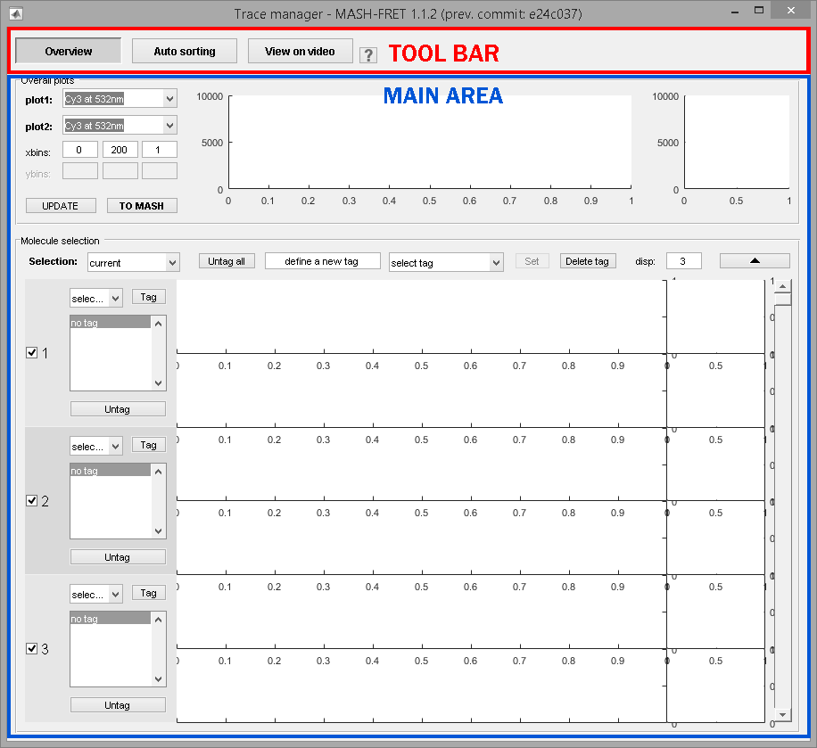
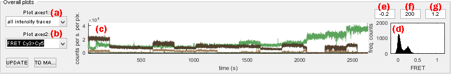

# Use Trace manager
{: .no_toc }

The trace manager allows to visualize all single molecule trajectories in the sample and is accessed by pressing 
 in the 
[Sample management](../panels/panel-sample-management.html#trace-manager) panel of module Trace processing.
It is used to sort single molecules into sub-groups by giving them a label and to exclude irrelevant traces from the set.

Individual single molecules can be labelled and selected/unselected in panel 
[Overview](#overview).
The effect on overall sample histograms and concatenated time traces can be visualized in panel 
[Overall plot](#overall-plot).

## Window components
{: .no_toc .text-delta }

1. TOC
{:toc}

---

## Overall plot

---

## Overview

