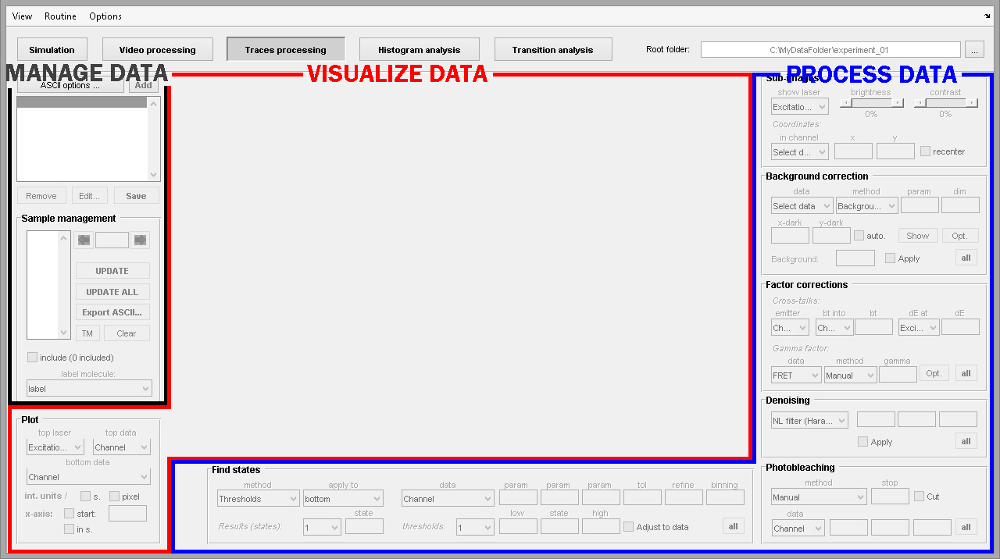

# Trace processing interface
{: .no_toc }

The module Trace processing is the third component of the software MASH-FRET and can be selected in the main 
[tool bar](../Getting_started.html#interface).

The interface can be divided into several subunits that respectively allow to:
* <u>manage</u> project and sample data
* <u>process</u> intensity data
* <u>visualize</u> processed and calculated data

Learn about individual components of the interface in the  
[Panels](panels.html) section.

