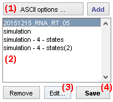
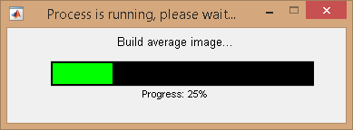

# Project management area
{: .no_toc }

## Panel components
{: .no_toc .text-delta }

1. TOC
{:toc}

---

## ASCII import options

ASCII files are imported according to the file structure defined by the import options. 
Import options can be modified by pressing 
.

To set the options, please refer to 
[Set project import options](../functionalities/set-project-import-options.html).

---

## Project list

Projects contain original single molecule data, calculated data and parameters necessary for calculations in all modules of MASH-FRET.

Use this area to manage your projects imported in module Trace processing.

Single molecule data can be imported in module Trace processing from:
* a [.mash file](../../output-files/mash-mash-project.html)
* a set of ASCII files.

Single molecule data are imported by pressing 
 and selecting the 
[.mash file](../../output-files/mash-mash-project.html "Add") or the set of ASCII files to import.
If a video is assigned to the imported data, laser-specific average images used for molecule visualization and background correction are calculated during the import process; see 
[Background correction](panel-subimage-background-correction.html#background-correction) for more information.

After import, the new project is added to the project list and the 
[Sample management](#sample-management) area is updated to the first molecule in the project.

Project settings such as relations between channels and lasers, FRET calculations, stoichiometry calculations, plot colors and project tags can be modified any time by pressing 
; see 
[Edit project options](#edit-project-options) for more details.

To close a project and remove it from the project list, select the project in the list and press 
.

---

## Edit project options

Project settings are opened by selecting the project in list **(a)** and pressing 
.

To modify project settings, please refer to 
[Set project options](../functionalities/set-project-options.html).

If the project was imported from a 
[.mash file](../../output-files/mash-mash-project.html) that was created in module Video processing, initial project options are taken from the pre-set
[Experiment settings](../../video-processing/panels/panel-experiment-settings.html#project-options).
If the project was imported from ASCII files, project options are set to default values.

---

## Save project

Projects can be exported to 
[.mash files](../../output-files/mash-mash-project.html) by selecting the project in list **(a)** and pressing 
.
To save modifications of one project, simply overwrite the existing 
[.mash file](../../output-files/mash-mash-project.html).

