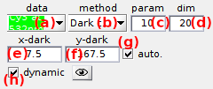

# Background correction
{: .no_toc }

## Panel components
{: .no_toc .text-delta }

1. TOC
{:toc}

---

## Background correction settings

Use this interface to define the settings used for background correction.

---

## Background analyzer

Opens the tool Background analyzer used to optimize background correction.

To use Background analyzer, refer to 
[Use Background analyzer](../functionalities/use-background-analyzer.html).

---

## Background intensity

---

## Apply background correction

---

## Apply settings to all molecules

