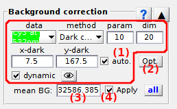

# Background correction
{: .no_toc }

Background correction is the fourth panel of module Trace processing.

Use this panel to estimate and subtract background intensities to intensity-time traces.

## Panel components
{: .no_toc .text-delta }

1. TOC
{:toc}

---

## Background correction settings

Use this interface to define the background correction method.

Background estimation methods are configured for individual intensity-time traces that can be selected in menu **(a)**.

MASH includes six background estimation methods that can be selected in menu **(b)**.
To configure a method, set parameters **(c - g)** according to the detailed description given in the table below.

| filter                                            | description                                                                                                                                                                                                                                                                                                                                                                                                                                                                                                                   | default parameters                                                        |
| ------------------------------------------------- | ----------------------------------------------------------------------------------------------------------------------------------------------------------------------------------------------------------------------------------------------------------------------------------------------------------------------------------------------------------------------------------------------------------------------------------------------------------------------------------------------------------------------------- | ------------------------------------------------------------------------- |
| `Mean value`                                      | The background intensity is estimated as *I*high + **(c)** &#215; *HWHM*high, with *I*high and *HWHM*high the respective mean and half-width at half-maximum of the high intensity distribution, high intensities being higher than *I*mean + **(d)** &#215; *&#963;*I, with *I*mean and *&#963;*I the respective mean and standard deviation of the intensity distribution in the sub-image of dimensions **(d)**-by-**(d)** pixels. | **(c)** = 0, **(d)** = 20                                                 |
| `Most frequent`                                   | The background intensity is estimated as the most frequent value in the sub-image of dimensions **(d)**-by-**(d)** pixels and considering a binning interval of (*I*max-*I*min) / **(c)**.                                                                                                                                                                                                                                                                                                              | **(c)** = 100, **(d)** = 20                                               |
| `Median value`                                    | The background intensity is estimated in the sub image of dimension **(d)**-by-**(d)**, either as the median of median pixels in the row dimension if **(c)** = 1, or as an average between the medians of median pixels in the row dimension and in the column dimension if **(c)** = 2                                                                                                                                                                                                                                      | **(c)** = 2, **(d)** = 20                                                 |
| `Histothresh`                                     | The background intensity is estimated as the intensity corresponding to a probability **(c)** in the cumulative distribution of intensities in the sub-image of dimensions **(d)**-by-**(d)** pixels.                                                                                                                                                                                                                                                                                                                         | **(c)** = 0.5, **(d)** = 20                                               |
| `<N median values>`                               | The background intensity is estimated as the average of median pixels in each columns of the sub-image of dimensions **(d)**-by-**(d)** pixels                                                                                                                                                                                                                                                                                                                                                                                | **(d)** = 20                                                              |
| `Dark trace`                                      | The background trace is calculated from a dark pixel located at position x=**(f)** and y=**(g)** that can be detected automatically in a **(d)**-by-**(d)** sub-image if **(h)** is activated. The trace is smoothed with the denoising method [Sliding average](panel-denoising.html#sliding-average) and an sliding window size of **(c)** frames prior being subtracted                                                                                                                                                    |  **(c)** = 10, **(d)** = 20, **(e)** = 0, **(f)** = 0, **(g)** activated  |
| `Manual`                                          | The background intensity in estimated by the user and set in [Background intensity](#background-intensity)                                                                                                                                                                                                                                                                                                                                                                                                                    |                                                                           |

For method `Dark trace`, the dark pixel coordinates are shown by a green cross mark on the corresponding 
[Sub-images](area-visualization.html#single-molecule-images).

The smoothed background intensity-time trace can be shown by pressing 
. 
In this case, an additional window appears with the dark trace plot in intensity units defined by 
[Intensity units](panel-plot.html#intensity-units).

After method configuration, the same settings can be applied to all molecules by pressing 
; see 
[Apply settings to all molecules](#apply-settings-to-all-molecules).

---

## Background analyzer

Press 
 to open Background analyzer.

Background analyzer is used to to screen parameter settings for background estimation.

To use Background analyzer, please refer to 
[Use Background analyzer](../functionalities/use-background-analyzer.html).

---

## Background intensity

Displays the background intensity estimated by the method  and for the intensity-time trace selected in 
[Background correction settings](#background-correction-settings).

For method `Manual`, the background intensity to subtract must be set here.

As the method `Dark tarce` calculates a background trajectory and not an intensity, the mean value of the dark trace is displayed here.

The background intensity is given in image counts per pixel and/or per second according to intensity units defined in 
[Intensity units](panel-plot.html#intensity-units).

---

## Apply background correction

Activate this option to subtract the background from the intensity-time trace selected in 
[Background correction settings](#background-correction-settings), or deactivate this option to visualize the original intensity-time trace.

For more information about how background correction is performed, see 
[Background correction](../workflow.html#background-correction) in Trace processing workflow.

---

## Apply settings to all molecules

Press 
 to apply trace-specific 
[Background correction settings](#background-correction-settings) to all molecules.

Corrections are applied to other molecules only when the corresponding data is processed, *e. g.* when pressing 
; see 
[Process all molecules data](panel-sample-management.html#process-all-molecules-data) for more information.

