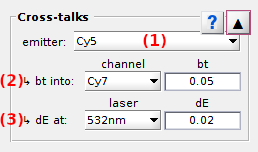
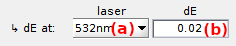

# Cross-talks correction
{: .no_toc }

Cross-talks correction is the fifth panel of module Trace processing.

Use this panel to configure global bleedthrough and direct excitation coefficients used in 
[Cross-talk correction](../workflow.html#cross-talk-correction).

## Panel components
{: .no_toc .text-delta }

1. TOC
{:toc}

---

## Emitter list

Use this list to select the emitter to configure or show the cross-talks for.

Corresponding bleedthrough and direct excitation coefficient are shown in 
[Bleedthrough coefficients](#bleedthrough-coefficients) and 
[Direct excitation correction](#direct-excitation-coefficients) respectively

Cross-talks are global correction coefficients, which means that only one set of coefficients is applied for the entire project.

---

## Bleedthrough coefficients

Use this interface to define the bleedthrough coefficients.

The fluorescence of each emitter used in the experiment has the propensity to "bleed" through unspecific detection channels. 
The ratio of fluorescence signal detected in the unspecific channel over the signal detected in the specific channel is called the bleedthrough coefficient.

To set the bleedthrough coefficient of a particular emitter in a particular unspecific channel, select the emitter in the
[Emitter list](#emitter-list), the destination channel in menu **(a)** and set the coefficient in **(b)**.

For more information about how to obtain the bleedthrough coefficient and how correction is performed, please refer to
[Cross-talk correction](../workflow.html#cross-talk-correction) in Trace processing workflow.

---

# Direct excitation coefficients

Use this interface to define the direct excitation coefficients.

Each emitter used in the experiment has the propensity to be excited by unspecific lasers.
The ratio of fluorescence signal detected upon unspecific illumination over the signal detected upon specific illumination is called the direct excitation coefficient.

To set the direct excitation coefficient of a particular emitter by a particular unspecific laser, select the emitter in the 
[Emitter list](#emitter-list), the unspecific laser in menu **(a)** and set the coefficient in **(b)**.

For more information about how to obtain the direct excitation coefficient and how correction is performed, please refer to
[Cross-talk correction](../workflow.html#cross-talk-correction) in Trace processing workflow.

