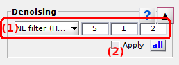

# Denoising
{: .no_toc }

## Panel components
{: .no_toc .text-delta }

1. TOC
{:toc}

---

## Denoising settings

Defines settings used to smooth trajectories.

---

## Apply denoising

---

## Apply settings to all molecules

