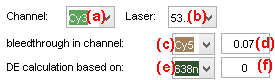
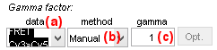
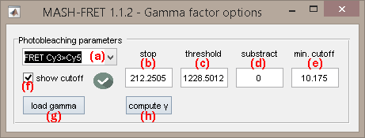

# Factor corrections
{: .no_toc }

## Panel components
{: .no_toc .text-delta }

1. TOC
{:toc}

---

## Cross-talks settings

Use this interface to define the bleedthrough and direct excitation coefficients.

The fluorescence of each emitter used in the experiment has the propensity to "bleed" in all unspecific detection channels. 
To set the bleedthrough coefficient of a particular emitter in a particular unspecific channel, select the emitter in list **(a)**, the destination channel in list **(b)** and set the coefficient in **(c)**.

Beside, each emitter used in the experiment has the propensity to be excited by all unspecific lasers.
To set the direct excitation coefficient of a particular emitter by a particular unspecific laser, select the emitter in list **(a)**, the unspecific laser in list **(d)** and set the coefficient in **(e)**.

For more information about how to obtain cross-talk coefficients and how cross-talk correction is performed, see 
[Cross-talk correction](../workflow.html#cross-talk-correction) in Trace processing workflow.

---

## Gamma factor settings

Use this interface to define the gamma factors.

Usually, the detection efficiency and quantum yields are different for the donor and the acceptor of a FRET pair. 
To put donor and acceptor intensity-time traces on the same scale and allow the conversion of apparent FRET to absolute distances, these differences must be corrected.
This is done by correcting apparent FRET values with the gamma factor.

Gamma factors are specific to each FRET pair listed in **(a)** and can be set in three different ways:
- calculated from acceptor photobleaching
[1](#references) after selecting `From acceptor photobleaching` in list **(b)**; see 
[Photobleaching-based calculation](#photobleaching-based-calculation) for more details
- set manually in **(c)** after selecting `Manual` in list **(b)**
- loaded from an external ASCII file for all molecules after selecting `Manual` in list **(b)** and pressing 
; see 
[.gam file](../../output-files/gam-gamma-factors.html) for more information about the file structure

For more information about how FRET values are corrected with gamma factors, see 
[Correct FRET values](../workflow.html#correct-fret-values) in Trace processing workflow.

### Photobleaching-based calculation
{: .no_toc }

Photobleaching-based gamma calculation requires intensity state trajectories; see 
[Find states](panel-find-states.html) for more information about how to obtain state trajectories for intensity-time traces.

The gamma factor 
[*&#947;**D*,*A*(*n*)](){: .math_var } for the donor-acceptor pair 
([*D*](){: .math_var },[*A*](){: .math_var }) on molecule 
[*n*](){: .math_var } can be calculated from intensity state trajectories 
[*state**A*,em*D*,ex](){: .math_var } and 
[*state**D*,em*D*,ex](){: .math_var }, before and after acceptor photobleaching such as:

{: .equation }

with 
[*t*0](){: .math_var } the detected photobleaching cutoff.

Acceptor photobleaching is detected in the acceptor intensity-time trace according to the Gamma factor options accessible by pressing 
.

Photobleaching detection settings are specific to each FRET pair that can be selected in list **(a)**.
Acceptor photobleaching is detected when the corresponding intensity-time trace drops below a certain intensity threshold defined in **(c)** providing a minimum cutoff value set in **(e)**.
Photobleaching cutoff is displayed in **(b)** in seconds or frame according to time-axis units defined in 
[Time axis](panel-plot.html#time-axis).
To ensure detection at the very beginning of acceptor photobleaching, the detected cutoff position can be shifted downwards by a certain number of frames set in **(d)**.
The resulting cutoff position can be shown in the top axes with a red cursor by activating the option in **(f)**.

To save options and compute the FRET-pair-specific gamma factors, press 
.

Gamma factors can also be loaded from an external file for all molecules by pressing 
; see 
[.gam file](../../output-files/gam-gamma-factors.html) for more information about the file structure.

### References
{: .no_toc }

1. J.J. McCann, U.B. Choi, L. Zheng, K. Weninger, M.E. Bowen, *Optimizing Methods to Recover Absolute FRET Efficiency from Immobilized Single Molecules*, *Biophys J.* **2010**, DOI: [10.1016/j.bpj.2010.04.063](https://dx.doi.org/10.1016%2Fj.bpj.2010.04.063).

---

## Apply settings to all molecules

Use this command to apply the emitter- and illumination-specific 
[Cross-talks settings](#cross-talks-settings), as well as the FRET pair-specific 
[Gamma factor settings](#gamma-factor-settings) to all molecules.

Corrections are applied to other molecules only when the corresponding data is processed, *i.e.*, when pressing 
; see 
[Process all molecules data](panel-sample-management.html#process-all-molecules-data) for more information.

**Warning:** *Applying settings to all molecules will overwrite gamma factors imported from file with the factors defined for the current molecule. 
To recover the gamma factors as written in the external file, the gamma factor file must be re-imported; see 
[Gamma factor settings](#gamma-factor-settings) for help.*

