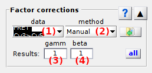

# Factor corrections
{: .no_toc }

## Panel components
{: .no_toc .text-delta }

1. TOC
{:toc}

---

## Cross-talks settings

Use this interface to set bleedthrough and direct excitation coefficients.

---

## Gamma factor settings

Use this interface to set gamma factors.

### Manual
{: .no_toc }

### Photobleaching-based
{: .no_toc }

---

## Apply settings to all molecules

