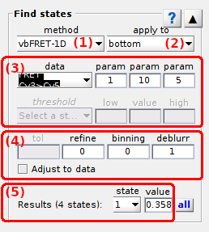
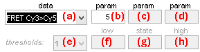
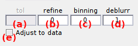

# Find states
{: .no_toc }

## Panel components
{: .no_toc .text-delta }

1. TOC
{:toc}

---

## Discretization method

---

## Data to discretize

---

## Method parameters

Defines the settings used to discretize the selected trajectory.

---

## Post-processing parameters

Defines parameters to apply to selected discretized trajectory.

---

## Apply settings to all molecules

---

## Found states

Shows states found in selected trajectory.

