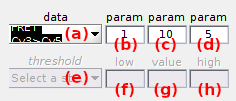
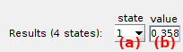

# Find states
{: .no_toc }

Find states is the eighth panel of module Trace processing.

Use this panel to obtain state trajectories.

## Panel components
{: .no_toc .text-delta }

1. TOC
{:toc}

---

## Discretization method

Use this menu to select the state finding algorithm.

State finding algorithm are applied to the traces selected in 
[Data to discretize](#data-to-discretize).

Five state finding algorithms are available and are described in the following sections:

* [`Thresholds`](#thresholds)
* [`vbFRET`](#vbfret) [1](#references)
* [`One state`](#one-state)
* [`CPA`](#cpa) [2](#references)
* [`STaSI`](#stasi) [3](#references)

After selecting an algorithm, set the corresponding parameters in 
[Method parameters](#method-parameters).

The MATLAB scripts for method `vbFRET` was  downloaded from 
[vbFRET sourceforge](http://vbfret.sourceforge.net/) page.

The MATLAB scripts for method `STaSI` was downloaded from 
[LandesLab](https://github.com/LandesLab/STaSI) Github repository.

### Thresholds
{: .no_toc }

The threshold method is fast and efficient for well-separated states but is not recommended for overlapping state populations.

The state algorithm makes no assumption about the nature of state transitions or noise in the time trace.
The number and values of states are predefined and for each state is assigned a lower and a higher threshold.

The algorithm analyzes data points one by one starting with the first point in the time trace.
The first data point is assigned to the state the closest in value and having a lower threshold below the data point.
Transition to another state is detected when the next data point goes beyond the lower of higher threshold of the current state.
The operation is repeated until every point in the time trace is assigned to a state.

More representative results are obtained when the threshold method is combined with post-processing methods 
[State refinement](#state-refinement) and 
[Adjust states to data](#adjust-states-to-data).

### vbFRET
{: .no_toc }

The vbFRET 
[1](#references) algorithm models time traces as Markov chains - with exponentially distributed dwell-times - with states hidden in Gaussian noise. 

The method iteratively infers state trajectories and determines the optimum state configuration by maximizing the evidence.

When state transitions occur within a time bin, the averaged value can be detected as a transient artefactual state, or "blurr state".
This can be corrected by using the post processing method 
[Remove blurr states](#remove-blurr-states).

Moreover, if the noise distribution in the time trace deviates from a Gaussian distribution, recurrent low-amplitude transition to artefactual states might occurs. 
This can be corrected by using the post processing method 
[State binning](#state-binning).

### One state
{: .no_toc }

The One state method averages the whole time trace into one state.

It assumes no FRET transitions and considers the noise to be symmetrically distributed in the time trace.
The One state method is meant for use on static time traces to save computation time.

### CPA
{: .no_toc }

The change-point analysis (CPA) 
[2](#references) method makes no assumption about the kinetic nature of state transitions, but considers the noise to be uniformly distributed around each state.
The method uses the uniform noise distribution to detect state transitions, called change points.

The maximum amplitude jump induced by noise is first estimated by shuffling data points in the time trace to build a certain number of bootstrap samples.
A change point is detected when the maximum jump amplitude found in the initial time trace is higher than in bootstrap samples considering a certain confidence level.

The exact change point can be assigned to the position where the maximum amplitude jump finishes, or at the point where the sum of root-mean squares before and after the change point is minimum.

More representative results are obtained when the CPA method is combined with post-processing methods 
[State refinement](#state-refinement) and 
[State binning](#state-binning).

### STaSI
{: .no_toc }

The STaSI 
[3](#references) method makes no assumption about the nature of state transitions, but considers the noise to be uniformly distributed in the time trace. 

The method uses the uniform noise distribution in each state to detect state transitions with the Student's t-test and groups the resulting segments into the state configuration that minimizes the minimum description length.

### References
{: .no_toc }

1. J.E. Bronson, J. Fei, J.M. Hofman, R.L. Gonzalez Jr., C.H. Wiggins, *Learning Rates and States from Biophysical Time Series: A Bayesian Approach to Model Selection and Single-Molecule FRET Data*, *Biophysical J.* **2009**, DOI: [10.1016/j.bpj.2009.09.031](https://doi.org/10.1016/j.bpj.2009.09.031)
1. W.A. Taylor, *Change-Point Analysis: A Powerful New Tool For Detecting Changes*, *Taylor enterprises* **2000**, web: [https://variation.com/change-point-analysis-a-powerful-new-tool-for-detecting-changes](https://variation.com/change-point-analysis-a-powerful-new-tool-for-detecting-changes/)
1. B. Shuang, D. Cooper, J.N. Taylor, L. Kisley, J. Chen, W. Wang, C.B. Li, T. Komatsuzaki, C.F. Landes, *Fast Step Transition and State Identification (STaSI) for Discrete Single-Molecule Data Analysis*, *J. Phys. Chem. Lett.* **2014**, DOI: [10.1021/jz501435p](https://dx.doi.org/10.1021%2Fjz501435p)

---

## Data to discretize

Use this menu to define which data are discretized.

Three options are available:

* `bottom` to infer state trajectories of FRET- and stoichiometry-time traces only
* `top` to infer state trajectories of intensity-time traces and deduce state trajectories of FRET- and stoichiometry-time traces from shared transitions
* `all` to infer state trajectories of all time traces

In the case of a `top` discretization, the post-processing method
[Find shared transitions](#find-shared-transitions) is applied to intensity state trajectories.

---

## Method parameters

Use this interface to define settings of the [Discretization method](#discretization-method).

Parameters are specific to each time-trace.
Select the time trace in menu **(a)** prior setting parameters in **(b-h)** as described in the table below.

| method                                         | parametrization                                                                                                                                                                                                     | default parameters                |
| ---------------------------------------------- | ------------------------------------------------------------------------------------------------------------------------------------------------------------------------------------------------------------------- | --------------------------------- |
| `Threshold`                                    | **(b)**: maximum number of states, **(e)**: state, **(f)**: state's lower threshold, **(g)**: state's value, **(h)**: state's higher threshold                                                                      | **(f)**=3, **(g)**=3, **(h)**=3   |
| `vbFRET` [1](#references)           | **(b)**: minimum number of states , **(c)**: maximum number of states, **(d)**: number of process iterations                                                                                                        | **(b)**=1, **(c)**=2, **(d)**=5   |
| `One state`                                    | no parameter to be set                                                                                                                                                                                              |                                   |
| `CPA` [2](#references)              | **(b)**: number of bootstrap samples, **(c)**: confidence level to identify a transition (%), **(d)**: change point localization by (1) maximum jump amplitude, or (2) minimum RMSE before and after change point   | **(b)**=50, **(c)**=90, **(d)**=2 |
| `STaSI` [3](#references)            | **(b)**: maximum number of states                                                                                                                                                                                   | **(b)**=2                         |

---

## Post-processing methods

Use this interface to define state trajectory processing methods.

Post-processing methods are algorithms that applies to state trajectories inferred by 
the [Discretization method](#discretization-method). 

Four post-processing methods are available and can be cumulated following the post-processing order:

* [Find shared transitions](#find-shared-transitions)
* [State refinement](#state-refinement)
* [State binning](#state-binning)
* [Remove blurr states](#remove-blurr-states)
* [Adjust states to data](#adjust-states-to-data)

### Find shared transitions
{: .no_toc }

Finding shared transitions is used after each `top` discretization, in order to obtain FRET- and stoichiometry- state trajectories from intensity state trajectories; see 
[Data to discretize](#data-to-discretize) for more details.

For FRET transitions, the algorithm looks for transitions detected in donor and acceptor state trajectories that occurs less than a certain number of frame away.

For stoichiometry transitions, intensity state trajectories are first summed over all channels and (1) over the emitter's specific excitation, and (2) over all laser illumination, prior looking for shared transitions.

The maximum frame gap between donor and acceptor transitions or emitter's sum and overall sum transitions, is set in **(a)** for FRET or stoichiometry data respectively.

### State refinement
{: .no_toc }

The refinement method corrects state assignment without modifying the values. 

Each segment is reassigned to the state having the closest value to the average data behind the segment.
The state refinement method is an iterative process with each iteration refining the new state trajectory.
The number of refinement iterations in set in **(b)**.

This method is useful to correct state trajectories from noise-induced transitions.

### State binning
{: .no_toc }

The state binning method bins segments in the state trajectories with a bin size set in **(c)**.

This method is useful in case artefactual small amplitude jumps are occurring in state trajectories.

### Remove blurr states
{: .no_toc }

The "Remove blurr states" method consists in ignoring the states that dwell one data point in the state trajectories.
The method is activated by setting **(d)** to 1, or to 0 otherwise.

When a one-data-point state is removed, the previous state is elongated of one frame forwards (or the next state is elongated one frame backwards if the first state of the sequence is ignored). 

This method is useful in case artefactual transient states, *e .g* to blur states, are occurring in state trajectories.

### Adjust states to data
{: .no_toc }

Adjusting states to data consists in recalculating states without modifying state transitions.

States are recalculated as the average data behind each segment of the state trajectory.

This method is useful to obtain more representative states when using predefined levels, *e. g.* with the Threshold method.

---

## Found states

Use this interface to look at states present in final state trajectories.

States found after discretizattion and post processing are displayed in **(b)** after selecting the state index in menu **(a)**.

---

## Apply settings to all molecules

Press 
 to apply the 
[Discretization method](#discretization-method),
[Method parameters](#method-parameters) and 
[Post-processing methods](#post-processing-methods) to all molecules.

Corrections are applied to other molecules only when the corresponding data is processed, *i.e.*, when pressing 
; see 
[Process all molecules data](panel-sample-management.html#process-all-molecules-data) for more information.

