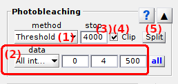

# Photobleaching
{: .no_toc }

Photobleaching is the seventh panel of module Trace processing.

Use this panel to detect dye photobleaching and suppress photobleached data.

## Panel components
{: .no_toc .text-delta }

1. TOC
{:toc}

---

## Photobleaching detection method

Use this list to select the appropriate method for photobleaching detection.

Emitter photobleaching can either be detected visually or automatically, by respectively selecting `Manual` or `Threshold` in the list.

For visual detection, the photobleaching cutoff must be set by hand in 
[Photobleaching cutoff](#photobleaching-cutoff).

Automatic detection is performed by thresholding using the settings defined in 
[Automatic detection settings](#automatic-detection-settings).

---

## Photobleaching cutoff

Shows the photobleaching position given in seconds or frame according to time-axis units defined in 
[Time axis](panel-plot.html#time-axis).

For method `Threshold`, with the photobleaching cutoff detected with 
[Automatic detection settings](#automatic-detection-settings) is shown here.

For method `Manual`, the photobleaching cutoff must be set here.

---

## Truncate trajectories

Activate this option to truncate time traces at the 
[Photobleaching cutoff](#photobleaching-cutoff), or deactivate this option to visualize a blue cursor at the cutoff position in 
[Intensity-time traces](visualization-area.html#intensity-time-traces-and-histograms) and 
[Ratio-time traces](visualization-area.html#ratio-time-traces-and-histograms).

For more information about how photobleaching correction is used in smFRET data analysis, see 
[Correct for photobleaching](../workflow.html#correct-for-photobleaching) in Trace processing workflow.

---

## Split trajectories

Intensity interruptions occurring in the middle of a trace (e. g., blinking) can be corrected by splitting intensity-time traces in two and truncating the end of the first trace (see 
[Truncate trajectories](#truncate-trajectories)) and the beginning of the second (see 
[Time axis](panel-plot.html#time-axis)).

Press 
 to split time traces in two at the 
[Photobleaching cutoff](#photobleaching-cutoff).
In this case, the right-side of the cutoff is saved as a separate molecule, which is added to the 
[Molecule list](panel-sample-management.html#molecule-list).
Both molecules will be given a "Split" tag in order to easily identify them in the list.

For more information about how blinking correction is used in smFRET data analysis, see 
[Correct for photobleaching](../workflow.html#correct-for-photobleaching) in Trace processing workflow.

---

## Automatic detection settings

Us this interface to define the settings for automatic detection of photobleaching.

Photobleaching is detected when the time trace selected in menu **(a)** drops below a certain threshold defined in **(b)** and providing a minimum cutoff value set in **(d)**.

Traces available for photobleaching detection are:

* `FRET [D]>[A]` the FRET-time trace of the pair donor emitter `[D]` -acceptor emitter `[A]`
* `S [D]>[A]` the Stoichiometry-time trace associated to the FRET pair donor emitter `[D]` -acceptor emitter `[A]`
* `[E] at [L]nm` the single intensity-time trace of emitter `[E]` upon illumination with laser wavelength `[L]` (in nm)
* `all intensities` the minimum values found in all intensity-time traces
* `summed intensities` the sum of all intensity-time traces

Traces `all intensities` and `summed intensities` are calculated from intensities in absence of any acceptors, *i. e.* summed over all channels at emitter-specific illumination.
This allows to exclude the zero-intensity signals collected at unspecific illuminations that are constantly "photobleached" and prevent the automatic photobleaching detection to function.
Only emitters having a specific illumination defined in 
[Video channels](../../video-processing/functionalities/set-project-options.html#video-channels) are considered in these calculations.

To ensure detection at the very beginning of acceptor photobleaching, the detected cutoff position can be shifted downwards by a certain number of frames set in **(c)**.

The resulting photobleaching cutoff displayed in 
[Photobleaching cutoff](#photobleaching-cutoff) only after processing the current molecule, *i.e.*, when pressing 
; see 
[Process current molecule data](panel-sample-management.html#process-current-molecule-data) for more information.

---

## Apply settings to all molecules

Press 
 to apply the 
[Photobleaching detection method](#photobleaching-detection-method) and 
[Automatic detection settings](#automatic-detection-settings) to all molecules.

Corrections are applied to other molecules only when the corresponding data is processed, *i.e.*, when pressing 
; see 
[Process all molecules data](panel-sample-management.html#process-all-molecules-data) for more information.
