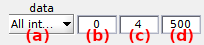

# Photobleaching
{: .no_toc }

## Panel components
{: .no_toc .text-delta }

1. TOC
{:toc}

---

## Photobleaching detection method

Use this list to select the appropriate method for photobleaching detection.

Emitter photobleaching can either be detected visually or automatically, by respectively selecting `Manual` or `Threshold` in the list.

For visual detection, the photobleaching cutoff must be set by hand in 
[Photobleaching cutoff](#photobleaching-cutoff).

Automatic detection is performed by thresholding using the settings in 
[Automatic detection settings](#automatic-detection-settings).

---

## Photobleaching cutoff

It displays the photobleaching cutoff detected with the method defined in 
[Automatic detection settings](#automatic-detection-settings).

For method `Manual`, the photobleaching cutoff must be set here.

Photobleaching cutoff is given in seconds or frame according to time-axis units defined in 
[Time axis](panel-plot.html#time-axis).

---

## Truncate trajectories

Activate this option to truncate the time traces at the cutoff position displayed in 
[Photobleaching cutoff](#photobleaching-cutoff), or deactivate this option to visualize a blue cursor at the cutoff position in top and bottom axes.

For more information about how photobleaching correction is used in smFRET data analysis, see 
[Correct for photobleaching](../workflow.html#correct-for-photobleaching) in Trace processing workflow.

---

## Automatic detection settings

Defines the settings used to detect photobleaching in intensity-time traces

Photobleaching is detected when the time trace selected in list **(a)** drops below a certain threshold defined in **(b)** and providing a minimum cutoff value set in **(d)**.
To ensure detection at the very beginning of acceptor photobleaching, the detected cutoff position can be shifted downwards by a certain number of frames set in **(c)**.

The resulting photobleaching cutoff displayed in 
[Photobleaching cutoff](#photobleaching-cutoff) only after processing the current molecule, *i.e.*, when pressing 
; see 
[Process current molecule data](panel-sample-management.html#process-current-molecule-data) for more information.

---

## Apply settings to all molecules

Use this command to apply the 
[Photobleaching detection method](#photobleaching-detection-method) and 
[Automatic detection settings](#automatic-detection-settings) to all molecules.

Corrections are applied to other molecules only when the corresponding data is processed, *i.e.*, when pressing 
; see 
[Process all molecules data](panel-sample-management.html#process-all-molecules-data) for more information.
