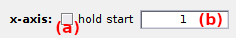

# Trace plot
{: .no_toc }

## Panel components
{: .no_toc .text-delta }

1. TOC
{:toc}

---

## Plot in top axes

Defines which traces to plot on top axes.

---

## Plot in bottom axes

---

## Intensity units

Defines intensity units used for plot and in processing parameters.

---

## X-axis settings

Defines limits and units of x-axis in top and bottom trace axes.

