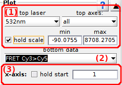

# Plot
{: .no_toc }

## Panel components
{: .no_toc .text-delta }

1. TOC
{:toc}

---

## Plot in top axes

Defines which intensity-time traces and histograms to plot on top axes; see 
[Visualization area](area-visualization.html) for more information.

* To plot intensity data upon illumination of a particular laser, select the corresponding wavelength in list **(a)**. 
To plot all laser illuminations, select the option `all`.

* To plot intensity data of a particular emitter, select the corresponding detection channel in list **(b)**.
To plot all emitters, select the option `all`.

---

## Plot in bottom axes

Defines which intensity ratio-time traces and histograms to plot on bottom axes; see 
[Visualization area](area-visualization.html) for more information.

* To plot the FRET data of a particular donor-acceptor pair, or the stoichiometry-time trace of a particular emitter, select the corresponding data in the list. 

* To plot only FRET data of all donor-acceptor pairs, select the option `all FRET` in the list.

* To plot only stoichiometry data of all emitters, select the option `all S` in the list.

* To plot intensity ratio data, select the option `all`.

---

## Intensity units

Defines intensity units used for plot and in processing parameters.

Intensities 
[*&#956;*ic](){: .math_var} are written in the MASH project as image counts (ic) per video frame recorded with an acquisition time 
[*t*exp](){: .math_var}, and are calculated as the sum of 
[*n*pix](){: .math_var} pixels; see
[Integration parameters](../../video-processing/panels/panel-intensity-integration.html#integration-parameters) for more information.

Intensity units can be converted to image counts per seconds and/or per pixels, for display only, and such as:

{: .equation}
 

with 
[*&#956;*ic,s](){: .math_var} intensities in counts per second  and 
[*&#956;*ic,pix](){: .math_var} per pixel, by respectively activating the option in **(a)** and/or **(b)**.

Units conversion concerns intensity-time traces and histogram plot, background intensities in panel 
[Background correction](panel-background-correction.html#background-intensity), as well as parameters of threshold methods in panels 
[Find states](panel-find-states.html#method-parameters) and 
[Photobleaching](panel-photobleaching.html#automatic-detection-settings).

---

## Time axis

Defines time axis of time-traces in top and bottom axes.

If needed, intensity-time traces can be truncated at the beginning of the time axis by setting the new starting point in **(b)**. 
To keep the starting point fixed for all single molecules, activate the option in **(a)**.

The time axis can displayed time units (in second) or video frame indexes by respectively activate or deactivate the option in **(c)**. 
Processing parameters affected by this options are the cutoff values in panel 
[Photobleaching cutoff](panel-photobleaching.html#photobleaching-cutoff) and in 
[Gamma factor settings](panel-factor-corrections#gamma-factor-settings).

