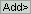

# Sample management
{: .no_toc }

## Panel components
{: .no_toc .text-delta }

1. TOC
{:toc}

---

## Molecule list

Use this list to navigate through the single molecules in your sample.

Molecules in your project can be browsed by selecting the corresponding index in the list or press 
 and 
 to go to the previous and next molecule respectively.

Selection in the list updates the 
[Visualization area](area-visualization.html) and adapt the processing parameters of panels 
[Sub-images](panel-subimage.html), 
[Background correction](panel-background-correction.html),
[Factor corrections](panel-factor-corrections.html), 
[Photobleaching](panel-photobleaching.html), 
[Denoising](panel-denoising.html) and 
[Find states](panel-find-states.html) to the selected molecule.

---

## Current molecule

Defines the molecule index of the currently selected molecule.

Editing the current molecule updates the 
[Visualization area](area-visualization.html) and adapt the processing parameters of panels 
[Sub-images](panel-subimage.html), 
[Background correction](panel-background-correction.html), 
[Factor corrections](panel-factor-corrections.html), 
[Photobleaching](panel-photobleaching.html), 
[Denoising](panel-denoising.html) and 
[Find states](panel-find-states.html) for the defined molecule index.

---

## Process current molecule data

Updates corrections and calculations for the current molecule.

Pressing 
 applies all intensity corrections as configured in panels 
[Background correction](panel-background-correction.html),
[Factor corrections](panel-factor-corrections.html), 
[Photobleaching](panel-photobleaching.html) and 
[Denoising](panel-denoising.html), and calculates states trajectories as configured in panel 
[Find states](panel-find-states.html) for the current molecule.

Usually, this functionality is used after changing any processing parameters in the sub-mentioned panels.

---

## Process all molecules data

Updates corrections and calculations for all molecules in the sample.

Pressing 
 applies all intensity corrections as configured in panels 
[Background correction](panel-background-correction.html),
[Factor corrections](panel-factor-corrections.html), 
[Photobleaching](panel-photobleaching.html) and 
[Denoising](panel-denoising.html), and calculates states trajectories as configured in panel 
[Find states](panel-find-states.html) for all molecules.

Usually, this functionality is used before exporting the MASH project.

---

## Export processed data

Pressing 
 opens the export options window.
Export options defines the files formats to export, including ASCII files and figures.

To set export options, refer to 
[Set export options](../functionalities/set-export-options.html).

---

## Trace manager

Pressing 
 opens the tool
Trace manager used to sort single molecules and set molecule statuses in the sample.

At opening, Trace manager import and process all single molecule data in the project up to gamma correction of FRET-time trace; see Trace processing 
[Woekflow](../workflow.html). 
Resulting time traces are then concatenated into on single trace and overall data histograms are built.

To use Trace manager, refer to 
[Use Trace manager](../functionalities/tm-overview.html).

---

## Molecule status

The molecule status is defined by sample inclusion/exclusion and subgroup assignment.

The current molecule can be deselected by deactivating the option in **(a)**. 
Deselected molecules can be deleted from the project by pressing 
.
Time traces of deselected molecules are plotted on a darker background in the 
[Visualization area](area-visualization.html#intensity-time-traces-and-histograms) for easier identification.

The current molecule can also be tagged to mark its assignment to specific molecule subgroups.
To assign a specific tag to the current molecule, press 
 and select a tag in list **(c)**.
Tags assigned to the current molecule are listed in **(b)** and can be dismissed by pressing 
.
To define customed tags, please refer to 
[Use Trace manager](../functionalities/tm-overview.html#molecule-selection).
