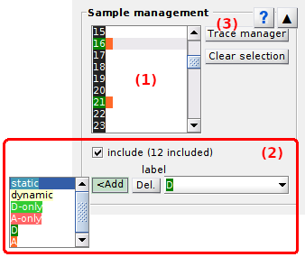
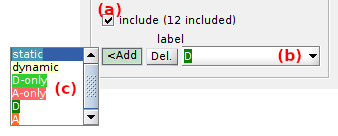

# Sample management
{: .no_toc }

## Panel components
{: .no_toc .text-delta }

1. TOC
{:toc}

---

## Molecule list

Use this list to navigate through the single molecules in your sample.

Molecules in your project are listed in **(a)**.
Selection in the list updates the 
[Visualization area](area-visualization.html) and adapt the processing parameters of panels 
[Sub-images and background correction](panel-subimage-background-correction), 
[Dwell-time processing](panel-dwelltime-processing), 
[Factor corrections](panel-factor-corrections), 
[Photobleaching](panel-photobleaching) and 
[Denoising](panel-denoising) to the selected molecule.
To navigate through the molecules in your sample, simply select the corresponding index in the list or press 
 and 
 to go to the previous and next molecule respectively.

---

## Current molecule

---

## Process current molecule data

---

## Process all molecules data

---

## Export processed data

Opens export options used to write processed single molecule data to ASCII files and figures.

To set export options, refer to 
[Set export options](../functionalities/set-export-options.html).

---

## Trace manager

Opens the tool Trace manager used to sort single molecules and set molecule statuses.

To use Trace manager, refer to 
[Use Trace manager](../functionalities/use-trace-manager.html).

---

## Molecule status

The molecule status is defined by the inclusion/exclusion from the sample and the label.

