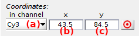

# Sub-images
{: .no_toc }

Sub-images is the third panel of module Trace processing.

Use this panel to adjust the appearance of 
[Single molecule images](area-visualization.html#single-molecule-images) and adjust molecule positions.

## Panel components
{: .no_toc .text-delta }

1. TOC
{:toc}

---

## Single molecule images

Use this interface to set the appearance of single molecule images.

Single molecule sub-images are clipped out of the average video frame with dimensions set in 
[Background correction settings](panel-background-correction.html#background-correction-settings).

Sub-images are shown for a particular laser illumination that can be selected in menu **(a)**.

The brightness and contrast of sub-images can be adjusted by using the respective sliding bars in **(b)** and **(c)**.
These functionalities show useful when the single molecule is too bright or the signal is too low.

---

## Single molecule coordinates

Use this interface to adjust single molecule positions.

X- and y- pixel coordinates of the current single molecule in video channel selected in list **(a)** can be modified manually in **(b)** and **(c)** respectively. 

Molecule positions can also be automatically recentered on the nearest brightest pixels by pressing 
.
In that case, the algorithm iteratively looks for the brightest pixel in a 3-by-3 pixel area around the initial positions in each detection channel, and stop after a maximum of three iterations.

After recentering, new intensity-time traces are calculated and initial shifted positions are lost.

The algorithm works with the average image calculated for laser illumination defined in 
[Single molecule images](#single-molecule-images).

