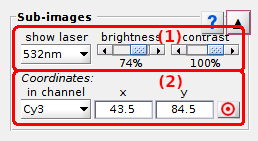

# Sub-images
{: .no_toc }

## Panel components
{: .no_toc .text-delta }

1. TOC
{:toc}

---

## Single molecule images

Use this interface to manage the appearances of single molecule images.

Single molecule sub-images are clipped out of the average image with dimensions set in 
[Background correction settings](panel-background-correction.html#background-correction-settings).

Sub-images are shown for a particular laser illumination used in the experiment by selecting the corresponding laser wavelength in list **(a)**.

If the single molecule signal is relatively low, the brightness and contrast can be adjusted by using the respective sliding bars in **(b)** and **(c)**.

---

## Single molecule coordinates

Use this interface to manage single molecule coordinates.

X- and y- pixel coordinates of the current single molecule in video channel selected in list **(a)** can be modified manually in **(b)** and **(c)** respectively. 

Molecule positions can also be automatically recentered on the nearest brightest pixels by activating the option in **(d)**.
In this case, the algorithm iteratively looks for the brightest pixel in a 3-by-3 pixel area around the initial positions in each detection channel. 
After recentering, new intensity-time traces are calculated and initial shifted positions are lost.
The algorithm works with the average image calculated for laser illumination defined in 
[Single molecule images](#single-molecule-images).

**Note:** *The recenter option in **(d)** is molecule-unspecific and remains activated when changing the current molecule. 
A good practice is to activate the option when needed and deactivate it right after the positions are recentered.*

