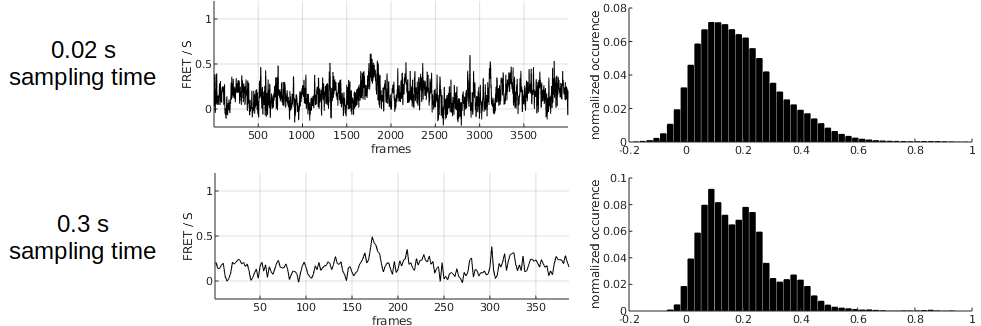
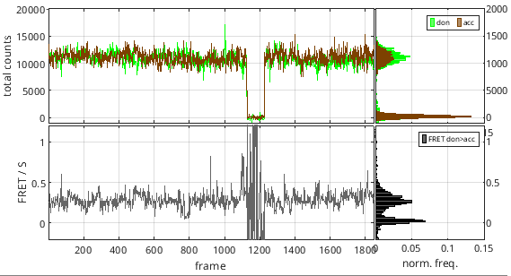
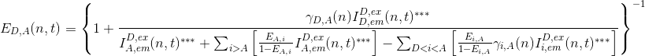
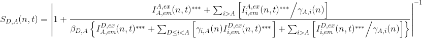

# Workflow
{: .no_toc }

In this section you will learn how to correct single molecule intensity-time traces from experimental bias and obtain state trajectories. 

Each time molecule data are processed by pressing 
, 
, or by navigating through molecules, data in modules 
[Histogram analysis](../histogram-analysis.html) and 
[Transition analysis](../transition-analysis.html) are automatically refreshed.

The procedure includes nine steps:

1. TOC
{:toc}

---

## Import trajectories

Initial trajectories come from 
[Simulation](../simulation.html)'s output in a simulation-based project, 
[Video processing](../video-processing.html)'s output in a video-based project, or from external ASCII files.

In the two first cases, you can skip this step and go directly to the next one.

In the latter case, a new trajectory-based project must be created. 
This implies to import the trajectory files, register the associated experiment settings and define the data structure in the files.
After the project creation is completed, it is recommended to save it to a 
[.mash file](../output-files/mash-mash-project.html) that should regularly be overwritten in order to keep traceability and access to the results.

Informing MASH about the particular experiment settings is crucial to adapt the software functionalities to your own experiment setup.
In theory, the software is compatible with:

* an unlimited number of video channels,
* an unlimited number of alternated lasers,
* FRET calculations for an unlimited number of FRET pairs.

To create a new trajectory-based project:

{: .procedure }
1. Open the experiment settings window by pressing 
    in the 
   [project management area](../Getting_started#project-management-area) and selecting `import trajectories`.  
     
1. Import a set of trajectory files and define your experiment setup by configuring tabs:  
     
   [Import](../tutorials/set-experiment-settings/import-trajectories.html#import)  
   [Channels](../tutorials/set-experiment-settings/import-trajectories.html#channels)  
   [Lasers](../tutorials/set-experiment-settings/import-trajectories.html#lasers)  
   [Calculations](../tutorials/set-experiment-settings/import-trajectories.html#calculations)  
   [Divers](../tutorials/set-experiment-settings/import-trajectories.html#divers)  
     
   If necessary, modify settings in 
   [Calculations](../tutorials/set-experiment-settings/import-trajectories.html#calculations) and 
   [Divers](../tutorials/set-experiment-settings/import-trajectories.html#divers) any time after project creation.  
     
1. Define how data are structured in the files by configuring tab 
   [File structure](../tutorials/set-experiment-settings/import-trajectories.html#file-structure).  
     
1. Finalize the creation of your project by pressing 
   ; the experiment settings window now closes and the interface switches to module Trace processing.  
     
1. Save modifications to a 
   [.mash file](../output-files/mash-mash-project.html) by pressing 
    in the 
   [project management area](../Getting_started#project-management-area).

---

## Adjust single molecule position

Single molecule image in each channel and upon illumination by a specific laser are shown in the 
[Visualization area](components/area-visualization.html#single-molecule-images).
Single molecule positions are marked with straight crosses and the dimensions of the pixel area used to integrate intensities are delimited by red solid lines.
To obtain the most accurate intensities, single molecule positions must be centered on the brightest pixel of the integration zone and the area of two neighbouring molecules must not overlap.

Because of imperfect coordinates transformation, it can happen that positions are shifted by one or two pixels away from the brightest pixel.
In that case, the positions must be recentered on the brightest pixel.

MASH offers the possibility to automatically recenter single molecule positions; see 
[Remarks](#remarks) for more details.

To recenter single molecule positions:

{: .procedure }
1. Select the molecule index in the 
   [Molecule list](components/panel-sample-management.html#molecule-list).  
     
1. If necessary, adjust the brightness and contrast in 
   [Single molecule images](components/panel-subimage.html#single-molecule-images) to render the molecule profile the most apparent.  
     
1. Press 
    in 
   [Single molecule images](components/panel-subimage.html#single-molecule-images) to adjust molecule positions in all detection channels; intensity-time traces will automatically be recalculated after re-centering.  

***Note:** If no video or molecule coordinates are available, single molecule images can not be shown and molecule positions can not be adjusted.*

---

## Correct intensities

Recorded intensities include the contribution of signals that must be subtracted to calculate reliable FRET and stoichiometry values. 
These unwanted signals are the background intensity and the cross-talks.

### Background correction
{: .no_toc }

The background intensity is channel- and laser-specific.
It consists mainly of the dark count of the detector and background light, like chamber auto-fluorescence for instance.
The background signal is usually distributed over the single molecule image and is therefore more accurately estimated in the local environments of single molecules. 
MASH offers a set of local background estimators that can be used for such purpose.

The intensity 
[*I**em**ex*(*n*,*t*)](){: .math_var } of molecule 
[*n*](){: .math_var } detected in emission channel 
[*em*](){: .math_var } upon illumination with laser 
[*ex*](){: .math_var } at time 
[*t*](){: .math_var } is background-corrected such as:

{: .equation }

with 
[*I**em**ex*(*n*,*t*)\*](){: .math_var } the background-corrected intensity and 
[*bg**em**ex*(*n*,*t*)](){: .math_var } the estimated background intensity.

To correct intensities from background:

{: .procedure }
1. If not already done, select the molecule index in the 
   [Molecule list](components/panel-sample-management.html#molecule-list).  
     
1. For each intensity-time trace, set parameters:  
     
   [Background correction settings](components/panel-background-correction.html#background-correction-settings)  
   [Apply background correction](components/panel-background-correction.html#apply-background-correction)  
     
1. Update data correction and display by pressing 
    in the 
   [Control area](components/area-control.html)  
     
1. If desired, apply the same parameter settings to all molecules by pressing 
    in panel 
   [Background correction](components/panel-background-correction.html)
   
   
---
   
### Trajectory re-sampling
{: .no_toc }

When the signal-to-noise ratio of the intensity trajectories is too low, the overlapping between FRET states becomes to large to be resolved and the determination of states and state transition kinetics becomes nearly impossible. 
One way to remedy to such issue is to re-sample the intensity trajectories using a sampling time larger than the original one. 

Larger sampling times immediately produce higher SNRs but worsen the time resolution. 
It is therefore to the user to determine the best compromise between SNR and the resolution of state transition kinetics to improve the separation between the states.

To re-sample trajectories:

{: .procedure }
1. Set the 
   [Trajectory sampling time](components/panel-resampling.html#trajectory-sampling-time)  
     
1. Update intensity calculation and display by pressing 
    in the 
   [Control area](components/area-control.html)

**Note:** *The trajectory sampling time is used to re-sample all trajectories in the molecule set.*

---
   
### Cross-talk correction
{: .no_toc }

Cross-talks are due to instrumental imperfections and include two phenomena:
* the detection of an emitter fluorescence into unspecific video channels, called the <u>bleedthrough</u>
* the detection of an emitter fluorescence into specific video channel after unspecific laser illumination, called the <u>direct excitation</u>

The bleedthrough and direct excitation coefficient can be determined from control experiments involving single-labelled species.
The bleedthrough coefficient 
[*bt**em*,*em*0](){: .math_var } of an emitter 
[*em*](){: .math_var } into detection channel of an emitter 
[*em*0](){: .math_var } is calculated with intensities measured from species carrying only emitter 
[*em*](){: .math_var } and after background correction, such as:

{: .equation }

The direct excitation coefficient 
[*dE**em*0*ex*&#8800;*ex*0](){: .math_var } of an emitter 
[*em*0](){: .math_var } upon unspecific illumination 
[*ex*](){: .math_var } is calculated with intensities measured from species carrying only emitter 
[*em*0](){: .math_var } and after background correction, such as:

{: .equation }

with 
[*ex*0](){: .math_var } the specific illumination of emitter 
[*em*0](){: .math_var }.

The background-corrected intensity 
[*I**em*0*ex*(*n*,*t*)\*](){: .math_var } of molecule 
[*n*](){: .math_var } detected in emission channel 
[*em*0](){: .math_var } upon illumination with laser 
[*ex*](){: .math_var } at time 
[*t*](){: .math_var } is corrected from cross-talks such as:

{: .equation }
 

with 
[*I**em*0*ex*(*n*,*t*)\*\*](){: .math_var } and 
[*I**em*0*ex*(*n*,*t*)\*\*\*](){: .math_var }, the intensities corrected from bleedthrough-only and from both cross-talks respectively.

To correct intensities from cross-talks:

{: .procedure }
1. For each emitter in the 
   [Emitter list](components/panel-crosstalk-corrections.html#emitter-list), set parameters: 
     
   [Bleedthrough coefficients](components/panel-crosstalk-corrections.html#bleedthrough-coefficients)  
   [Direct excitation coefficients](components/panel-crosstalk-corrections.html#direct-excitation-coefficients)  
     
1. Update data correction and display by pressing 
    in the 
   [Control area](components/area-control.html)

**Note:** *The set of cross-talk coefficients is used to correct all trajectories in the molecule set.*

---

## Sort trajectories into subgroups

Single molecules trajectories can be manually or automatically sorted into subgroups to perform category-specific analysis.
For instance, molecules with correct dye-labelling and showing dynamics can be saved into a separate project to determine the state configuration and transition rates involved in molecule dynamics.

It can also be convenient to sort molecules with incomplete dye labelling in order to make statistics on the labelling efficiency in the sample.

Beside, it is important to identify and exclude incoherent intensity-time traces from the analysis set.

MASH offers a tool called Trace manager that can be used to perform such task. 
Otherwise, molecules can be sorted manually in the Trace processing interface; see 
[Remarks](#remarks) for more details.

To sort molecules and save a particular subgroup:

{: .procedure }
1. Open Trace manager by pressing 
   .  
     
1. Sort single molecule data into subgroups by referring to  
   [Use Trace manager](functionalities/tm-overview.html); it is recommended to save the sorting by pressing 
    and overwriting the project file.  
     
1. Clear out unselected molecules form the 
   [Molecule list](components/panel-sample-management.html#molecule-list) and from the project by pressing 
   .  
     
1. Save selected molecules to a new 
   [.mash file](../output-files/mash-mash-project.html) by pressing 
   .

---

## Correct for photobleaching and blinking

It can happen that emitters get photochemically destroyed after absorbing a certain amount of photons. 
This phenomenon is called photobleaching and results in the permanent loss of signal in the dye-specific emission channel, which in turn translates into a drop of the corresponding intensity-time trace to zero.

On the other hand, reversible changes in the structure or environment of the emitters can induce temporary interruption of dye emission, which results in short-lived drops of intensity-time traces to zero. 

These zero-intensity portions of the time trace may bias the following histogram and transition analysis by creating irrelevantly fluctuating FRET data. 
To prevent such bias, it is necessary to detect intensity interruptions in time traces and ignore them in the following analysis.

The most efficient way to do so is to inspect the so-called total emission intensity trace of each emitter, meaning the intensity trajectory that would be collected if no other fluorophore were around. In this way, all intensity fluctuations due to conformational changes are cancelled and ideally only remains a noisy signal dwelling at a single-dye emission level interrupted by blinking events and terminated by a photobleaching event.
These trajectories are obtained by summing up background- and crosstalks-corrected intensities accross all emission channels when the emitter-specific excitation laser is used:

$$
I_{k,\mathrm{tot}}\!\left(t \right) = \sum_{i}I_{i,\mathrm{em}}^{k,\mathrm{ex}}\!\left(t \right)
$$

where $$I_{k,\mathrm{tot}}$$ is the total emission intensity trajectory of emitter $$k$$, and $$I_{i,\mathrm{em}}^{k,\mathrm{ex}}$$ is the intensity collected in emission channel $$i$$ upon illumination with laser exciting specifically emitter $$k$$.

The portions of the total emission trajectory that are in a off state can be automatically detected via discretization and relative thresholding.
Off-state data is ignored from the rest of the analysis (state-finding, histogram analysis, transition analysis).

Rigorous characterization of dye photophysics in the molecule sample is possible by looking at detailed statistics on photobleaching and blinking time distribution.
The mean survival time $$\tau_{\mathrm{bleach},k}$$ for emitter $$k$$ can be obtained by fitting a single exponential decay to the distribution of times until photobleaching $$\Delta t_{\mathrm{bleach}}$$:

$$
\Delta t_{\mathrm{bleach},k} \sim \mathrm{Exp}\!\left( \frac{1}{\tau_{\mathrm{bleach},k}} \right)
$$

In the same manner, blinking kinetics can be obtained by fitting single exponential decays to distributions of "on" and "off" times:

$$
\Delta t_{\mathrm{on},k} \sim \mathrm{Exp}\!\left( \frac{1}{\tau_{\mathrm{on},k}} \right)
$$

$$
\Delta t_{\mathrm{off},k} \sim \mathrm{Exp}\!\left( \frac{1}{\tau_{\mathrm{off},k}} \right)
$$

and converting mean "off" and "on" times $$\tau_{\mathrm{on},k}$$ and $$\tau_{\mathrm{off},k}$$ into rate constants, such as:

$$
k_{\mathrm{on},k} = \frac{1}{\tau_{\mathrm{off},k}}
$$

$$
k_{\mathrm{off},k} = \frac{1}{\tau_{\mathrm{on},k}}
$$

where $$k_{\mathrm{on},k}$$ and $$k_{\mathrm{off},k}$$ are the rate constants governing transitions to the "on" and "off" states of emitter $$k$$, respectively.

To detect blinking and photobleaching:

{: .procedure }
1. If not already done, select the molecule index in the 
   [Molecule list](components/panel-sample-management.html#molecule-list)  
     
1. Set parameters  
     
   [Photobleaching/blinking detection method](components/panel-photobleaching.html#photobleachingblinking-detection-method) to `Threshold`  
   [Threshold detection settings](components/panel-photobleaching.html#threshold-detection-settings)  
     
1. Update data correction and display by pressing 
    in the 
   [Control area](components/area-control.html)  
     
1. If desired, apply the same parameter settings to all molecules by pressing 
    in panel  
   [Photobleaching](components/panel-photobleaching.html) 

To obtain statistics on photobleaching and blinking:

{: .procedure }
1. Set parameters  
     
   [Photobleaching/blinking detection method](components/panel-photobleaching.html#photobleachingblinking-detection-method) to `Threshold`  
   [Threshold detection settings](components/panel-photobleaching.html#threshold-detection-settings)  
     
1. Apply the same parameter settings to all molecules by pressing 
    in panel  
   [Photobleaching](components/panel-photobleaching.html)  
     
1. Update correction for all molecues by pressing 
    in the 
   [Control area](components/area-control.html)  
     
1. Open statistics window by pressing 
    in panel 
   [Photobleaching](components/panel-photobleaching.html) 

---

## Smooth trajectories

Intensity-time traces are naturally noisy due to the stochastic nature of photon emission but also of camera detection, signal amplification and signal conversion.
The noise magnitude in a background- and cross-talk-corrected intensity-time trace 
[*I*emex(*n*,*t*)\*\*\*](){: .math_var } is characterized by the signal-to-noise ratio 
[*SNR*emex(*n*)](){: .math_var } calculated as:

{: .equation }
 

with 
[*&#956;*emex(*n*)\*\*\*](){: .math_var } and 
[*&#963;*emex(*n*)\*\*\*](){: .math_var }, the respective mean and standard deviation of the intensities over the observation time.

The lower the intensity, the lower the 
[*SNR*](){: .math_var } and the noisier the intensity-time traces.

A low 
[*SNR*](){: .math_var } creates a large broadening in intensity histograms and even larger in intensity ratio histograms, *e. g.* in FRET histograms.
Large broadening in FRET histograms implies greater overlaps between FRET populations which make the identification of the state configuration more difficult.

One way to minimize the population overlap in histograms is to artificially reduce the noise magnitude, or to "smooth" intensity-time traces.

To smooth trajectories:

{: .procedure }
1. If not already done, select the molecule index in the 
   [Molecule list](components/panel-sample-management.html#molecule-list).  
     
1. Set parameters  
     
   [Denoising settings](components/panel-denoising.html#denoising-settings)  
   [Apply denoising](components/panel-denoising.html#apply-denoising)  
     
1. Update correction and display by pressing 
    in the 
   [Control area](components/area-control.html)  
     
1. If desired, apply the same parameter settings to all molecules by pressing 
    in panel 
   [Denoising](components/panel-denoising.html)

**Note:** *Smoothing is not recommended when determining state trajectories as it induces a modification in data distribution, while most state finding algorithms rely on a naturally distributed noise to identify states and detect state transitions.*

---

## Correct ratio values

To recover the labelling efficiencies and absolute distances between the donor and the acceptor of a FRET pair, it is necessary, but not sufficient, to put donor and acceptor intensities on the same scale.
For this, the differences in detection efficiencies, quantum yields, extinction coefficients and excitation intensities between donor 
[*D*](){: .math_var } and acceptor 
[*A*](){: .math_var } must be corrected.

The differences in detection efficiencies and quantum yields are accounted for in the FRET pair-specific
[*&#947;**D*,*A*](){: .math_var } factor such as:

{: .equation }

with 
[*&#934;*A](){: .math_var } and 
[*&#934;*D](){: .math_var } the acceptor and donor quantum yield respectively, and 
[*&#951;*A](){: .math_var } and 
[*&#951;*D](){: .math_var } the photon detection efficiency in the respective emission channels.

The differences in extinction coefficients and excitation intensities are accounted for in the FRET pair-specific
[*&#946;**D*,*A*](){: .math_var } factor such as:

{: .equation }

with 
[*I**A*,ex](){: .math_var } and 
[*I**D*,ex](){: .math_var } the intensities of acceptor- and donor-specific excitations respectively, and 
[*&#963;*A,exA](){: .math_var } and 
[*&#963;*D,exD](){: .math_var } the respective absorption cross-sections at specific excitation.

Apparent FRET 
[*E*\**D*,*A*(*n*,*t*)](){: .math_var } of a donor-acceptor pair 
[*D*](){: .math_var }-[*A*](){: .math_var } is calculated according to 
[FRET calculations](../tutorials/set-experiment-settings/import-trajectories.html#fret-calculations) and is 
[*&#947;*](){: .math_var }-corrected into 
[*E**D*,*A*(*n*,*t*)](){: .math_var } such as:

{: .equation }
A}\left [\frac{E_{A,i}}{1-E_{A,i}}I_{A,em}^{D,ex}(n,t)^{***} \right ] -\sum_{D<i<A}\left[ \frac{E_{i,A}}{1-E_{i,A}}\gamma_{i,A}(n)I_{i,em}^{D,ex}(n,t)^{***}\right ]}  \right \}^{-1}">

Apparent stoichiometry 
[*S*\**D*,*A*(*n*,*t*)](){: .math_var } of a donor-acceptor pair 
[*D*](){: .math_var }-[*A*](){: .math_var } is calculated according to 
[Stoichiometry calculations](../tutorials/set-experiment-settings/import-trajectories.html#stoichiometry-calculations) and is 
[*&#947;*](){: .math_var }- and 
[*&#946;*](){: .math_var }-corrected into 
[*S**D*,*A*(*n*,*t*)](){: .math_var } such as:

{: .equation }
A}\left [ I_{i,em}^{A,ex}(n,t)^{***} \Big/ \gamma_{A,i}(n) \right] }{\beta_{D,A} \left \{ I_{A,em}^{D,ex}(n,t)^{***} + \sum_{D\leq i<A}\left [\gamma_{i,A}(n) I_{i,em}^{D,ex}(n,t)^{***} \right ] + \sum_{i>A}\left [I_{i,em}^{D,ex}(n,t)^{***} \Big/ \gamma_{A,i}(n) \right ] \right \} }  \right |^{-1}">

To correct apparent FRET- and stoichiometry-time traces with 
[*&#947;*](){: .math_var } and 
[*&#946;*](){: .math_var } factors:

{: .procedure }
1. If not already done, select the molecule index in the 
   [Molecule list](components/panel-sample-management.html#molecule-list).  
     
1. For each donor-acceptor FRET pair in the 
   [FRET pair list](components/panel-factor-corrections.html#fret-pair-list), set parameters: 
     
   [Factor estimation method](components/panel-factor-corrections.html#factor-estimation-method)  
   [Gamma factor](components/panel-factor-corrections.html#gamma-factor)  
   [Beta factor](components/panel-factor-corrections.html#beta-factor)  
     
1. Update data correction and display by pressing 
    in the 
   [Control area](components/area-control.html)  
     
1. If desired, apply the same parameter settings to all molecules by pressing 
      

--- 

## Determine state trajectories

The main goal of module Trace processing is to obtain a reliable set of single molecule intensity- and FRET-time traces in order to infer reliable state trajectories.

State trajectories are idealized time traces, *i.e.*, without noise. 
In other words, state trajectories are a succession of discrete values, and are here called "discretized" time traces.

Discretized time traces allow to characterize the conformational states visited by the molecule during the observation time and to quantify the duration the molecule dwells in each state. 

Further analysis with the module 
[Transition analysis](../transition-analysis.html) yields the most probable state configuration of single molecules and the rate coefficients that govern transitions between those states.

To infer state trajectories:

{: .procedure }
1. If not already done, select the molecule index in the 
   [Molecule list](components/panel-sample-management.html#molecule-list).  
     
1. Set parameters  
     
   [Discretization method](components/panel-find-states.html#discretization-method)  
   [Data to discretize](components/panel-find-states.html#data-to-discretize)  
   [Method parameters](components/panel-find-states.html#method-parameters)  
   [Post-processing parameters](components/panel-find-states.html#post-processing-parameters)  
     
1. Update calculations and display by pressing 
    in the 
   [Control area](components/area-control.html)  
     
1. If desired, apply the same parameter settings to all molecules by pressing 
      

---

## Process all data and merge projects

Instead of processing one molecule at a time, a general configuration can be applied to all molecules by using the 
 buttons and all data can be processed at once using the 
 button. 

Finally, to constitute a more representative sample of molecules to be analyzed in  
[Transition analysis](../transition-analysis.html) and 
[Histogram analysis](../histogram-analysis.html), molecules from different projects with identical experiment settings can be merged into one big data set.

To process all molecules at once:

{: .procedure }
1. Update all data corrections and calculations by pressing 
    in the 
   [Control area](components/area-control.html)  

To merge projects:

{: .procedure }
1. Select the multiple projects to merge in the 
   [Project list](Getting_started.html#project-management-area)  
     
1. Right-click in the 
   [Project list](Getting_started.html#project-management-area) and choose the option `Merge projects`  
   
1. Press 
    to start the merging process  
     
   ***Note:** The merging process induces a loss of single molecule videos that were used in individual projects. 
   Therefore, it is recommended to perform all adjustments of molecule positions and background corrections prior merging; see 
   [Remarks](@remarks) for more information.*

---
 
## Remarks
{: .no_toc }

If the initial single molecule position is shifted more than 3 pixels from the brightest pixel, spots coordinates are considered as ill-defined and the automatic recentering option will not function.
In this case, it is recommended to review the spot detection and/or transformation procedure to obtain a more decent set of single molecule coordinates; see 
[Spotfinder](../video-processing/components/panel-molecule-coordinates.html#spotfinder) and 
[Coordinates transformation](../video-processing/components/panel-molecule-coordinates.html#coordinates-transformation) for more information. 
However, if desired, molecule x- and y-coordinates must be modified manually; see 
[Single molecule coordinates](components/panel-subimage.html#single-molecule-coordinates) for more information.

Molecules can be given several tags and/or deselected from the set while browsing the 
[Molecule list](components/panel-sample-management.html#molecule-list) in the Trace processing interface; see 
[Molecule status](components/panel-sample-management.html#molecule-status) for more information.

To merge multiple projects into one, experiment setups must be the same, *i.e.*, the frame rate, the number of channels and laser excitations, the laser wavelengths, the emitter labels, the FRET pairs and the stoichiometry calculations must be identical. 

