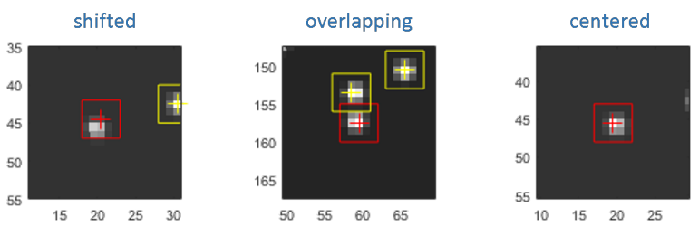
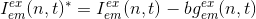
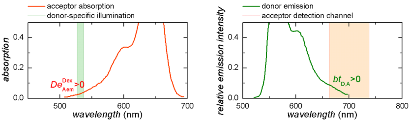
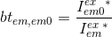
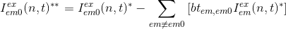
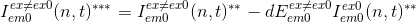
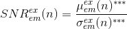
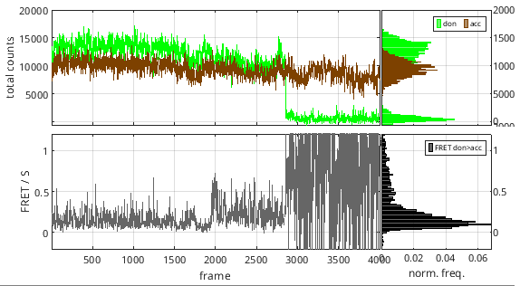
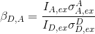
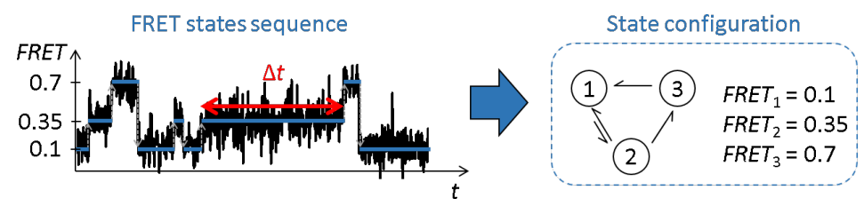

# Trace processing workflow
{: .no_toc }

In this section you will learn how to correct single molecule intensity-time traces from experimental bias and obtain state trajectories. 
Exported data, in particular to the 
[mash project](../output-files/mash-mash-project.html) file, can further be used in modules Histogram analysis and Transition analysis for 
[data analysis](../tutorials/analyze-data.html).

The procedure includes nine steps:

1. TOC
{:toc}

---

## Import single molecule data

Single molecule data can be imported from a 
[.mash file](../output-files/mash-mash-project.html), previously created in Video processing, or from a set of ASCII files.
If data are imported from ASCII files, MASH must be informed about the particular file structure and about your experiment settings in order to adapt the software functionalities. 
In that case, data must be exported to a new 
[.mash file](../output-files/mash-mash-project.html) after import in order to use the processed data for further analysis.

After successful import, channel-specific images and trajectories of the first single molecule in the project are displayed in the 
[Visualization area](panels/area-visualization.html).

To import single molecule data from a 
[.mash file](../output-files/mash-mash-project.html):

{: .procedure }
1. Add the project to the list by pressing 
    and selecting the corresponding 
   [.mash file](../output-files/mash-mash-project.html)  
     
1. If not already done in Video processing, set the project options by selecting the project in the project list and pressing 
   ; see 
   [Set project options](../video-processing/functionalities/set-project-options.html) for more information. 
   Save modifications to your project file by pressing 
    and overwriting the corresponding 
   [.mash file](../output-files/mash-mash-project.html).

To import single molecule data from a ASCII files:

{: .procedure }
1. Set the import settings by pressing 
   ; see 
   [Set import options](functionalities/set-import-options.html) for help  
     
1. Import data by pressing 
    and selecting the corresponding ASCII files; this will add a new project to the project list  
     
1. Set the project options by selecting the new project in the project list and pressing 
   ; see 
   [Set project options](../video-processing/functionalities/set-project-options.html) for more information.
     
1. Save the new project to a 
   [.mash file](../output-files/mash-mash-project.html) by pressing 
   .

---

## Adjust single molecule position

Single molecule image in each channel and upon a specific laser shine are shown in the 
[Visualization area](panels/area-visualization.html#single-molecule-images).
Single molecule positions are marked with red crosses and the dimensions of the pixel area used to integrate the intensities are indicated by red squares.
To be obtain the most accurate intensities, the single molecule positions must be centered on the brightest pixel in the integration zone and the integration area of two neighbouring molecules must not overlap.

Because of imperfect coordinates transformation, it can happen that positions are shifted one or two pixels away from the brightest pixel.
In that case, the positions must be recentered on the brightest pixel.

MASH offers the possibility to automatically recenter single molecule positions; see 
[Remarks](#remarks) for more details.

To automatically recenter single molecule positions:

{: .procedure }
1. Select the molecule index in the 
   [Molecule list](panels/panel-sample-management.html#molecule-list).  
     
1. If necessary, adjust the brightness and contrast in 
   [Single molecule images](panels/panel-subimage.html#single-molecule-images) to render the molecule profile the most apparent.  
     
1. Select the channel where position needs to be re-centered and activate the "recenter" option in 
   [Single molecule coordinates](panels/panel-subimage.html#single-molecule-coordinates); intensity-time traces will automatically be recalculated after re-centering.  
     
1. To prevent re-centering on potentially empty single molecule images, deactivate the "recenter" option in 
   [Single molecule coordinates](panels/panel-subimage.html#single-molecule-coordinates) after re-centering.

---

## Correct intensities

Raw intensities obtained after integration include the contribution of signals that must be subtracted to calculate reliable FRET and stoichiometry values.
These unwanted signals are the background intensity and the cross-talks.

### Background correction
{: .no_toc }

The background intensity is channel- and illumination-specific.
It consists mainly of the dark count of the detector and background light, like auto-fluorescence of the medium in the chamber for instance.
The background signal is usually spatially distributed over the single molecule image and is therefore more accurately estimated in single molecule local environments.
MASH offers a set of local background estimators that can be used for such purpose.

The intensity 
[*I**em**ex*(*n*,*t*)](){: .math_var } of molecule 
[*n*](){: .math_var } detected in emission channel 
[*em*](){: .math_var } upon illumination with laser 
[*ex*](){: .math_var } at time 
[*t*](){: .math_var } is background-corrected such as:

{: .equation }

<!--
{: .equation }
*I*\**em*,*ex*(*n*,*t*) = *I**em*,*ex*(*n*,*t*) - *bg**em*,*ex*(*n*,*t*)
-->

with 
[*I**em**ex*(*n*,*t*)\*](){: .math_var } the background-corrected intensity and 
[*bg**em**ex*(*n*,*t*)](){: .math_var } the estimated background intensity.

To correct intensities from background:

{: .procedure }
1. If not already done, select the molecule index in the 
   [Molecule list](panels/panel-sample-management.html#molecule-list).  
     
1. For each intensity-time trace, set parameters:  
     
   [Background correction settings](panels/panel-background-correction.html#background-correction-settings)  
   [Apply background correction](panels/panel-background-correction.html#apply-background-correction)  
     
1. Update background correction and display of intensity-time traces for the current molecule by pressing 
   .
     
1. If desired, apply the same parameter settings to all molecules by pressing 
      

---
   
### Cross-talk correction
{: .no_toc }

Cross-talks are due to instrumental imperfections and include two phenomena:
* the detection of an emitter fluorescence into unspecific video channels, called the <u>bleedthrough</u>
* the detection of an emitter fluorescence into specific video channel after unspecific laser illumination, called the <u>direct excitation</u>

The bleedthrough and direct excitation coefficient can be determined from control experiments involving single-labelled species.
The bleedthrough coefficient 
[*bt**em*,*em*0](){: .math_var } of an emitter 
[*em*](){: .math_var } into detection channel of an emitter 
[*em*0](){: .math_var } is calculated from intensities measured from species single-labelled with emitter 
[*em*](){: .math_var } and after background correction, such as:

{: .equation }

<!--
{: .equation }
*bt**em*,*em*0 = *I*\**em*0*ex* / *I*\**em**ex*
-->

The direct excitation coefficient 
[*dE**em*0*ex*&#8800;*ex*0](){: .math_var } for direct excitation of an emitter 
[*em*0](){: .math_var } specifically excited by illumination 
[*ex*0](){: .math_var } upon unspecific illumination 
[*ex*](){: .math_var } is calculated from intensities measured from species single-labelled with emitter 
[*em*0](){: .math_var } and after background correction, such as:

{: .equation }

<!--
{: .equation }
*dE**em*0*ex*&#8800;*ex*0 = *I*\**em*0*ex* / *I*\**em*0*ex*0
-->

The background-corrected intensity 
[*I**em*0*ex*(*n*,*t*)\*](){: .math_var } of molecule 
[*n*](){: .math_var } detected in emission channel 
[*em*0](){: .math_var } upon illumination with laser 
[*ex*](){: .math_var } at time 
[*t*](){: .math_var } is corrected from cross-talks such as:

{: .equation }
 

<!--
{: .equation }
*I*\*\**em*0*ex*(*n*,*t*) = *I*\**em*0*ex*(*n*,*t*) - &#931;*em*&#8800;*em*0[ *bt**em*,*em*0(*n*) &#215; *I*\**em**ex*(*n*,*t*) )]  
*I*\*\*\**em*0*ex*&#8800;*ex*0(*n*,*t*) = *I*\*\**em*0*ex*&#8800;*ex*0(*n*,*t*) - *dE**em*0*ex*&#8800;*ex*0(*n*) &#215; *I*\*\**em*0*ex*0(*n*,*t*)
-->

with 
[*I**em*0*ex*(*n*,*t*)\*\*](){: .math_var } and 
[*I**em*0*ex*(*n*,*t*)\*\*\*](){: .math_var }, the intensities corrected from bleedthrough-only and both cross-talks respectively.

To correct intensities from cross-talks:

{: .procedure }
1. If not already done, select the molecule index in the 
   [Molecule list](panels/panel-sample-management.html#molecule-list).  
     
1. For each emitter, set parameters 
   [Cross-talks settings](panels/panel-factor-corrections.html#cross-talks-settings)  
     
1. Update cross-talk correction and display of intensity-time traces for the current molecule by pressing 
   .
     
1. If desired, apply the same parameter settings to all molecules by pressing 
    (usually the case) 

---

## Correct FRET values

To recover absolute distances between a FRET pair and from apparent FRET values, it is necessary, but not sufficient, to have the donor and acceptor intensities on the same scale.
For this, differences in detection efficiencies and quantum yields between the donor 
[*D*](){: .math_var } and the acceptor 
[*A*](){: .math_var } of a FRET pair must be corrected.
These differences are accounted for in the FRET pair-specific
[*&#947;**D*,*A*](){: .math_var } factor such as:

{: .equation }

<!--
{: .equation }
*&#947;**D*,*A* = *&#951;**A**&#934;**A* / *&#951;**D**&#934;**D*
-->

with 
[*&#951;*A](){: .math_var } and 
[*&#951;*D](){: .math_var }, the respective photon detection efficiency in acceptor and donor emission channels, and 
[*&#934;*A](){: .math_var } and 
[*&#934;*D](){: .math_var }, the respective acceptor and donor quantum yields.

Apparent FRET values 
[*E*\**D*,*A*(*n*,*t*)](){: .math_var } from a donor emitter 
[*D*](){: .math_var } to an acceptor emitter 
[*A*](){: .math_var } are calculated according to 
[FRET calculations](../video-processing/functionalities/set-project-options.html#fret-calculations) and are 
[*&#947;*](){: .math_var }-corrected to 
[*E**D*,*A*(*n*,*t*)](){: .math_var } values such as:

{: .equation }

<!--
{: .equation }
*E**D*,*A*(*n*,*t*) = *E*\**D*,*A*(*n*,*t*) / [ *&#947;**D*,*A*(*n*) - *E*\**D*,*A*(*n*,*t*)  &#215;  ( *&#947;**D*,*A*(*n*) - 1 ) ]
-->

To correct apparent FRET-time traces with 
[*&#947;*](){: .math_var } factors:

{: .procedure }
1. If not already done, select the molecule index in the 
   [Molecule list](panels/panel-sample-management.html#molecule-list).  
     
1. For each donor-acceptor FRET pair, set parameters 
   [Gamma factor settings](panels/panel-factor-corrections.html#gamma-factor-settings)  
     
1. Update correction and display of FRET-time traces for the current molecule by pressing 
   .
     
1. If desired, apply the same parameter settings to all molecules by pressing 
      

--- 

## Sort trajectories into subgroups

Single molecules trajectories can be manually sorted into subgroups to perform category-specific analysis.
For instance, molecules with correct dye-labelling and showing dynamics can be saved into a separate project to determine the state configuration and corresponding state transition rates involved in molecule dynamics.
It can also be convenient to sort molecules with incomplete dye labelling in order to make statistics on the labelling efficiency in the sample.
Beside, it is important to identify and exclude incoherent intensity-time traces from the analysis set.

MASH offers a tool called Trace manager that can be used to perform such task.
Molecules can also be sorted manually in the Trace processing interface; see 
[Remarks](#remarks) for more details.

To sort molecules and save a particular subgroup:

{: .procedure }
1. Open Trace manager by pressing 
   .  
     
1. Sort single molecule data into subgroups by referring to  
   [Use Trace manager](functionalities/use-trace-manager.html); 
   in order to save the original data set with manual sorting, it is recommended to save modifications by pressing 
    and overwriting the project file.  
     
1. Clear unselected molecules form the 
   [Molecule list](panels/panel-sample-management.html#molecule-list) and from the data set by pressing 
   .
     
1. Save the conserved subgroup of molecules to a new 
   [.mash file](../output-files/mash-mash-project.html) by pressing 
   .

---

## Correct for photobleaching

It can happen that emitters get photochemically destroyed after absorbing a certain amount of photons.
This phenomenon is called photobleaching and results in the permanent loss of signal in the dye-specific emission channel that translates into a drop of the corresponding intensity-time trace to zero.

These zero-intensity portions of the intensity-time traces may bias the following histogram and transition analysis by creating irrelevantly fluctuating FRET data.
To prevent such bias, it is necessary to detect photobleaching and delete photobleached data by truncating intensity-time traces.

To detect and truncate photobleached data:

{: .procedure }
1. If not already done, select the molecule index in the 
   [Molecule list](panels/panel-sample-management.html#molecule-list).  
     
1. Set parameters  
     
   [Photobleaching detection method](panels/panel-photobleaching.html#photobleaching-detection-method)  
   [Method parameters](panels/panel-photobleaching.html#method-parameters)  
   [Truncate trajectories](panels/panel-photobleaching.html#truncate-trajectories)  
     
1. Update photobleaching correction and display of the intensity-time traces for the current molecule by pressing 
   .
     
1. If desired, apply the same parameter settings to all molecules by pressing 
      

---

## Smooth trajectories

Intensity-time traces are naturally noisy due to the stochastic nature of photon emission but also of camera detection, signal amplification and signal conversion.
The magnitude of the noise in a background- and cross-talk-corrected intensity-time trace 
[*I*emex(*n*,*t*)\*\*\*](){: .math_var } is characterized by the signal-to-noise ratio 
[*SNR*emex(*n*)](){: .math_var } calculated as:

{: .equation }

<!--
{: .equation }
*SNR* = *&#956;*( *I*\*\*\*(*t*) ) / *&#963;*( *I*\*\*\*(*t*) )
-->

with 
[*&#956;*emex(*n*)\*\*\*](){: .math_var } and 
[*&#963;*emex(*n*)\*\*\*](){: .math_var }, the respective mean and standard deviation of the intensities over the observation time.

Therefore, the lower the intensity is in the time trace, the lower the 
[*SNR*](){: .math_var } and the noisier the intensity-time traces.
A low 
[*SNR*](){: .math_var } results in a large broadening in intensity histograms and to even larger broadening in intensity ratio histograms, *e. g.* in FRET histograms.
Large broadening in FRET histograms implies greater overlaps between FRET populations which make the identification of the state configuration more difficult.
One way to minimize the population overlap in histograms is to artificially reduce the noise magnitude in, or to "smooth", intensity-time traces.

To smooth trajectories:

{: .procedure }
1. If not already done, select the molecule index in the 
   [Molecule list](panels/panel-sample-management.html#molecule-list).  
     
1. Set parameters  
     
   [Denoising settings](panels/panel-denoising.html#denoising-settings)  
   [Apply denoising](panels/panel-denoising.html#apply-denoising)  
     
1. Update and display smoothed trajectories for the current molecule by pressing 
   .
     
1. If desired, apply the same parameter settings to all molecules by pressing 
      

**Note:** *Smoothing is not recommended when determining state trajectories as it induces a modification in data distribution, while most state finding algorithms rely on a naturally distributed noise to identify states and detect state transitions.*

---

## Determine state trajectories

The main goal of module Trace processing is to obtain a reliable set of single molecule intensity- and FRET-time traces in order to infer reliable state trajectories.
These state trajectories are idealized time traces, i.e., without noise, or in other words, are discretized time traces.
State trajectories allow to characterize the conformational states visited by the molecule during the observation time and to quantify the times the molecule dwells in each state. 

After further analysis of state trajectories with the module Transition analysis, one can obtain the most probable state configuration of single molecules and the rate coefficient that govern transitions between those states.

To infer state trajectories:

{: .procedure }
1. If not already done, select the molecule index in the 
   [Molecule list](panels/panel-sample-management.html#molecule-list).  
     
1. Set parameters  
     
   [Discretization method](panels/panel-find-states.html#discretization-method)  
   [Data to discretize](panels/panel-find-states.html#data-to-discretize)  
   [Method parameters](panels/panel-find-states.html#method-parameters)  
   [Post-processing parameters](panels/panel-find-states.html#post-processing-parameters)  
     
1. Update and display state trajectories for the current molecule by pressing 
   .
     
1. If desired, apply the same parameter settings to all molecules by pressing 
      

---

## Save project and export data

Project modifications must be saved in order to use corrected data for further histogram and transition analysis.
Additionally, processed data and processing parameters can be exported to various file formats, including ASCII files compatible with other software.

To save project modifications:

{: .procedure }
1. Update all data corrections and calculations by pressing 
     
     
1. Save modifications to the 
   [.mash file](../output-files/mash-mash-project.html) by pressing 
    and overwriting existing file.  

To export data to files:

{: .procedure }
1. Open export options by pressing 
    and set the options as desired; please refer to 
   [Set export options](functionalities/set-export-options.html) for help.
     
1. Press 
    to start writing processed molecule data in files. 

---
 
## Remarks
{: .no_toc }

If the initial single molecule position is shifted more than 3 pixels from the brightest pixel, spots coordinates are considered as ill-defined and the automatic recentering option will not function.
In this case, it is recommended to review the spot detection and/or transformation procedure to obtain a more decent set of single molecule coordinates; see 
[Spotfinder](../video-processing/panels/panel-molecule-coordinates.html#spotfinder) and 
[Coordinates transformation](../video-processing/panels/panel-molecule-coordinates.html#coordinates-transformation) for more information. 
However, if desired, molecule x- and y-coordinates must be modified manually; see 
[Single molecule coordinates](panels/panel-subimage.html#single-molecule-coordinates) for more information.

Molecule can be excluded from or included in the data set and can be given a label while browsing the 
[Molecule list](panels/panel-sample-management.html#molecule-list) in the Trace processing interface; see 
[Molecule status](panels/panel-sample-management.html#molecule-status) for more information.

