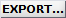

# Control area
{: .no_toc }

The control area contains the export button of module Transition analysis. 

Use this area to export data.

## Area components
{: .no_toc .text-delta }

1. TOC
{:toc}

---

## Export data

Press
 to open the export options.

Export options defines the file formats to export, including ASCII files and figures.

To set export options, refer to 
[Set export options](../functionalities/set-export-options.html).

