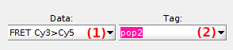

# Data selection area
{: .no_toc }

The data selection area includes two lists that define the data analyzed in module Transition analysis. 

Use this area to define the data to be analyzed.

## Area components
{: .no_toc .text-delta }

1. TOC
{:toc}

---

## Data list

Use this list to select the data to be analyzed in Transition analysis.

Supported data are:
* `I[i]-[L]`: intensity state trajectories for detection channel indexed `[i]` upon illumination with laser wavelength `[L]` nm
* `FRET[D]to[A]`: FRET state trajectories for donor emitter detected in channel indexed `[D]` and acceptor emitter detected in channel indexed `[A]`
* `S[D]to[A]`: stoichiometry state trajectories for donor emitter detected in channel indexed `[D]` and acceptor emitter detected in channel indexed `[A]`

---

## Tag list

Use this list to select the molecule subgroup to be analyzed in Transition analysis.

Molecule subgroups consist of molecules that carry the same tag.
Tags that are created and assigned to molecules in module 
[Trace processing](../../trace-processing.html) only:

* Molecule tags are created in 
[Molecule selection](../../trace-processing/functionalities/tm-overview.html#molecule-selection)
* Tags can be assigned to individual molecules in 
[Molecule selection](../../trace-processing/functionalities/tm-overview.html#molecule-selection) or in 
[Molecule status](../../trace-processing/components/panel-sample-management.html#molecule-status). 
They can also be assigned to groups of molecules defined by specific data ranges with 
[Automatic sorting](../../trace-processing/functionalities/tm-automatic-sorting.html#tm-menu).

