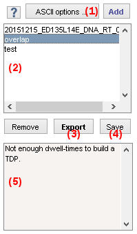

# Project management area
{: .no_toc }

The project management area is the main import/export interface of module Transition analysis.

Use this area to import state trajectories and save analysis results.

## Area components
{: .no_toc .text-delta }

1. TOC
{:toc}

---

## ASCII import options

Press
 to open the import options.

Import options define the file structure of ASCII files to import state trajectories from.

To set the options, please refer to 
[Set project import options](../../trace-processing/functionalities/set-import-options.html).

---

## Project list

Use this list to manage the projects imported in module Transition analysis.

Projects contain original single molecule data, calculated data and parameters necessary for calculations in all modules of MASH-FRET.

Single molecule state trajectories can be imported from:

* a [.mash file](../../output-files/mash-mash-project.html)
* a set of ASCII files with import options defined in 
[ASCII import options](#ascii-import-options).

To import single molecule data, press
 and select the 
[.mash file](../../output-files/mash-mash-project.html) or the set of ASCII files to import.

After import, the new project is added to the project list and the transition density plot is built according to 
[Transition density plot](panel-transition-density-plot.html) for the first data in the project.

Press 
 to close a project and remove it from the project list.

---

## Export analysis results

Press
 to open the export options.

Export options define the files formats to export analysis results, including ASCII files and images.

To set export options, please refer to 
[Set export options](../functionalities/set-export-options.html).

---

## Save project

Press 
 to export the current project to a
[.mash file](../../output-files/mash-mash-project.html).

To save modifications of one project, simply overwrite the existing 
[.mash file](../../output-files/mash-mash-project.html).

---

## Control panel 

Lists the action logs. 

Actions are automatically saved to a 
[daily log file](../../output-files/log-daily-logs.html).
