# Visualization area
{: .no_toc }

The visualization area is the main display of module Transition analysis. 
It consists in six tabs, each showing different analysis-related data.

Use this area to visualize overall data histograms, fit results and kinetic model estimation. 
Any graphics in MASH-FRET can be exported to an image file by right-clicking on the axes and selecting `Export graph`.

## Area components
{: .no_toc .text-delta }

1. TOC
{:toc}

---

## TDP

Use this tab to visualize the TDP and clustering results or to modify cluster color code.

<a class="plain" href="../../assets/images/gui/TA-area-visu-tdp.png">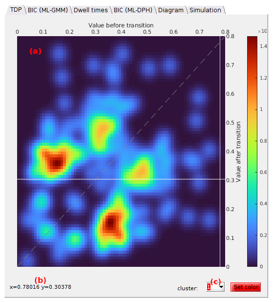</a>

The axes in **(a)** display the TDP according to the stage the transition analysis is at. 
Transition densities are color-coded according to the user-defined 
[Color map](panel-transition-density-plot.html#color-map) shown by the scale located on the right hand side of the axes.

When hoovering the axes with the mouse, a crosshair indicates the position on the x- and y-axis and mouse coordinates are shown in **(b)**.

Cluster colors can be modified by selecting the cluster index in list **(c)** prior opening the color picker by pressing 
.

### Clusters
{: .no_toc }

After completing TDP clustering, clustered transition are indicated by cross markers that are colored according to the defined cluster colors and the contour of each cluster is plotted as a white solid line.

<a class="plain" href="../../assets/images/gui/TA-area-visu-tdp-clusters.png">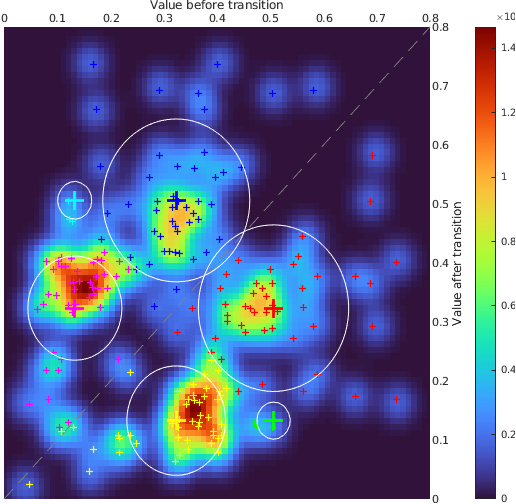</a>

---

## BIC (ML-GMM)

Use this tab to visualize the BIC calculated for each model complexity tested in GM clustering.

<a class="plain" href="../../assets/images/gui/TA-area-visu-bicgmm.png">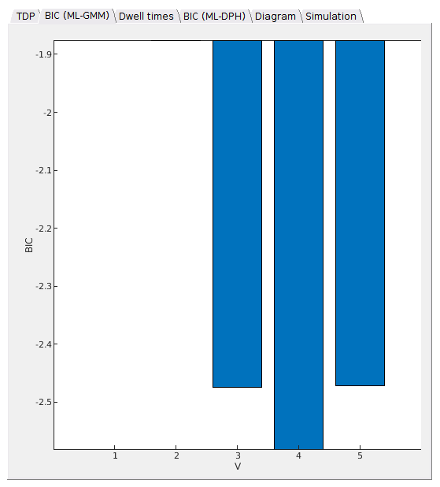</a>

This bar plot shows the BIC values obtained for Gaussian mixture clustering in panel 
[State configuration](state-configuration.html) in function of the model complexity *V*. 
The most sufficient model complexity *V*opt yields the minimum BIC.

---

## Dwell times

Use this tab to visualize the cumulative dwell time histogram and fitting results.

The histogram plot depends on the 
[Fit settings](panel-dwell-time-histograms.html#fit-settings) and the stage the transition analysis is at.

### Default
{: .no_toc }

Just after TDP clustering, the cumulative and complementary dwell time histogram corresponding to the dwell time set selected in the
[State list](panel-dwell-time-histograms.html#state-list) is plotted with blue solid markers.

<a class="plain" href="../../assets/images/gui/TA-area-visu-dt-default.png">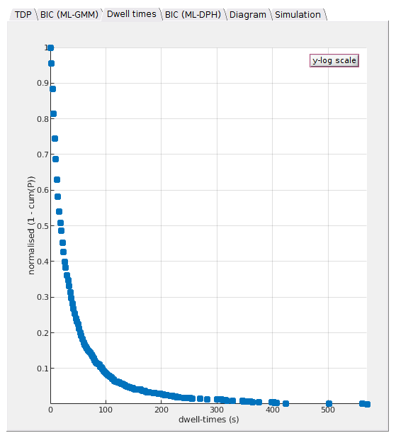</a>

To identify potential multiple decays, the dwell time histogram can be visualized on a semi-log scale by pressing 
.

<a class="plain" href="../../assets/images/gui/TA-area-visu-dt-log.png">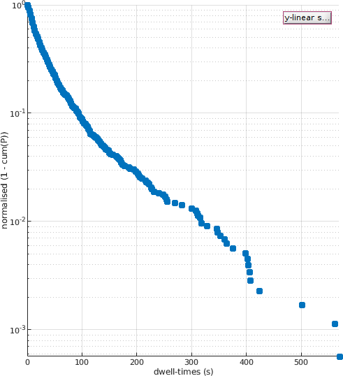</a>

### After fit
{: .no_toc }

After performing exponential fitting, the resulting fit function is plotter over the histogram as a solid red line.

<a class="plain" href="../../assets/images/gui/TA-area-visu-dt-fit.png">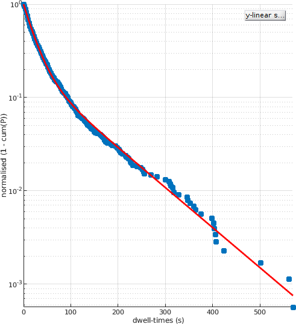</a>

When the 
[Fit settings](panel-dwell-time-histograms.html#fit-settings) include bootstrapping, the exponential function built with bootstrap means of the fitting parameters is plotted as a red solid line.

Exponential fit functions giving the lowest and highest lifetimes are plotted in dotted lines. 
This gives an visual estimation of the cross-sample variability of state lifetimes.

<a class="plain" href="../../assets/images/gui/TA-area-visu-dt-boba.png">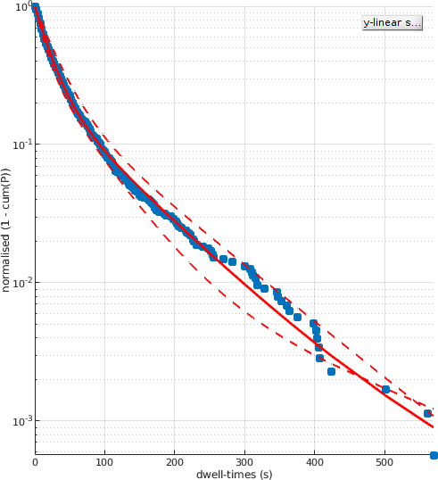</a>

---

## BIC (ML-DPH)

Use this tab to visualize model selection on discrete phase type distibutions.

<a class="plain" href="../../assets/images/gui/TA-area-visu-bicdph.png">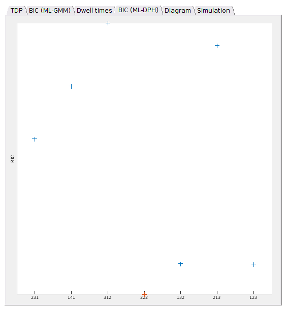</a>

If the method used in 
[State degeneracy](panel-kinetic-model.html#state-degeneracy) is `ML-DPH`, the resulting BIC values are shown by blue cross markers against the respective model complexities, with the most sufficient complexity being shown in red.

A degeneracy `121` means that one state (`1`) yields the first observed value in the 
[State list](panel-dwell-time-histograms.html#state-list), two (`2`) yield the second, and one (`1`) the third.

---

## Diagram

Use this tab to visualize the final kinetic model, depending on the stage the analysis is at.

Once the observed 
[state configuration](panel-state-configuration.html) and 
[state degeneracies](panel-kinetic-model.html#state-degeneracy) are resolved, the final degenerate state configuration is shown as a treillis diagram.
States are depicted by circles labelled in red with the observed state values.

<a class="plain" href="../../assets/images/gui/TA-area-visu-diagram.png">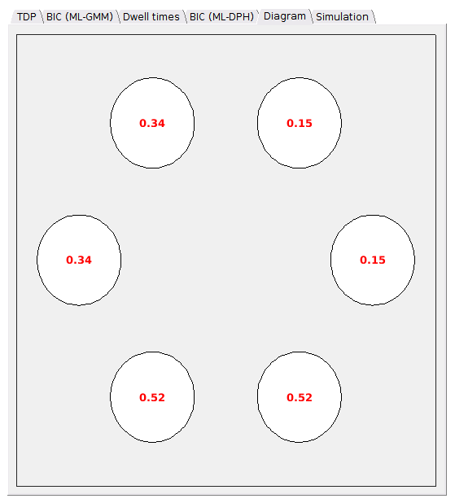</a>

### After estimation of transition rate constants
{: .no_toc }

After 
[estimation of transition rate constants](panel-kinetic-model.html#Transition-rate-constants), the radii of circles are determined by the relative state populations calculated from [Simulation](#simulation), and state transitions are shown by black arrows which thickness depend on the number of transitions obtained in 
[Simulation](#simulation).

State lifetimes calculated from the diagonal terms of the inferred transition probability matrix are shown in blue.

<a class="plain" href="../../assets/images/gui/TA-area-visu-diagram-trans.png">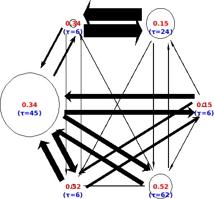</a>

Transition probabilities lower than 
[1/*L*0](){: .math_var }, with 
[*L*0](){: .math_var } the total number of data points in the experimental trajectory set, are not represented.

---

## Simulation

Use this tab to compare experimental data with simulation from inferred kinetic parameters.

<a class="plain" href="../../assets/images/gui/TA-area-visu-sim.png">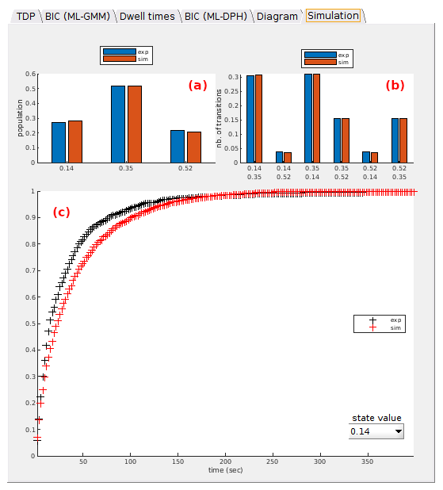</a>

Four plots are presented in three axes:
- **(a)** [`Pop.`](#pop)
- **(b)** [`Trans.`](#trans)
- **(c)** [`Dwell times`](#dwell-times)

### Pop
{: .no_toc }

Experimental populations of observed states (in blue) are compared to simulation (in red).

<a class="plain" href="../../assets/images/gui/TA-area-visu-sim-pop.png">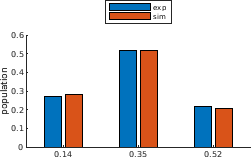</a>

State populations are calculated as the sum of corresponding dwell times.

### Trans
{: .no_toc }

Experimental number of transitions between observed states (in blue) are compared to simulation (in red).

<a class="plain" href="../../assets/images/gui/TA-area-visu-sim-trans.png">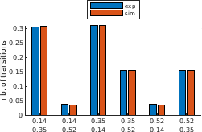</a>

### Dwell times
{: .no_toc }

Experimental normalized cumulated dwell time histograms of the observed state selected in **(a)** (in blue) is compared to simulation (in red).

<a class="plain" href="../../assets/images/gui/TA-area-visu-sim-dt.png">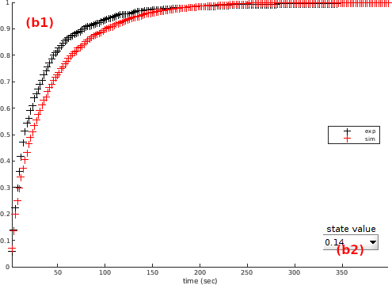</a>

