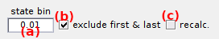
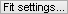
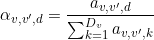

# Dwell time histograms
{: .no_toc }

Dwell time histograms is the third panel of module Transition analysis. 
Access the panel content by pressing 
. 
The panel closes automatically after other panels open or after pressing 
. 

Use this panel to fit dwell time histograms with exponential functions and estimate state dgeneracy, transition rate coefficients (homogenous kinetics only) and associated cross-sample variability with BOBA-FRET.

## Panel components
{: .no_toc .text-delta }

1. TOC
{:toc}

---

## Dwell time processing

Use this panel to process state sequences prior building histograms.

It is possible to unite multiple states obtained in panel 
[State configuration](panel-state-configuration.html) that have similar values by binning state values.  
&#8618; To unite states, enter a bin size in **(a)** greater than the largest value gap.

The first and last dwell times in state trajectories are not reliable as they are truncated by the limited observation time.
This experimental bias can be corrected by ignoring these particular dwell times in later analyses.  
&#8618; To exclude the first and last dwell times of each sequence, activate the option **(b)**.

In order to obtain dwell time histograms in line with clustered data, state sequences can be processed according to clustering results.
In this case, state transitions that are not included in any cluster (
[clustering methods](panel-state-configuration.html#method-settings) `k-means` or `simple`), or that are included in diagonal clusters, are ignored and the dwell time prior transition is elongated.  
&#8618; To recalculate dwell times according to clustering results, activate the option **(c)**.

***Note:** The processed set of state sequences are used for dwell time histogram fit and in panel 
[Kinetic model](panel-kinetic-model.html).*

---

## State list

Use this list to select the observed state value for which the dwell times have to be analyzed.

Listed states are taken from the 
[Clustering results](panel-state-configuration.html#clustering-results).

After selection, the complementary cumulative distribution of the selected observed state dwell times is built. 
The distribution is immediatley shown in 
[Dwell times](area-visualization.html#dwell-times) and available for 
[Histogram fit](#histogram-fit).

---

## Histogram fit

Press 
 to open fit options and set the fitting model and parameters, or to look at fitting results.

As described in Transition analysis 
[Workflow](../workflow.html#via-exponential-fit), fitting the cumulative dwell time histogram allows to:
- determine the state **transition rate coefficients in an homogenous system** (no degenerate state) from single exponential fit
- estimate **state degeneracy** via fitting a mixture of exponential functions or a single stretched exponential function

Fit settings are specific to each state value listed in **(a)**.

The fitting model can be automatically determined by performing successive exponential fits with an increasing number of components (3 max.) and stopping when bootstrap error ranges (3&sigma;) of time constants overlap.  
&#8618; To automatically determine model complexity and perform the fit, activate the option **(b)**. To set the fitting model manually, activate the option **(c)**.

### Manual settings
{: .no_toc }

Dwell time histograms can be fitted with two types of exponential functions:

- a **mixture of exponential** functions, by activating the option in **(e)** and set the number of components in **(f)**
- a **stretched exponential** function, by activating the option in **(d)**

Additionally, the cross-sample variability associated with rate coefficients can be estimated with BOBA-FRET by activating the option in **(g)**.
In that case, the number of replicates used to build a bootstrap histogram sample must be set in **(i)** and the number of bootstrap samples in **(j)**.
By default, the number of replicates is set to the number of molecules included in the selected transition cluster.

In order to not over-represent short trajectories in the bootstrap histograms, replicates can be given a weight proportional to the length of the associated state trajectory.
This is done by activating the option in **(h)**.

Parameters 
[*av,d*](){: .math_var },
[*&tau;v,d*](){: .math_var } and 
[*&#946;v*](){: .math_var } as described in detail in Transition analysis
[Workflow](../workflow.html#via-exponential-fit) are respectively set in rows **(l)**, **(m)** and **(n)**, with the staring guess in column **(o)**, the lower bound in column **(p)** and higher bound in column **(q)**.

Press 
 to fit the currently displayed dwell time histogram with the fitting method defined in 
[Fit settings](#fit-settings).

Press 
 to fit all dwell time histograms.

In the case where 
[Fit settings](#fit-settings) include BOBA-FRET and the number of replicates is different from the number of trajectories involving the current state, the number of replicates can be corrected prior performing histogram bootstrapping and exponential fit.

After completion, best fit parameters for the function selected in list **(k)** are displayed in column **(r)**.
When using BOBA-FRET, the bootstrap mean and standard deviation of fitting parameters are respectively displayed in column **(r)** and **(s)**.

State lifetimes together with relative contributions to the dwell time histogram are shown in 
[Fit results](#fit-results).

---

## Fit results

Shows state lifetimes and relative contributions calculated from fit parameters.

States are defined by two indexes: 
- [*v*](){: .math_var } for the observed state value
- [*d*](){: .math_var } for the degenerate level 

The lifetime 
[*&tau;v,d*](){: .math_var } of each degenerate state 
[*d*](){: .math_var } listed in **(a)** with the observed state value 
[*v*](){: .math_var } listed in the 
[State list](#state-list) is shown in **(b)** .
When using BOBA-FRET, the bootstrap mean and standard deviation are respectively shown in **(b)** and **(c)**.

In the case of an homogeneous system (no state degeneracy), the transition rate coefficients 
[*k**v*,*v'*](){: .math_var } can be calculated as the inverse of the state lifetime
[*&tau;**v*](){: .math_var } weighted by the associated number of transitions, such as:

{: .equation }

Where 
[*w**v*,*v'*](){: .math_var } is the cluster population for transition 
[*v*](){: .math_var } to 
[*v'*](){: .math_var }. Cluster populations are available in the 
[Transition density cluster file](../../output-files/clst-transition-density-clusters.html).

The relative contribution 
[*&alpha;*](){: .math_var } of the exponential component selected in **(a)** to the dwell time set selected in the 
[State list](#state-list) and considering the state transition selected in **(d)** is shown in **(e)**.
To include all state transition, select `all` in **(d)**.

The relative contribution is calculated from exponential amplitudes such as:

{: .equation }

When using BOBA-FRET, the bootstrap mean and standard deviation are respectively shown in **(e)** and **(f)**.

