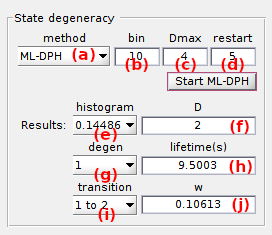
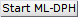
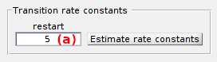

# Kinetic model
{: .no_toc }

Kinetic model is the fourth panel of module Transition analysis. 
Access the panel content by pressing 
. 
The panel closes automatically after other panels open or after pressing 
. 

Use this panel to infer the most probable kinetic model and compare experiment to simulation.

## Panel components
{: .no_toc .text-delta }

1. TOC
{:toc}

---

## State degeneracy

Use this panel to determine the most sufficient degeneracies of all observed states.

The degenerate state configuration can be determined via two methods listed in **(a)**:
- `ML-DPH`
  [1](#references): finds state degeneracy via optimization and BIC-selection of discrete-phase type distributions on dwell time histograms
- `From exponential fit`: uses the state degeneracy from dwell time histogram fit in panel [Dwell time histograms](panel-dwelltime-histograms.html)

With the first method, three parameters must be defined:
* the bin size (in time steps) of the dwell time histogram prior performing ML-DPH fit in **(b)**; it is relative to the resolution limit in time of the used state finding algorithm, with a bin size of 1 yielding the guenuine histogram,
* the maximum state degeneracy in **(c)**; *i.e.*, the maximum number of degenerate states to be found in one dwell time histogram,
* the number of DPH parameter initializations in **(d)**; the larger the more accurate, but also the higher the computation cost.

&#8618; Press 
 to start ML-DPH inference.
The inferrence time varies according to (1) the number of dwell times, (2) the maximum model complexity and (3) the number of model initializations.
Unfortunately, once started the process can not be interrupted in a standard manner.
To stop calculations, Matlab must be forced to close.

Once ML-DPH inferrence is completed, the most sufficient state degeneracy found for the dwell time histogram selected in **(e)** is shown in **(f)**.
Additionally, DPH parameters like lifetime of degenerate state selected in **(g)** and probability of transition selected in **(i)** are shown in **(h)** and **(j)**, respectively.
BIC values found for each degenerate state configuration are presented in the  
[BIC (ML-DPH)](area-visualization.html#bic-ml-dph) plot.

### References
{: .no_toc }

1. M. Bladt and B.F. Nielsen, *Estimation of Phase-Type Distributions. In: Matrix-Exponential Distributions in Applied Probability.*,  *Probability Theory and Stochastic Modelling* **2017**, DOI: [10.1007/978-1-4939-7049-0_13](https://doi.org/10.1007/978-1-4939-7049-0_13)

---

## Transition rate constants

Use this panel to estimate the state transition rate constants.

For the particular degenerate state configuration defined in 
[State degeneracy](#state-degeneracy), transition probabilities are optimized for experimental state sequences with the Baum-Welch algorithm as described in 
[Workflow](../workflow.html#solve-the-kinetic-model).

If state degeneracies were determined via `ML-DPH`, the transition probabilities are initialized the first time using DPH parameters, and randomly the next ones.

After BW inferrence, the negative and positive errors 
[&Delta;*pjj'*-](){: .math_var } and 
[&Delta;*pjj'*+](){: .math_var } on transition probabilities are automatically estimated via a 95% confidence likelihood ratio test
[1](#references), giving an estimated range delimited by the lower bound 
[*pj,j'* - &Delta;*pjj'*-](){: .math_var } and the upper bound 
[*pj,j'* + &Delta;*pjj'*+](){: .math_var }.
Additionally, a set of artificial state trajectories are generated based on the inferred transition probability matrix and on the experimental data set mensurations, which allows to evaluate visually the legitimacy of the inferred model.

&#8618; Press 
 to start model inference and error estimation.
The inferrence time varies from seconds to days depending on (1) the size of the data set, (2) the model complexity (number of states) and (3) the number of model initializations.
Unfortunately, once started the process can not be interrupted in a standard manner.
To stop calculations, Matlab must be forced to close.

Once model inferrence is completed, the most probable kinetic model (maximum likelihood estimator) is show as a treillis diagram in 
[Diagram](area-visualization.html#diagram) and a comparison between experimental and simulated data is shown in 
[Simulation](area-visualization.html#simulation).

### References
{: .no_toc }

1. S. Schmid and T. Hugel, *Efficient use of single molecule time traces to resolve kinetic rates, models and uncertainties*, *J Chem Phys.* **2018**, DOI: [10.1063/1.5006604](https://doi.org/10.1063/1.5006604)

