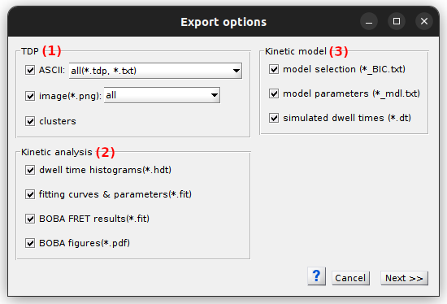
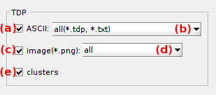
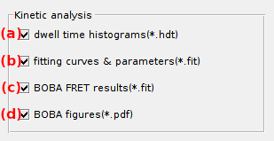

# Set export options
{: .no_toc }

Export options define the particular files to export from an analysis with module Transition analysis.

The window is accessed by pressing 
 in the project management area of module Transition analysis.

Press 
 to start file export.

## Window components
{: .no_toc .text-delta }

1. TOC
{:toc}

---

## Transition density plot (TDP)

Use this panel to export the TDP and clustering results.

The TDP can be exported to ASCII files by activating the option in **(a)**.
In this case, the TDP can be exported in the different format listed in **(b)**:
* `matrix(*.tdp)`: exported as a matrix
* `gauss. convoluted matrix(*.tdp)`: exported as a Gaussian-filtered matrix
* `coordinates (x,y,occurrence)(*.txt)`: exported as 3D-coordinates
* `all(*.tdp, *.txt)`: all three formats

For more information about the file structures, please refer to 
[Transition density plot file](../../output-files/tdp-transition-density-plot.html) and 
[Transition density coordinates file](../../output-files/txt-transition-density-coordinates.html).

The TDP matrix can also be exported to a PNG image file by activating the option in **(c)** and selecting one of the plot listed in **(d)**:
* `original`: shows initial transition counts
* `Gaussian-convoluted`: shows Gaussian-filtered counts
* `all`: export both images

TDP clustering results can be exported to a 
[Transition density clusters file](../../output-files/clst-transition-density-clusters.html) by activating the option **(e)**.

***Note:** Transition densities written in TDP ASCII files and images are counted as defined in 
[Transition count](../panels/panel-transition-density-plot.html#transition-count)*

---

## Kinetic analysis

Use this panel to export dwell time histograms and fitting results.

Dwell time histograms can be exported to ASCII 
[.hdt files](../../output-files/hdt-dwelltime-histogram.html) by activating the options in **(a)**.

Fitting results can also be exported to separated ASCII
[.fit files](../../output-files/fit-dwelltime-fit.html) by activating the option in **(b)**. 

If the 
[Fit settings](../panels/panel-dwell-time-histograms.html#fit-settings) include BOBA-FRET:
* the [.fit file](../../output-files/fit-dwelltime-fit.html) can be appended with bootstrapping parameters and results by activating the option in **(c)**
* plots of bootstrap histogram samples and associated fit can be exported to a multi-pages [.pdf file](../../output-files/pdf-transition-analysis-bootstrap-plots.html) by activating the option in **(d)**

---

## Kinetic model

Use this panel to export results of model selection on DPHs, the kinetic model parameters and simulated data.

If state degeneracy was determined with model selection on DPHs, the BIC values obtained for all state degeneracy can be summarize in ASCII 
[.txt files](../../output-files/txt-dph-model-select.html) by activating the options in **(a)**.

The inferred kinetic model including state values, lifetimes, initial probabilities and transition rate coefficients can be exported to ASCII 
[.txt files](../../output-files/txt-kinetic-model.html) by activating the options in **(b)**.

The synthetic dwell time set created with the kinetic model parameters can be exported to ASCII 
[.dt files](../../output-files/dt-dwelltimes.html) by activating the options in **(c)**.

