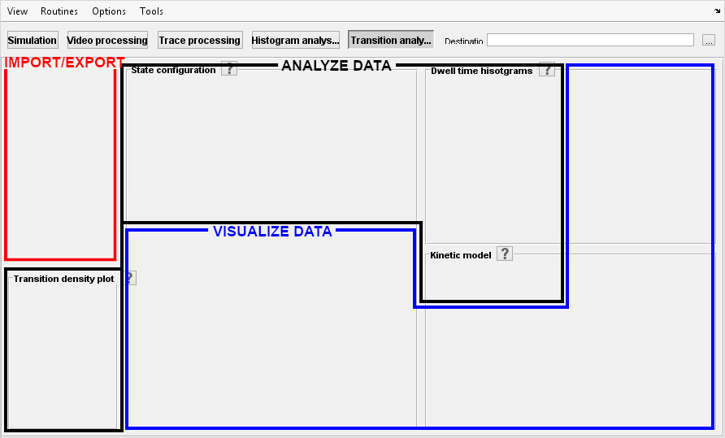

# Interface
{: .no_toc }

Transition analysis is the fifth module of MASH-FRET and is accessed by pressing 
 in the main 
[tool bar](../Getting_started.html#interface).

The interface can be divided into three subunits that respectively allow to:
* <u>import</u> and <u>export</u> data
* <u>analyze</u> state transitions
* <u>visualize</u> transition analysis

Learn about individual components of the interface in the 
[Panels](panels.html) section.

