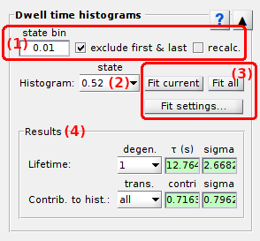
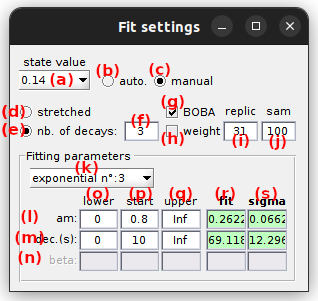

# Dwell time histograms
{: .no_toc }

Dwell time histograms is the third panel of module Transition analysis.

Use this panel to estimate state degeneracy, 2-state-restricted transition rates and associated cross-sample variability with BOBA-FRET.

## Panel components
{: .no_toc .text-delta }

1. TOC
{:toc}

---

## Dwell time processing

Use this panel to process state sequences prior building histograms.

---

## Fit settings

Press 
 to open settings and set the fitting model as well as the starting guess, or to look at fitting results.

---

## Start fit

Press 
 to fit the currently displayed dwell time histogram with the fitting method defined in 
[Fit settings](#fit-settings).

Press 
 to fit all dwell time histograms.

---

## State lifetimes

Watch this area to obtain state lifetimes after histogram fitting is completed.

---

## Visualization area

Use this interface to visualize the cumulative dwell time histogram and fitting results.

The histogram plot depends on the 
[Fit settings](#fit-settings) and the stage the transition analysis is at.

Any graphics in MASH can be exported to an image file by right-clicking on the axes and selecting `Export graph`.

### Default
{: .no_toc }

Just after clustering and providing that the dwell time set selected in the
[State lifetimes](#state-lifetimes) is not empty, the corresponding cumulative and complementary dwell time histogram is plotted with blue solid markers.

To identify potential multiple decays, the dwell time histogram can be visualized on a semi-log scale by pressing 
.

### After fit
{: .no_toc }

After performing exponential fitting, the resulting fit function is plotter over the histogram as a solid red line.

When the 
[Fit settings](#fit-settings) include bootstrapping, the exponential function built with bootstrap means of the fitting parameters is plotted as a red solid line.

Exponential fit functions giving the lowest and highest lifetimes are plotted in dotted lines. 
This gives an visual estimation of the cross-sample variability of state lifetimes.

