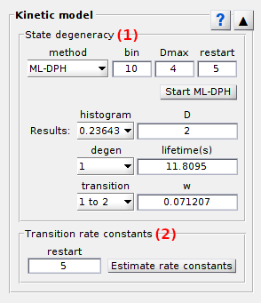

# Kinetic model
{: .no_toc }

Kinetic model is the fourth panel of module Transition analysis.

Use this panel to infer the most probable kinetic model and compare simulated to experimental dwell times.

## Panel components
{: .no_toc .text-delta }

1. TOC
{:toc}

---

## Model inferrence

Use this interface to set the starting guess for model inference.

The kinetic model is obtain by optimizing transition probabilities for state sequences with the Baum-Welch algorithm as described in Transition analysis
[Workflow](../workflow.html#solve-the-kinetic-model).

Press 
 to start model inference with the Baum-Welch algorithm as defined in 
[Model inferrence settings](#model-inference-settings).

The inferrence time varies from seconds to days depending on (1) the size of the data set, (2) the model complexity (number of states) and (3) the number of model initializations.
Unfortunately, once started the process can not be interrupted in a standard manner.
To stop calculations, Matlab must be forced to close.

Once model inferrences are completed, the most probable kinetic model (maximum likelihood estimator) is show as a treillis diagram.

---

## Visualization area

Use this interface to visualize model selection on discrete phase type distibutions and to compare experimental data with simulation from inferred kinetic parameters.

Four plots are presented in four panel tabs:
- [`BIC`](#BIC)
- [`Dwell times`](#dwell-times)
- [`Pop.`](#pop)
- [`Trans.`](#trans)

Any graphics in MASH can be exported to an image file by right-clicking on the axes and selecting `Export graph`.

### BIC

If the 
[Model inferrence](#model-inferrence) settings include model selection on discrete phase-type distributions, the BIC values are plotted against the respective model complexities, with the most sufficient complexity plotted in red.

### Dwell times

Experimental normalized cumulated dwell time histograms of observed states (in blue) are compared to simulation (in red).

### Pop

Experimental populations of observed states (in blue) are compared to simulation (in red).

State populations are calculated as the sum of corresponding dwell times.

### Trans

Experimental number of transitions between observed states (in blue) are compared to simulation (in red).

