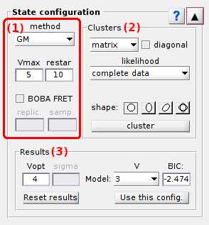
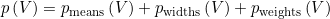

# State configuration
{: .no_toc }

State configuration is the second panel of module Transition analysis.

Use this panel to determine the optimum number of transition clusters and associated cross-sample variability.

## Panel components
{: .no_toc .text-delta }

1. TOC
{:toc}

---

## Method settings

Use this interface to define a method to cluster transitions.

Transition clustering consists partitioning the TDP into groups of transitions by determining the optimum number and positions of transition clusters.

Two clustering algorithms are available and are described in the following sections:

* [k-mean clustering](#k-mean-clustering), by pressing 

* [Gaussian mixture (GM) clustering](#gm-clustering), by pressing

In both cases, the algorithms look for 
[*J*2](){: .math_var} clusters in the TDP, with 
[*J*](){: .math_var} the number of states in the configuration.
The 
[*J*](){: .math_var } clusters on the TDP diagonal are included to the model to cluster the small-amplitude jumps together, *e. g.* transitions to blur states, and exclude them from dwell time histograms.

Once the clusters are identified, states are deduced from the x- and y- coordinates of their centers.

To estimate the cross-sample variability of state configurations, transition clustering can be combined with TDP bootstrapping by activating the option in **(c)**.
In that case, the number of replicates used to build a bootstrap TDP sample must be set in **(f)** and the number of bootstrap samples in **(g)**.
By default, the number of replicates is set to the number of molecules in the project.

### k-mean clustering
{: .no_toc }

This algorithm uses a starting guess for initial cluster positions and assigns each data point to the nearest cluster center providing a minimum distance to the center, called the tolerance radius. 
Cluster centers are then recalculated as the mean data assigned to each cluster.

Centers are iteratively calculated until a maximum number of iterations is reached, or when calculations converged to a stable state configuration.

The maximum number of states to look for is set in **(a)** and the maximum number of process iterations in **(b)**.
The starting guess and state-specific tolerance radius are set in 
[Clusters](#clusters).

### GM clustering
{: .no_toc }

The GM clustering algorithm has the particularity to infer cluster configurations for different number of states, and then determine the most sufficient description.
The method is adapted from the smFRET literature 
[1](#references).

With GM clustering, a transition cluster is modelled with a 2D-Gaussian.
Therefore, the TDP is modelled with a mixture of 2D-Gaussian and each data point has a specific probability to belong to a cluster.

Gaussian mixtures with increasing 
[*J*](){: .math_var } are optimized for the data with an expectation-maximization (E-M) algorithm repeated a defined number of times with new model initializations.

The most sufficient state configuration is then determined using the Bayesian information criterion (BIC).

The 
[*BIC*](){: .math_var } is similar to a penalized likelihood and is expressed such as:

{: .equation }

with 
[*p*](){: .math_var } the number of parameters necessary to describe the model with 
[*J*](){: .math_var } components and
[*N*total](){: .math_var } the total number of counts in the TDP.

The number of parameters necessary to describe the model includes the number of Gaussian means, 
[*p*means](){: .math_var }, the number of parameters to describe Gaussian covariances, 
[*p*widths](){: .math_var } and Gaussian relative weights, 
[*p*weights](){: .math_var }, and is calculated such as:

{: .equation }

The number of parameters necessary to describe all 2D-Gaussian covariances, [*p*widths](){: .math_var }, depends on the Gaussian shape:

* for `spherical` Gaussians: [*p*widths = *J*2](){: .math_var }
* for `ellipsoid straight` or `ellipsoid diagonal` Gaussians: [*p*widths = 2*J*2](){: .math_var }
* for `free`-shaped Gaussians: [*p*widths = 3*J*2](){: .math_var }

The maximum number of states to look for is set in **(a)** and the number of E-M initializations in **(b)**.

The Gaussian shape used for clustering is set in 
[Clusters](#clusters).

### References
{: .no_toc }

1. S.A. McKinney, C. Joo, and T. Ha, *Analysis of Single-Molecule FRET Trajectories Using Hidden Markov Modeling*, *Biophys. J.* **2006**, DOI: [10.1529/biophysj.106.082487](https://dx.doi.org/10.1529%2Fbiophysj.106.082487)

---

## Clusters

Use this panel to define the initial cluster configuration.

The interface changes depending on which clustering method is used (left 
[GM clustering](#gm-clustering) and right 
[k-mean clustering](#k-mean-clustering)):

For 
[GM clustering](#gm-clustering), select the appropriate cluster shape in the menu **(a)**.
Four shapes are available:

* `spherical`: Gaussian widths are equal in the x- and y- direction
* `ellipsoid straight`: Gaussian widths are different in the x- and y- direction and the Gaussian orientation is fixed and defined with 0° inclination
* `ellispoid diagonal`: Gaussian widths are different in the x- and y- direction and the Gaussian orientation is fixed and defined with 45° inclination
* `free`: Gaussian widths are different in the x- and y- direction and the Gaussian orientation is free

For 
[k-mean clustering](#k-mean-clustering) and for each state selected in menu **(a)**, set tolerance radius in **(c)** and the starting guess for the state value.

Starting guesses can be set:

* manually in **(b)**
* by activating the `Target centroid` cursor and clicking on the 
[Transition density plot](#trasition-density-plot); `Target centroid` is activated by right-clicking on the axes and selecting the option with the same name
* automatically by pressing 
; in this case, states will be evenly distributed within the TDP limits

Press
 to start clustering transitions.
If the 
[Method settings](#method-settings) include BOBA-FRET, TDP bootstrapping and subsequent clustering will be performed.

After completion, the interface 
[Clustering results](#clustering-results) and the 
[Visualization area](#visualization-area) are updated.

---

## Clustering results

Use this interface to visualize results of a state configuration analysis.

After transition clustering, results are summarized in a bar plot where the BIC is presented in function of the number of components.

The number of components in the most sufficient model is displayed in **(b)**.
When using BOBA-FRET, the bootstrap mean and standard deviation of the most sufficient number of components are respectively displayed in **(b)** and **(c)**.

Other inferred models can be visualized in the 
[Visualization area](#visualization-area) by selecting the corresponding number of components in the list **(d)**. 

Transition clusters of any model can be imported in 
[State transition rates](panel-state-transition-rates.html) for dwell time analysis, by pressing 
.

Press
 to reset TDP clustering. 

---

## Visualization area

Use this interface to visualize the TDP and analysis results.

The axes display two types of plots depending on which stage the transition analysis is at.

Any graphics in MASH can be exported to an image file by right-clicking on the axes and selecting `Export graph`.

### Transition density plot
{: .no_toc }

When opening a new project in Transition analysis and providing that the data selected in the
[Data list](panel-transition-density-plot.html#data-list) exists in the project, the TDP is built as defined in 
[Transition density plot](panel-transition-density-plot.html) and plotted in the axes.

The transition density is color-coded according to the color scale located on the right hand side of the axes and according to the 
[Color map](panel-transition-density-plot.html#color-map).

### Clusters
{: .no_toc }

After completing TDP clustering, clustered transition are indicated by cross markers that are colored according to the cluster they belong to.

Cluster colors can be modified in the 
[Transitions](panel-state-transition-rates.html#transitions).

When the 
[Method settings](#method-settings) include the use of GM clustering, the contour of each Gaussian-shaped cluster is plotted as a blue solid line.

