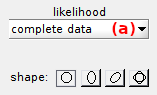
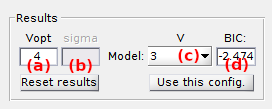

# State configuration
{: .no_toc }

## Panel components
{: .no_toc .text-delta }

1. TOC
{:toc}

---

## Method settings

Defines the method used to cluster transitions in the TDP.

Two clustering methods are available:
* k-mean clustering, by selecting 

* clustering with a Gaussian mixture (GM), by selecting 

In both cases, the algorithms look for 
[*J*2](){: .math_var} clusters in the TDP, with 
[*J*](){: .math_var} the number of states in the configuration. 
Once clusters are identified, states are deduced from the x- and y- coordinates of their centers.
The 
[*J*](){: .math_var } clusters on the TDP diagonal are included to the model to cluster the small-amplitude jumps together, *e. g.* transitions to blur states, and exclude them from dwell time histograms.

Transition clustering can be combined with TDP bootstrapping by activating the option in **(c)**, to estimate the cross-sample variability of state configurations.
In that case, the number of replicates used to build a bootstrap TDP sample must be set in **(f)** and the number of bootstrap samples in **(g)**.
By default, the number of replicates is set to the number of molecules in the project.

### k-mean clustering
{: .no_toc }

This algorithm uses a starting guess for initial cluster positions and assigns each data point to the nearest cluster center providing a minimum distance to the center, called the tolerance radius. 
Cluster centers are then recalculated as the mean data assigned to each cluster.
Centers are iteratively calculated until a maximum number of iterations is reached, or when calculations converged to a stable state configuration.

The maximum number of states to look for is set in **(a)** and the maximum number of process iterations in **(b)**.
The starting guess and state-specific tolerance radius are set in 
[Cluster settings](#cluster settings).

### GM clustering
{: .no_toc }

The GM clustering algorithm has the particularity to infer cluster configurations for different number of states, and then determine the most sufficient description.
The method is largely inspired from the smFRET literature 
[1](#references).

With GM clustering, transition clusters are modelled with a 2D-Gaussian.
Therefore, the TDP is modelled as a mixture of 2D-Gaussian and each data point has a specific probability to belong to a cluster.
Gaussian mixtures with increasing 
[*J*](){: .math_var } are optimized for the data with an expectation-maximization (E-M) algorithm and a define number of randomly distributed starting guess.
The most sufficient state configuration is then determined by comparing the Bayesian information criteria (BIC) of each optimum model.

The 
[*BIC*](){: .math_var } is similar to a penalized likelihood and is expressed such as:

{: .equation }

with 
[*p**J*](){: .math_var } the number of parameters necessary to describe the model with 
[*J*](){: .math_var } components and
[*N*total](){: .math_var } the total number of counts in the TDP.
The number of parameters necessary to describe the model includes the number of Gaussian means, 
[*p*means](){: .math_var }, the number of parameters to describe Gaussian covariances, 
[*p*widths](){: .math_var } and Gaussian weights, 
[*p*weights](){: .math_var }, and is calculated such as:

{: .equation }

The number of parameters that describe the all 2D-Gaussian covariances, [*p*widths](){: .math_var }, depends on the Gaussian shape used in the mixture:
* for `spherical` Gaussians: [*p*widths = *J*2](){: .math_var }
* for `ellipsoid straight` or `ellipsoid diagonal` Gaussians: [*p*widths = 2*J*2](){: .math_var }
* for `free`-shaped Gaussians: [*p*widths = 3*J*2](){: .math_var }

The maximum number of states to look for is set in **(a)** and the number of E-M restart with new starting guess in **(b)**.
The Gaussian shape used for clustering is set in 
[Cluster settings](#cluster settings).

### References
{: .no_toc }

1. S.A. McKinney, C. Joo, and T. Ha, *Analysis of Single-Molecule FRET Trajectories Using Hidden Markov Modeling*, *Biophys. J.* **2006**, DOI: [10.1529/biophysj.106.082487](https://dx.doi.org/10.1529%2Fbiophysj.106.082487)

---

## Cluster settings

Defines the clusters used in the clustering procedure.

The interface changes depending on which clustering method is used (left 
[GM](GM-clustering) and right 
[k-mean](#k-mean-clustering)):

For 
[GM clustering](GM-clustering), select the appropriate cluster shape in the list **(a)**.
Four shapes are available:
* `spherical`: Gaussian widths are equal in the x- and y- direction
* `ellipsoid straight`: Gaussian widths are different in the x- and y- direction and the Gaussian orientation is fixed and defined with 0° inclination
* `ellispoid diagonal`: Gaussian widths are different in the x- and y- direction and the Gaussian orientation is fixed and defined with 45° inclination
* `free`: Gaussian widths are different in the x- and y- direction and the Gaussian orientation is free

For 
[k-mean clustering](#k-mean-clustering), set the starting guess in **(b)** and tolerance radius in **(c)** of each state by browsing the state list in **(a)**.
Starting guesses can also be automatically set by pressing 
.
In this case, states will be evenly distributed within the TDP limits.

After setting the cluster parameters, the clustering procedure is started by pressing 
.
If the 
[Method settings](#method-settings) include BOBA-FRET, TDP bootstrapping and subsequent clustering will be performed.

After completion, the interface 
[Clustering results](#clustering-results) and the 
[Visualization area](#visualization-area) are updated.

---

## Clustering results

Use this interface to visualize the results of state configuration analysis.

After the clustering procedure is completed, analysis results are summarized in a bar plot where the BIC is presented in function of the number of components.
The number of components in the most sufficient model is displayed in **(b)**.
When using BOBA-FRET, the bootstrap mean and standard deviation of the most sufficient number of components are respectively displayed in **(b)** and **(c)**.

Other inferred models can be visualized in the 
[Visualization area](#visualization-area) by selecting the corresponding number of components in the list **(d)**. 

Transition clusters of any model can be imported in 
[State transition rates](panel-state-transition-rates.html) for dwell time analysis, by pressing 
.

Clustering can be reset any time by pressing 
.

---

## Visualization area

The axes display two types of plots depending on which stage the transition analysis is at.

### Transition density plot
{: .no_toc }

When opening a new project in Transition analysis and providing that the data selected in the
[Data list](panel-transition-density-plot.html#data-list) exists in the project, the TDP is built as defined in 
[Transition density plot](panel-transition-density-plot.html) and plotted in the axes.

The transition density is color-coded according to the color scale located on the right hand side of the axes and according to the 
[Color map](panel-transition-density-plot.html#color-map).

### Clusters
{: .no_toc }

After completing TDP clustering, clustered transition are indicated by cross markers that are colored according to the cluster they belong to.
Cluster colors can be modified in the 
[Transition list](panel-state-transition-rates.html#transition-list).
When the 
[Method settings](panel-state-populations.html#method-settings) include the use of GM clustering, the contour of each Gaussian-shaped cluster is plotted as a blue solid line.

