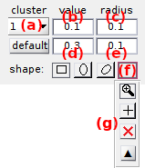

# State configuration
{: .no_toc }

State configuration is the second panel of module Transition analysis.

Use this panel to determine the optimum number of transition clusters and associated cross-sample variability.

## Panel components
{: .no_toc .text-delta }

1. TOC
{:toc}

---

## Method settings

Use this interface to define a method to cluster transitions.

TDP clustering consists in partitioning the state transitions into groups. 
Clustering can be done in an iterative fashion to search for the optimum cluster configuration, or in a non-iterative fashion by simply imposing a starting configuration.

The clustering method is chosen in list **(a)** which includes:

* [`k-mean`](#k-mean-clustering) iterative clustering, with the maximum number of process iteration set in **(c)**
* [`GM`](#gm-clustering) (Gaussian mixture) iterative clustering, with the maximum number of mixture initialization set in **(c)**
* [`simple`](#simple-clustering) non-iterative clustering

In all cases, the algorithms look for a number of clusters 
[*K*](){: .math_var} that depends on the cluster configuration chosen in 
[Clusters](#clusters) and in the complexity 
[*J*](){: .math_var} set in **(b)**, such as:

| configuration                    |  [*K*](){: .math_var }            |
| -------------------------------- |:---------------------------------:|
| `matrix` incl. diagonal clusters | [*J*2](){: .math_var } |
| `matrix` excl. diagonal clusters | [*J*(*J* - 1)](){: .math_var }    |
| `symmetrical`                    | [2*J*](){: .math_var }            |
| `free`                           | [*J*](){: .math_var }             |

Once the clusters are identified, states are deduced from the x- and y- coordinates of their centers.

To estimate the cross-sample variability of state configurations, transition clustering can be combined with TDP bootstrapping by activating the option in **(d)**.
In that case, the number of replicates used to build a bootstrap TDP sample must be set in **(e)** and the number of bootstrap samples in **(f)**.
By default, the number of replicates is set to the number of molecules in the project.

### k-mean clustering
{: .no_toc }

This algorithm uses a starting guess for initial cluster positions and assigns each transition to the nearest cluster center providing a minimum distance to the center, which is defined by the cluster dimensions. 
Cluster centers are then recalculated by averaging the transitions they are assigned.

Centers are iteratively calculated until the maximum number of iterations set in **(c)** is reached, or when calculations converged to a stable cluster configuration.

The starting guess for cluster positions and dimensions is defined in 
[Clusters for k-mean or simple clustering](#clusters-for-k-mean-or-simple-clustering).

### GM clustering
{: .no_toc }

The GM clustering algorithm has the particularity to infer cluster configurations of different complexities, and then, to determine the most sufficient complexity to describe the data.
The method is adapted from the smFRET literature 
[1](#references).

With GM clustering, a transition cluster is modelled with a 2D-Gaussian.
Therefore, the TDP is modelled with a mixture of 2D-Gaussian and each data point has a specific probability to belong to a cluster.

Gaussian mixtures with increasing complexities, up to a maximum complexity set in **(b)**, are fit to the TDP with an expectation-maximization (E-M) algorithm that maximizes the likelihood.
For each model complexity, the risk of converging to local maxima is minimized by repeating the fit with random model initializations.
The number of model initialization is set in **(c)**.

The most sufficient state configuration is then determined using the Bayesian information criterion (BIC).

The 
[*BIC*](){: .math_var } is similar to a penalized likelihood and is expressed such as:

{: .equation }

with 
[*p*(*J*)](){: .math_var } the number of parameters necessary to describe the mixture, with 
[*J*](){: .math_var } the model complexity  set in 
[Method settings](#method-settings), and
[*N*total](){: .math_var } the total number of counts in the TDP.

The number of parameters necessary to describe the model includes the number of Gaussian means, 
[*p*means](){: .math_var }, the number of parameters to describe Gaussian covariances, 
[*p*widths](){: .math_var } and Gaussian relative weights, 
[*p*weights](){: .math_var }, and is calculated such as:

{: .equation }

The number of parameters necessary to describe the means of the 
[*K*](){: .math_var } 2D-Gaussians depend on the cluster constraint set in 
[Clusters](#clusters) and the complexity 
[*J*](){: .math_var }:

| configuration                    |  [*p*means](){: .math_var }  |
| -------------------------------- |:---------------------------------------:|
| `matrix` incl. diagonal clusters | [*J*](){: .math_var }                   |
| `matrix` excl. diagonal clusters | [*J*](){: .math_var }                   |
| `symmetrical`                    | [2*J*](){: .math_var }                  |
| `free`                           | [2*J*](){: .math_var }                  |

The number of parameters necessary to describe the weights of 
[*K*](){: .math_var } 2D-Gaussians is calculated as: [*p*weights = *K* - 1](){: .math_var }

The number of parameters necessary to describe the covariances of 
[*K*](){: .math_var } 2D-Gaussians depends on the Gaussian shape:

| shape                          |  [*p*widths](){: .math_var }     | 
| ------------------------------ |:-------------------------------------------:| 
| isotropic                      | [*K*2](){: .math_var }           | 
| straight/diagonal multivariate | [2*K*2](){: .math_var }          | 
| freely rotating multivariate   | [3*K*2](){: .math_var }          | 

The Gaussian shape and likelihood calculations used in GM clustering are set in 
[Clusters for GM clustering](#clusters-for-gm-clustering).

### Simple clustering
{: .no_toc }

This algorithm uses user-defined cluster positions and dimensions, and assign transitions to the cluster in which they are contained.
When a transition is contained in two different clusters, it is arbitrary assigned to the cluster with the greatest index.

Cluster positions and dimensions are defined in 
[Clusters for k-mean or simple clustering](#clusters-for-k-mean-or-simple-clustering).

### References
{: .no_toc }

1. S.A. McKinney, C. Joo, and T. Ha, *Analysis of Single-Molecule FRET Trajectories Using Hidden Markov Modeling*, *Biophys. J.* **2006**, DOI: [10.1529/biophysj.106.082487](https://dx.doi.org/10.1529%2Fbiophysj.106.082487)

---

## Clusters

Use this panel to define the cluster configuration.

Cluster centers are constrained according to one of the three types of configuration listed in **(a)**:

|  constraint   | description                                                                                                 |
|:-------------:| ----------------------------------------------------------------------------------------------------------- |
| `matrix`      | [*J*](){: .math_var }-by[*J*](){: .math_var } cluster matrix defined by [*J*](){: .math_var } states        |
| `symmetrical` | [*J*](){: .math_var } clusters having their symmetrical projection on the opposite side of the TDP diagonal |
| `free`        | [*J*](){: .math_var } clusters free of constraint                                                           |

with 
[*J*](){: .math_var } being defined in 
[Method settings](#method-settings).

When using the `matrix` configuration, the 
[*J*](){: .math_var } clusters on the TDP diagonal are used to group together low-amplitude state transitions that are usually artefacts rising from noise discretization. 
To remove diagonal clusters from the `matrix` configuration, deactivate the option in **(b)**.

The different cluster configurations for a complexity 
[*J*](){: .math_var } = 4 are shown below:

The interface **(c)** defines the shape and coordinates of clusters and depends on the clustering method:
1. [Clusters for GM clustering](#clusters-for-gm-clustering) 
2. [Clusters for k-mean or simple clustering](#clusters-for-k-mean-or-simple-clustering)

Press
 to start clustering transitions.
If the 
[Method settings](#method-settings) include BOBA-FRET, TDP bootstrapping and subsequent clustering will be performed.

After completion, the interface 
[Clustering results](#clustering-results) and the 
[Visualization area](#visualization-area) are updated.

### Clusters for GM clustering
{: .no_toc }

Use this interface to set the cluster shape and likelihood calculations.

Likelihood calculation is selected in list **(a)** and can be performed in two ways:
- `complete-data` likelihood (*recommended*): associates each transition to one and cluster only 
- `incomplete-data` likelihood: considers a non-null probability to be associated with each cluster in the configuration (subject to over-estimation of model complexity)

Gaussian clusters can have four different shapes, each being selected by pressing the corresponding button:

|  shape                       |  button                                                                                            | description                                                                                                                        |
|:----------------------------:|:--------------------------------------------------------------------------------------------------:| ---------------------------------------------------------------------------------------------------------------------------------- |
| isotropic                    |                                    | Gaussian widths are equal in the x- and y- direction                                                                               |
| straight mutivariate         |            | Gaussian widths can be different in the x- and y- direction and the Gaussian orientation is fixed and defined with 0° inclination  |
| diagonal mutivariate         |            | Gaussian widths can be different in the x- and y- direction and the Gaussian orientation is fixed and defined with 45° inclination |
| freely rotating multivariate |  | Gaussian widths can be different in the x- and y- direction and the Gaussian orientation is free                                   |

### Clusters for k-mean or simple clustering
{: .no_toc }

Use this interface to set the cluster shape and center coordinates.

A k-mean or simple cluster is defined by the (x,y) coordinates of its center, its shape and its dimensions.

Clusters can be of three different shapes, each being selected by pressing the corresponding button:

- square by pressing 
- straight ellipse by pressing 
- diagonal ellipse by pressing 

Cluster centers and dimensions are set:
* by typing the corresponding x- and/or y-value in **(b)** and/or **(d)** respectively and the x- and/or y- radius in **(c)** and/or **(e)**
* with the <u>mouse selection tool</u> by pressing **(f)** to open the selection panel **(g)**, and by selecting 
* <u>automatically</u> by pressing 
; in this case, centers are evenly distributed within the TDP limits

To quit the <u>mouse selection tool</u>, select  in panel **(h)**.  
To reset mouse-selected clusters, select  in panel **(h)**.  
Panel **(h)** closes after selecting one of the above or by pressing .

Coordinates and radii in the y-direction are not adjustable when using `matrix` the configuration.

---

## Clustering results

Use this interface to visualize results of a state configuration analysis.

After transition clustering, GM-clustering results are summarized in a bar plot where the BIC is presented in function of the number of components.

The complexity 
[*J*](){: .math_var } of the most sufficient model is displayed in **(b)**.
When using BOBA-FRET, the bootstrap mean and standard deviation of the most sufficient number of components are respectively displayed in **(b)** and **(c)**.

Other inferred models can be visualized in the 
[Visualization area](#visualization-area) by selecting the corresponding number of components in the list **(d)**. 
The associated BIC value is shown in **(e)**.

Transition clusters of any model can be imported in 
[State transition rates](panel-state-transition-rates.html) for dwell time analysis, by pressing 
.

Press
 to reset TDP clustering. 

---

## Visualization area

Use this interface to visualize the TDP and analysis results or to modify cluster color code.

The axes display two types of plots depending on which stage the transition analysis is at.

Any graphics in MASH can be exported to an image file by right-clicking on the axes and selecting `Export graph`.

### Transition density plot
{: .no_toc }

When opening a new project in Transition analysis and providing that the data selected in the
[Data list](panel-transition-density-plot.html#data-list) exists in the project, the TDP is built as defined in 
[Transition density plot](panel-transition-density-plot.html) and plotted in the axes.

The transition density is color-coded according to the color scale located on the right hand side of the axes and according to the 
[Color map](panel-transition-density-plot.html#color-map).

When hoovering the axes with the mouse selection tool activated, mouse coordinates are shown in **(a)**.

### Clusters
{: .no_toc }

After completing TDP clustering, clustered transition are indicated by cross markers that are colored according to the cluster they belong to.

Cluster colors can be modified by selecting the cluster index in list **(b)** prior opening the color picker by pressing 
.

When the 
[Method settings](#method-settings) include the use of GM clustering, the contour of each Gaussian-shaped cluster is plotted as a white solid line.

When hoovering the axes with the mouse selection tool activated, mouse coordinates are shown in **(a)**.

