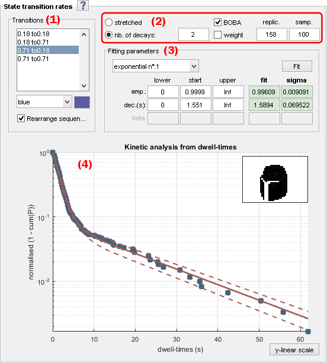
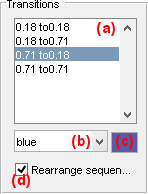
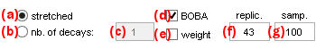
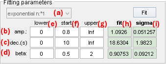
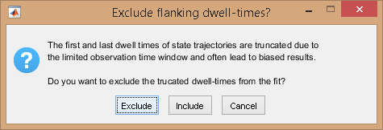
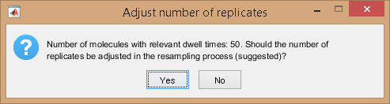
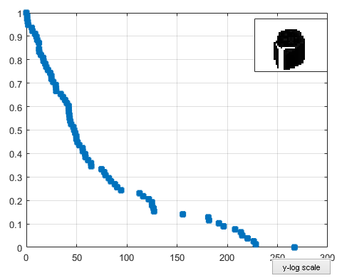
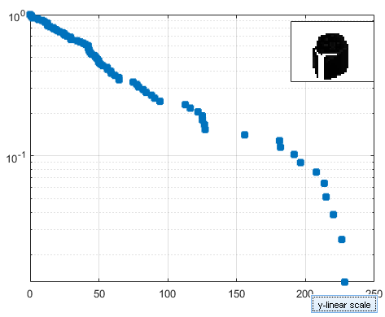
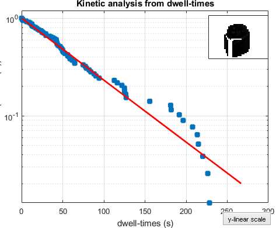
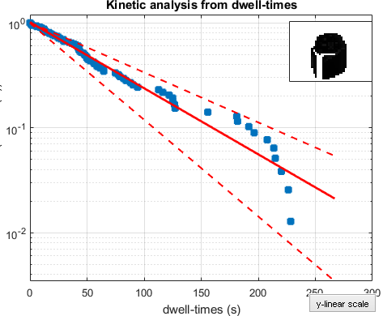

# State transition rates
{: .no_toc }

## Panel components
{: .no_toc .text-delta }

1. TOC
{:toc}

---

## Transition list

---

## Method settings

---

## Fitting parameters

---

## Visualization area

### Default
{: .no_toc }

### Simple fit
{: .no_toc }

### Bootstrap fit
{: .no_toc }

