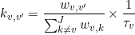

# State transition rates
{: .no_toc }

## Panel components
{: .no_toc .text-delta }

1. TOC
{:toc}

---

## Transition list

Use this list to select transition clusters for dwell time analysis.

Transition clusters are listed in **(a)** and entitled as `XXX to YYY` with `XXX` and `YYY` the inferred states before and after transition respectively.
The color representing the selected cluster in the 
[TDP plot](panel-state-configuration.html#clusters) is displayed in **(c)** and can be modified by choosing a new color in list **(b)**.

Selection of a new cluster in list **(a)** will update the 
[Visualization area](#visualization-area) with the corresponding dwell time histogram and fitting results if any.

---

## Method settings

Defines the method to obtain state transition rates.

State transition rates are obtain by fitting the cumulative dwell time histogram with an exponential function as described in the corresponding section of 
[Transition analysis Workflow](../worklow.html#estimate-state-transition-rates-and-associated-cross-sample-variability).

Dwell time histograms can be fitted with three type of exponential functions:
* simple exponential, by activating the option in **(b)** and set **(c)** to 1
* sum of exponential, by activating the option in **(b)** and set the number of decays in **(c)**
* stretched exponential decay, by activating the option in **(a)**

Additionally, the cross-sample variability of state transition rates can be estimated with the BOBA-FRET method by activating the option in **(d)**.
In that case, the number of replicates to build a bootstrap histogram sample must be set in **(f)** and the number of bootstrap samples in **(g)**.
By default, the number of replicates is set to the number of molecules included in the selected transition cluster.

In order to not over-represent state trajectories with few transitions in the bootstrap histograms, replicates can be given a weight proportional to the number of transitions in the state trajectories.
This is done by activating the option in **(e)**.

---

## Fitting parameters

Defines fitting parameters and display fitting results.

Function parameters described in 
[Transition analysis Workflow](../worklow.html#estimate-state-transition-rates-and-associated-cross-sample-variability) must be defined in **(b-g)** prior fitting, in terms of starting guesses and boundaries, for each exponential function selected in list **(a)**.
To ease the estimation of parameter 
[*k**j*,*j'*](){: .math_var } from the dwell time histogram, the inverse 
[*t**j*,*j'*](){: .math_var } is used such as:

{: .equation }

Parameters 
[*a**z*](){: .math_var },
[*t**j*,*j'*](){: .math_var } and 
[*&#946;**j*,*j'*](){: .math_var } must be respectively set in rows **(b)**, **(c)** and **(d)**, with the staring guess in column **(e)**, the lower bound in column **(f)** and higher bound in column **(g)**.

After setting parameters, exponential fit can be started by pressing 
. 

The first and last dwell times in state trajectories are not reliable as they are truncated by the limited observation time.
This experimental bias can be corrected by excluding these particular dwell times them from the fit.

In the case where 
[Method settings](#method-settings) include BOBA-FRET and the number of replicates is different from the number of state trajectories containing the selected transitions, the numebr of replicate can be readjusted to the number of trajectories prior performing histogram bootstrapping and subsequent exponential fit.

After completion, fitting results for the exponential function selected in list **(a)** are displayed in column **(h)**.
When using BOBA-FRET, the bootstrap mean and standard deviation of fitting parameters are respectively displayed in column **(h)** and **(i)**.

---

## Visualization area

The axes display the cumulative dwell time histogram with fitting results depending on the 
[Method settings](#method-settings) and the stage the transition analysis is at.

Any graphics in MASH can be exported to an image file by right-clicking on the axes and selecting `Export graph`.

### Default
{: .no_toc }

Just after clustering and providing that the cluster selected in the
[Transition list](#transition-list) is not empty, the corresponding cumulative and complementary dwell time histogram is plotted with blue solid markers.

To identify potential multiple decays, the dwell time histogram can be visualize on a semi-log scale by pressing 
.

### Simple fit
{: .no_toc }

After performing exponential fitting, the resulting fit function is plotter over the histogram as a solid red line.

When the 
[Method settings](#method-settings) include the use of BOBA-FRET, the exponential function built with bootstrap means of the fitting parameters is plotted as a red solid line.
The exponential fit functions giving the lowest and highest transition rates are plotted in dotted lines. 
This gives an visual estimation of the cross-sample variability of state transition rates.

