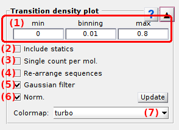
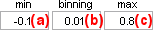
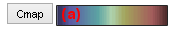
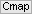

# Transition density plot
{: .no_toc }

Transition density plot (TDP) is the first panel of module Transition analysis.

Use this panel to select data and build the TDP.

## Panel components
{: .no_toc .text-delta }

1. TOC
{:toc}

---

## Data list

Use this list to select the data to be analyzed in Transition analysis.

Supported data are:

* intensity state trajectories 
* FRET state trajectories (`FRET`)
* stoichiometry state trajectories (`S`)

---

## Molecule subgroup list

Use this list to select the molecule subgroup to be analyzed in Transition analysis.

Molecule subgroups are defined by the molecule tags that are created and assigned to molecules in module 
[Trace processing](../../trace-processing.html) exclusively.

Molecule tags are created in 
[Molecule selection](../../trace-processing/functionalities/tm-overview.html#molecule-selection) and can be assigned to individual molecules in 
[Molecule selection](../../trace-processing/functionalities/tm-overview.html#molecule-selection) or in 
[Molecule status](../../trace-processing/panels/panel-sample-management.html#molecule-status).

Molecule tags can also be assigned to groups of molecules defined by specific data ranges with 
[Automatic sorting](../../trace-processing/functionalities/tm-automatic-sorting.html#tm-menu).

---

## Bounds and bin size

Use this interface to define TDP limits and sorting intervals.

TDP limits define the range of data used in the analysis, and the bin size defines the intervals used to sort data in the transition density plot (TDP).

Limits and bin sizes are identical for the x- and y-axis.
The lower limit is set in **(a)**, the bin size in **(b)** and the higher limit in **(c)**.

For more information about the influence of limits and bin size on the analysis, please refer to 
[Build transition density plot](../workflow.html#build-transition-density-plot) in Transition analysis workflow.

<u>default</u>: For ratio data, default limits are set to [-0.2;1.2] and the bin size to 0.01

---

## Include last states

Activate this option to make last states on sequences, and thus static state sequences, visible in the TDP.

In the TDP, only state transitions are represented as a 2D-point with coordinates (state1,state2) with state1 being the state prior transition and state2, after transition. 
State sequences made of only one state (or static) can not be represented in the TDP with the regular coordinate system and are therefore excluded from the TDP and dwell time histograms.

Including statics allows to represent one-state sequences in the TDP by positioning them on the diagonal (stae1=state2).
This positioning is performed for every state which following state is unknown (last states of sequences).

To work with state transitions only, and thus, exclude static state sequences, deactivate this option.

For more information about including static state sequences, please refer to 
[Build transition density plot](../workflow.html#build-transition-density-plot) in Transition analysis workflow.

**Note:** *Including statics has an effect on transition densities used in clustering and on the dwell time histogram of clusters including these "transitions"* in
[State transition rates](panel-state-transition-rates.html).

---

## Re-arrange state sequences

Activate this option to re-build state sequences only with states visible the TDP.

In the regular building process, states that lay out-of-TDP-range are ignored from the state sequences creating time gaps. 

Sequence re-arrangement allows to fill these time gaps by prolonging the duration of states preceding the outliers in the sequence.
If no state is preceding the outliers, the duration of the following states in the sequence is prolonged.

To work with initial state durations, and thus, with time-gapped state sequences, deactivate this option.

For more information about sequence re-arrangement, please refer to 
[Build transition density plot](../workflow.html#build-transition-density-plot) in Transition analysis workflow.

**Note:** *Sequence re-arrangement has an effect on transition densities used in clustering and dwell time histograms in *
[State transition rates](panel-state-transition-rates.html).

---

## Transition count

Activate this option to build the TDP with single transition counts per trajectory.

Single transition count allows to scale equally the most and least occurring transitions in the TDP.

To build the TDP with absolute transition counts and obtain the genuine transition probability distribution, deactivate this option.

For more information about the two types of transition counting, please refer to 
[Build transition density plot](../workflow.html#build-transition-density-plot) in Transition analysis workflow.

**Note:** *Transition counts in the TDP are used only for clustering and have no effect on the dwell time histograms used in *
[State transition rates](panel-state-transition-rates.html).

---

## Gaussian filter

Activate this option to convolute the TDP with a 2-D Gaussian.

Gaussian convolution eases the identification of transition clusters for 
[State configuration](panel-state-configuration.html) analysis.

Deactivate this option to use the genuine transition probability distribution for clustering.

**Note:** *Gaussian-convoluted counts in the TDP are used only for clustering and have no effect on the dwell time histograms used in 
[State transition rates](panel-state-transition-rates.html).*

---

## Normalized probability

Activate this option to display the TDP in normalized counts.

In this case, counts are normalized by the sum for display only, and are color-coded as shown in the color bar located on the right-hand side of the 
[Visualization area](panel-state-configuration.html#visualization-area).

---

## Update TDP

Press 
 to build the TDP new, using options set in 
[Bounds and bin size](#bounds-and-bin-size), 
[Transition count](#transition-count),
[Re-arange sequences](#re-arrange-sequences) and 
[Gaussian filter](#gaussian-filter).

For more information about how TDPs are built, please refer to 
[Build transition density plot](../workflow.html#build-transition-density-plot) in Transitions analysis workflow.

---

## Color map

Use this interface to define the color scale used in the 
[Visualization area](panel-state-configuration.html#visualization-area).

Press 
 to open MATLAB's colormap editor in order to edit the color scale. 

For more information about the colormap editor, please refer to 
[MATLAB's documentation](https://www.mathworks.com/help/matlab/ref/colormapeditor.html).
