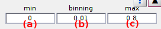

# Transition density plot
{: .no_toc }

Transition density plot (TDP) is the first panel of module Transition analysis.

Use this panel to select data and build the TDP.

## Panel components
{: .no_toc .text-delta }

1. TOC
{:toc}

---

## Data list

Use this list to select the data to be analyzed in Transition analysis.

Supported data are:

* intensity state trajectories 
* FRET state trajectories (`FRET`)
* stoichiometry state trajectories (`S`)

---

## Bounds and bin size

Use this interface to define TDP limits and sorting intervals.

TDP limits define the range of data used in the analysis and the bin size, the intervals used to sort data in the transition density plot (TDP).

The lower x- and y-limits are respectively set in **(a)** and **(d)**, the higher limits in **(c)** and **(f)** and the x- and y- bin sizes in **(b)** and **(e)**.

For more information about the influence of limits and bin size on the analysis, please refer to 
[Build transition density plot](../workflow.html#build-transition-density-plot) in Transition analysis workflow.

<u>default</u>: For ratio data, default x- and y-limits are set to [-0.2;1.2] and the bin size to 0.01

---

## Transition count

Activate this option to build the TDP with single transition counts per trajectory.

Single transition count allows to scale equally the most and least occurring transitions in the TDP.

To build the TDP with absolute transition counts and obtain the genuine transition probability distribution, deactivate this option.

For more information about the two types of transition counting, please refer to 
[Build transition density plot](../workflow.html#build-transition-density-plot) in Transition analysis workflow.

**Note:** *Transition counts in the TDP are used only for clustering and have no effect on the dwell time histograms used in 
[State transition rates](panel-state-transition-rates.html).*

---

## Gaussian filter

Activate this option to convolute the TDP with a 2-D Gaussian.

Gaussian convolution eases the identification of transition clusters for 
[State configuration](panel-state-configuration.html) analysis.

Deactivate this option to use the genuine transition probability distribution for clustering.

**Note:** *Gaussian-convoluted counts in the TDP are used only for clustering and have no effect on the dwell time histograms used in 
[State transition rates](panel-state-transition-rates.html).*

---

## Normalized probability

Activate this option to display the TDP in normalized counts.

In this case, counts are normalized by the sum for display only, and are color-coded as shown in the color bar located on the right-hand side of the 
[Visualization area](panel-state-configuration.html#visualization-area).

---

## Update TDP

Press 
 to build the TDP new, using options set in 
[Bounds and bin size](#bounds-and-bin-size), 
[Transition count](#transition-count) and 
[Gaussian filter](#gaussian-filter).

Setting bounds to the TDP induces the exclusion of out-of-ranges states from the building process. 
To later work with state trajectories conformed to the TDP limits, state trajectories can be readjusted by suppressing these outliers and linking the neighbouring states together.
This will have an effect on the dwell time distributions used in 
[State transition rates](panel-state-transition-rates.html).

For more information about how TDPs are built, please refer to 
[Build transition density plot](../workflow.html#build-transition-density-plot) in Transitions analysis workflow.

---

## Color map

Use this interface to define the color scale used in the 
[Visualization area](panel-state-configuration.html#visualization-area).

Press 
 to open MATLAB's colormap editor in order to edit the color scale. 

For more information about the colormap editor, please refer to 
[MATLAB's documentation](https://www.mathworks.com/help/matlab/ref/colormapeditor.html).
