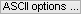
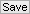
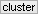
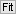
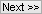

# Transition analysis workflow
{: .no_toc }

In this section you will learn how to determine the most sufficient state configuration from state transitions, obtain state transition rates and estimate the associated variability in the molecule sample. 
Transition analysis results are saved in the 
[mash project](../output-files/mash-mash-project.html) and/or exported to ASCII files for traceability.

The procedure include four steps:

1. TOC
{:toc}

---

## Import single molecule data

Single molecule data can be imported from a 
[.mash file](../output-files/mash-mash-project.html), ideally processed in module Trace processing, or from a set of traces written in ASCII files; see 
[Remarks](#remarks) for more details about ASCII import.
If data are imported from ASCII files, MASH must be informed about the particular file structure. 
In that case, it is recommended to export the imported data set to a new 
[.mash file](../output-files/mash-mash-project.html) in order to save analysis results and allow further review.

After successful import, the list of data available in the project (*e.g.*, intensities, FRET or stoichiometry) is updated in 
, and the transition density plot of the first data in the list (usually first channel intensities upon first illumination) is displayed in the 
[Visualization area](panels/area-visualization.html) providing that state trajectories exist in the project; see 
[Determine state trajectories](../trace-processing/workflow.html#determine-state-trajectories) for more information about how to obtain state trajectories.

To import single molecule data:

{: .procedure }
1. Add the project to the list by pressing 
    and selecting the corresponding 
   [.mash file](../output-files/mash-mash-project.html)  

To import single molecule data from a ASCII files:

{: .procedure }
1. Set the import settings by pressing 
   ; see 
   [Set project import options](../trace-processing/functionalities/set-project-import-options.html) for help  
     
1. Import data by pressing 
    and selecting the corresponding ASCII files; this will add a new project to the project list  
     
1. Save the new project to a 
   [.mash file](../output-files/mash-mash-project.html) by pressing 
   .

   
---

## Build transition density plot

In a transition density plot (TDP), a transition from a state 
[*val**i*](){: .math_var } to a state 
[*val**i'*](){: .math_var } is represented as a point with coordinates 
( [*val**i*](){: .math_var };[*val**i'*](){: .math_var } ). 
To build a TDP, states in state trajectories are first limited to specific boundaries and transitions 
( [*val**i*](){: .math_var };[*val**i'*](){: .math_var } ) are then sorted into bins of specific size.
Ideally, transitions involving similar states assemble into clusters in the TDP: the identification of these clusters, *e. g.* by clustering algorithms, is crucial to determine the overall state configuration.

The regular way of sorting transitions into bins, *i.e.*, counting transition absolute occurrences, will systematically favour state transitions that occur the most in trajectories at the expense of rarely occurring state transitions.
For instance, rapid interconversion of two states will appear as intense clusters whereas irreversible state transitions might be barely visible.
One way of scaling equally the two type of clusters is to assign one transition count per trajectory, regardless the amount of times it occurs in the trajectory.

**[*scheme: effect of single count per molecule on rarely occurring state transitions in TDP*]**

The bin size has a substantial influence on the cluster shapes: large bins will increase the overlap between neighbouring clusters until the extreme case where all clusters are merged in one, whereas short bins will spread out the clusters until the extreme case where no cluster is distinguishable.
TDP boundaries are important to exclude out-of range states that would bias the determination of state configuration.
Therefore, data-specific TDP limits and bin size have to be carefully chosen in order to make transition clusters visible and sufficiently separated.

**[*scheme: effect of bin size on TDP*]**

Transition clusters are easier identified by eyes and by clustering algorithms if a Gaussian filter is applied to the TDP.
This has for effect to smooth the cluster's edges and to enhance the Gaussian shape of their 2D-profile.

**[*scheme: effect of Gaussian filter on TDP*]**

To build the TDP:

{: .procedure }
1. Select a data type in the 
   [Data list](panels/panel-transition-density-plot.html#data-list)
     
1. Set parameters:
     
   [Bounds and bin size](panels/panel-transition-density-plot.html#bounds-and-bin-size)  
   [Transition count](panels/panel-transition-density-plot.html#transition-count)  
   [Gaussian filter](panels/panel-transition-density-plot.html#gaussian-filter)  
     
1. Update the TDP and display by pressing 
   .

---

## Determine the most sufficient state configuration

Identifying the most probable configuration of clusters is equivalent to identifying the most probable state configuration.
The TDP can be partitioned into a maximum of 
[*J*( *J*-1 )](){: .math_var } clusters, with 
[*J*](){: .math_var } the number of states.
In MASH, the TDP is partitioned into 
[*J*2](){: .math_var } clusters to group the transitions close to the diagonal together, i. e., very small state jumps, and exclude them from real transition clusters to not bias the resulting dwell-time histograms.

In the case of well-separated transition clusters, it is easy to determine 
[*J*](){: .math_var } by eye, where a simple partition algorithm, like k-mean, can be used.
But when clusters overlap to great extend, they can't be accurately identified.

**[*scheme of well-separated and overlapping clusters*]**

One way of objectively identifying the number of clusters is to model the TDP by a sum of 
[*J*2](){: .math_var } 2D-Gaussians, with each Gaussian modelling a cluster, such as:

{: .equation }
TDP( *val**i*;*val**i'* ) = &#931;1&#8805;*j*&#8805;*J*2{ &#931;1&#8805;*j*&#8805;*J*2[ *a**j*,*j'*G*j*,*j'*( *val**i*,*val**i'* ) ] }

with 
[*a**j*,*j'*](){: .math_var } the weight in the sum of the Gaussian 
[G*j*,*j'*](){: .math_var } with bi-dimensional mean 
[&#956;*j*,*j'*](){: .math_var } that contains information about inferred states 
( [*val**j*](){: .math_var };[*val**j'*](){: .math_var } ), and covariance 
[*&#931;**j*,*j'*](){: .math_var } that contains information about cluster's shape.

The Gaussian mixtures that describe the data the best for different 
[*J*](){: .math_var } are inferred and compared to each other.
As the model likelihood fundamentally increases with the number of components, inferred models are compared via the Bayesian information criterion (BIC), with the most sufficient cluster model having the lowest BIC.

The inferred model is a single estimate and carry no information about how much the configuration varies from molecule to molecule.
The clustering procedure can be combined with TDP bootstrapping in order to estimate the cross-sample variability of the most sufficient number of states 
[*J*](){: .math_var }, giving the bootstrap mean 
[*&#956;**J*](){: .math_var } and bootstrap standard deviation
[*&#963;**J*](){: .math_var } for the given sample.

To determine the most sufficient state configuration:

{: .procedure }
1. If not already done, select a data type in the 
   [Data list](panels/panel-transition-density-plot.html#data-list)  
     
1. Set parameters:  
     
   [Method settings](panels/panel-state-configuration.html#method-settings)  
   [Cluster settings](panels/panel-state-configuration.html#cluster-settings)  
     
1. Start inference of state configurations by pressing 
   ; after completion, the display is instantly updated with the most sufficient Gaussian mixture

---

## Estimate state transition rates and associated cross-sample variability

Rate coefficients 
[*k**j*,*j'*](){: .math_var} of transitions from state 
[*j*](){: .math_var} to state 
[*j'*](){: .math_var} is associated to the probability for the molecule to dwell in state 
[*j*](){: .math_var } prior transiting to state 
[*j'*](){: .math_var }.
It can be determined from the cumulative histogram of dwell times 
[&#916;*t**j*,*j'*](){: .math_var } in state 
[*j*](){: .math_var } prior transiting to state 
[*j'*](){: .math_var }, by fitting an exponential decay function such as:

{: .equation }
1- *F*( &#916;*t**j*,*j'* ) = exp( - *k**j*,*j'*&#916;*t**j*,*j'* )

with 
[*F*( &#916;*t**j*,*j'* )](){: .math_var } the cumulative histogram normalized between 0 and 1.

For heterogeneous system, the dwell time histogram is not sufficiently described by a single exponential decay and must be described either by the sum of 
[*Z*](){: .math_var } exponential functions weighted by the respective 
[*a**z*](){: .math_var } coefficients, such as:

{: .equation }
1- *F*( &#916;*t**j*,*j'* ) = &#931;1&#8805;*z*&#8805;*Z*[ *a**z*exp( - *k**j*,*j'*,*z*&#916;*t**j*,*j'* ) ]

or by a stretched exponential function, such as:

{: .equation }
1- *F*( &#916;*t**j*,*j'* ) = exp[ - ( *k**j*,*j'*&#916;*t**j*,*j'* )*&#946;**j*,*j'* ]

with the stretching exponent 
[*&#946;**j*,*j'*](){: .math_var } being an indicator of the degree of heterogeneity 
([*&#946;*](){: .math_var } = 0.5 indicates a bi-exponential decay function).

After fitting, only single estimates of rate coefficients are obtained.
One way to estimate the variability of fitting parameters across the sample is to use the bootstrap-based analysis called BOBA-FRET.
BOBA-FRET applies to all fit functions, and infers the bootstrap means and bootstrap standard deviations of all fitting parameters for the given sample, including 
[*&#956;**k*,*j*,*j'*](){: .math_var } and 
[*&#963;**k*,*j*,*j'*](){: .math_var }, the mean and standard deviation for transition rate coefficients.

To determine the transition rate coefficients:

{: .procedure }
1. Select the state transition in the 
   [Transition list](panels/panel-state-transition-rates.html#transition-list)  
     
1. Set parameters:  
     
   [Method settings](panels/panel-state-transition-rates.html#method-settings)  
   [Fitting parameters](panels/panel-state-transition-rates.html#method-settings)  
     
1. Start exponential fit by pressing 
   ; after completion, the display is instantly updated with fitting results

---

## Export data

Project modifications must be saved in order to keep traceability and access to the results.
Additionally, TDP, dwell time histograms, analysis results and analysis parameters can be exported to ASCII files and PNG images.

To save project modifications:

{: .procedure }
1. Select the data to export in the 
   [Data list](panels/panel-transition-density-plot.html#data-list)  
     
1. Save modifications to the 
   [.mash file](../output-files/mash-mash-project.html) by pressing 
    and overwriting existing file.  

To export data to files:

{: .procedure }
1. Open export options by pressing 
    and set the options as desired; please refer to 
   [Set export options](functionalities/set-export-options.html) for help.
     
1. Press 
    to start writing processed molecule data in files. 

---

## Remarks

For the moment only FRET state trajectories can be imported.
Additionally, imported state trajectories are only available in module Histogram analysis and Transition analysis: if the project is loaded and saved in module Trace processing, state trajectories will be overwritten by newly calculated ones. 
This compatibility problem will be managed in the future.
