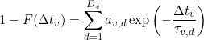

# Workflow
{: .no_toc }

In this section you will learn how to determine the most sufficient state configuration from state trajectories, to obtain state transition rates and to estimate the associated cross-sample variability. 

Transition analysis results are saved in the 
[mash project](../output-files/mash-mash-project.html) and/or exported to ASCII files for traceability.

The procedure include five steps:

1. TOC
{:toc}

---

## Import single molecule data

Single molecule data can be imported from a 
[.mash file](../output-files/mash-mash-project.html), which ideally contains state trajectories obtained in module Trace processing, or from a set of traces written in ASCII files; see 
[Remarks](#remarks) for more details about ASCII import.

If data are imported from ASCII files, MASH must be informed about the particular file structure. 
In that case, it is recommended to export the imported data set to a new 
[.mash file](../output-files/mash-mash-project.html) in order to save analysis results and allow further review.

After successful import, the list of available data in the project (*e.g.*, intensities, FRET or stoichiometry) is shown in the 
[Data list](panels/panel-transition-density-plot.html#data-list), and the transition density plot is displayed in the 
[Visualization area](panels/area-visualization.html) for the first data in the list - intensities collected in the left-most video channel upon first laser illumination - providing that the corresponding state trajectories exist in the project; see 
[Determine state trajectories](../trace-processing/workflow.html#determine-state-trajectories) for more information about how to obtain state trajectories.

To import single molecule data:

{: .procedure }
1. Add the project to the list by pressing 
    and selecting the corresponding 
   [.mash file](../output-files/mash-mash-project.html)  

To import single molecule data from ASCII files:

{: .procedure }
1. Set the import settings by pressing 
   ; see 
   [Set project import options](../trace-processing/functionalities/set-project-import-options.html) for help  
     
1. Import data by pressing 
    and selecting the corresponding ASCII files; this will add a new project to the project list  
     
1. Save the new project to a 
   [.mash file](../output-files/mash-mash-project.html) by pressing 
   .

   
---

## Build transition density plot

In a transition density plot (TDP), a transition from a state 
[*i*](){: .math_var } associated with the value 
[*val**i*](){: .math_var } to a state 
[*i*](){: .math_var } associated with the value
[*val**i'*](){: .math_var } is represented as a point with coordinates 
( [*val**i*](){: .math_var };[*val**i'*](){: .math_var } ). 

To build a TDP, state values 
[*val**i*](){: .math_var } in trajectories are first limited to specific boundaries, and then, transitions 
( [*val**i*](){: .math_var };[*val**i'*](){: .math_var } ) are sorted into bins of specific size.

Ideally, transitions involving similar states assemble into clusters in the TDP: the identification of these clusters, *e. g.* by clustering algorithms, is crucial to determine the overall state configuration.

The bin size has a substantial influence on the cluster shapes: large bins will increase the overlap between neighbouring clusters until the extreme case where all clusters are merged in one, whereas short bins will spread out the clusters until the extreme case where no cluster is distinguishable.

TDP boundaries are important as they define the range of data considered for analysis.
Large data ranges can include outliers that would bias the state analysis and narrow ranges can exclude relevant contribution for state transition rate analysis.

When setting bounds to the TDP, the states laying out-of-TDP-ranges are ignored from the building process. 
To later work with state trajectories and dwell times consistent with what is seen in the TDP, state trajectories can be re-arranged by suppressing these outliers and linking the neighbouring states together.

TDP limits and bin size have to be carefully chosen in order to make transition clusters visible and sufficiently separated.

The regular way of sorting transitions into bins, *i.e.*, summing up transition counts, will systematically favour state transitions that occur the most in trajectories at the expense of rarely occurring state transitions.
For instance, rapid interconversion of two states will appear as intense clusters whereas irreversible state transitions might be barely visible.

One way of scaling equally the two type of clusters is to assign a single transition count per trajectory, regardless the amount of times it occurs in the trajectory.
In this case, the resulting TDP maps the state configurations of single molecules and exclude the contribution of state kinetics.

Transition clusters are easier identified by eyes and by clustering algorithms if a Gaussian filter is applied to the TDP.
This has for effect to smooth the cluster's edges and to enhance the Gaussian shape of their 2D-profile.

As the TDP is built out of *state1*-to-*state2* transitions, static state sequences are naturally not represented and the corresponding state might therefore be omitted in the final cluster configuration.

Static state sequences, and more generally last states of each sequence, can be represented as a *state1*-to-*state1* "transition", *i.e*, on the *state1*=*state2* diagonal of the TDP, and thus participate to TDP clustering.

To build the TDP:

{: .procedure }
1. Select a data type in the 
   [Data list](panels/panel-transition-density-plot.html#data-list)
     
1. Select a data type in the 
   [Molecule subgroup list](panels/panel-transition-density-plot.html#molecule-subgroup-list)
     
1. Set parameters:
     
   [Bounds and bin size](panels/panel-transition-density-plot.html#bounds-and-bin-size)  
   [Transition count](panels/panel-transition-density-plot.html#transition-count)  
   [Re-arrange sequences](panels/panel-transition-density-plot.html#re-arrange-sequences)  
   [Gaussian filter](panels/panel-transition-density-plot.html#gaussian-filter)  
   [Include last states](panels/panel-transition-density-plot.html#include-last-states)  
     
1. Update the TDP and display by pressing 
   .

---

## Determine the most sufficient state configuration

Identifying the most probable configuration of clusters is equivalent to identifying the most probable state configuration.

Ideally, the TDP can be partitioned into a <u>cluster matrix</u> with 
[*K* = *J*2](){: .math_var } clusters, with 
[*J*](){: .math_var } the number of states. 
The transitions close to the diagonal, *i. e.*, the small-amplitude state jumps rising from noise discretization, are grouped together with on-diagonal one-state sequences in diagonal clusters to prevent the participation of noise-induced transitions to dwell-time histograms and leave the resulting transition rate coefficients unbiased.

However, modelling the TDP with a matrix of clusters presumes that all possible transitions between all states occur, which is usually not the case. 
Although the majority of TDPs do not resemble a cluster matrix, they do share a common feature which is the <u>symmetry of clusters</u> relative to their diagonal. 
In this case, one TDP can be modelled with 
[*K* = 2*J*](){: .math_var } clusters, with 
[*J*](){: .math_var } the number of clusters on one side of the TDP diagonal.

Cluster symmetry becomes broken only when irreversible state transitions are present, which is a rare case in structural dynamic studies. 
For this particular cluster configuration, the TDP is modelled with 
[*K* = *J*](){: .math_var } <u>clusters free of constraint</u>, with 
[*J*](){: .math_var } the total number of clusters.

The number 
[*J*](){: .math_var } is here called the model complexity and depends on the type of constraint applied to the cluster configuration. 
An example for [*J*](){: .math_var } = 4 and for each cluster configuration is given below:

In the case of well-separated transition clusters, 
[*K*](){: .math_var } is easily determined by eye, where a simple partition algorithm, like k-mean or manual clustering, can be used to cluster data.
However, overlapping clusters can't be accurately distinguished and need a more elaborated method.

One way of objectively identifying the number of overlapping clusters is to model the TDP by a sum of 
[*K*](){: .math_var } 2D-Gaussians, with each Gaussian modelling a cluster, such as:

{: .equation }

with 
[*a**k*](){: .math_var } the weight in the sum of the Gaussian 
[G*k*](){: .math_var } with bi-dimensional mean 
[&#956;*k*](){: .math_var } that contains information about inferred states 
( [*val**j*](){: .math_var };[*val**j'*](){: .math_var } ), and covariance 
[*&#931;**k*](){: .math_var } that contains information about cluster's shape.

Gaussian mixtures with increasing 
[*J*](){: .math_var } are fit to the TDP.
For each 
[*J*](){: .math_var }, the models that gives the best description of the data, *i. e.*, that gives the highest likelihood, are compared to each other.

As the model likelihood fundamentally increases with the number of components, inferred models are compared via the Bayesian information criterion (BIC), with the most sufficient cluster model having the lowest BIC.

The outcome of such analysis is a single estimate of the most sufficient model, meaning that it carries no information about variability of the model across the sample.

To estimate the cross-sample variability of the most sufficient model complexity 
[*J*](){: .math_var }, the clustering procedure can be combined with TDP bootstrapping, giving the bootstrap mean 
[*&#956;**J*](){: .math_var } and bootstrap standard deviation
[*&#963;**J*](){: .math_var } for the given sample.
This method is similar to the bootstrap-based analysis applied to histograms and called BOBA-FRET.

To determine the most sufficient state configuration:

{: .procedure }
1. If not already done, select a data type in the 
   [Data list](panels/panel-transition-density-plot.html#data-list)  
     
1. Set parameters:  
     
   [Method settings](panels/panel-state-configuration.html#method-settings)  
   [Clusters](panels/panel-state-configuration.html#clusters)  
     
1. Start inference of state configurations by pressing 
   ; after completion, the display is instantly updated with the most sufficient Gaussian mixture

---

## Estimate state transition rates and associated cross-sample variability

Rate coefficients 
[*k**j*,*j'*](){: .math_var} are similar to rates involved in a chemical equilibrium, where two states 
[*j*](){: .math_var } and 
[*j'*](){: .math_var } are in equilibrium.
Rates [*k**j*,*j'*](){: .math_var} are associated to the probability or speed (in second-1) of transformation of a molecule in state 
[*j*](){: .math_var } into a state 
[*j'*](){: .math_var }.

They can be determined from the cumulative histogram of dwell times 
[&#916;*t**j*,*j'*](){: .math_var } in state 
[*j*](){: .math_var } prior transiting to state 
[*j'*](){: .math_var } by fitting an exponential decay function such as:

{: .equation }

with 
[*F*( &#916;*t**j*,*j'* )](){: .math_var } the cumulative histogram normalized between 0 and 1 and 
[*k**j*,*j'*](){: .math_var} in second-1.

For heterogeneous systems, the dwell time histogram is not sufficiently described by a single exponential decay and must be described either by the sum of 
[*Z*](){: .math_var } exponential functions weighted by the respective 
[*a**z*](){: .math_var } coefficients, such as:

{: .equation }

or by a stretched exponential function, such as:

{: .equation }

with the stretching exponent 
[*&#946;**j*,*j'*](){: .math_var } being an indicator of the degree of heterogeneity 
([*&#946;*](){: .math_var } = 0.5 indicates a bi-exponential decay function).

The outcome of such analysis are single estimates of the transition rate coefficients.
One way to estimate the variability of fitting parameters across the sample is to use the bootstrap-based analysis called BOBA-FRET.
BOBA-FRET applies to all fit functions, and infers the bootstrap means and bootstrap standard deviations of all fitting parameters for the given sample, including 
[*&#956;**j*,*j'*](){: .math_var } and 
[*&#963;**j*,*j'*](){: .math_var }, the mean and standard deviation for transition rate coefficients.

To determine the transition rate coefficients:

{: .procedure }
1. Select the state transition in the 
   [Transitions](panels/panel-state-transition-rates.html#transitions)  
     
1. Set parameters:  
     
   [Method settings](panels/panel-state-transition-rates.html#method-settings)  
   [Fitting parameters](panels/panel-state-transition-rates.html#method-settings)  
     
1. Start exponential fit by pressing 
   ; after completion, the display is instantly updated with fitting results

---

## Export data

Project modifications must be saved in order to keep traceability and access to the results.
Additionally, TDP, dwell time histograms, analysis results and analysis parameters can be exported to ASCII files and PNG images.

To save project modifications:

{: .procedure }
1. Save modifications to the 
   [.mash file](../output-files/mash-mash-project.html) by pressing 
    and overwriting existing file.  

To export data to files:

{: .procedure }
1. Select the data to export in the 
   [Data list](panels/panel-transition-density-plot.html#data-list)  
     
1. Select the molecule subgroup to export in the 
   [Molecule subgroup list](panels/panel-transition-density-plot.html#molecule-subgroup-list)  
     
1. Open export options by pressing 
    and set the options as desired; please refer to 
   [Set export options](functionalities/set-export-options.html) for help.
     
1. Press 
    to start writing processed molecule data in files. 

---

## Remarks
{: .no_toc }

For the moment only FRET state trajectories can be imported.
Additionally, imported state trajectories are only available in module Histogram analysis and Transition analysis: if the project is loaded and saved in module Trace processing, state trajectories will be overwritten by newly calculated ones. 
This compatibility problem will be managed in the future.
