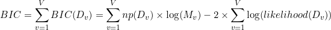
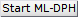
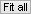
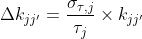

# Workflow
{: .no_toc }

In this section you will learn how to determine the most sufficient state configuration from state trajectories, to obtain state transition rates and to estimate the associated cross-sample variability. 

The procedure include five steps:

1. TOC
{:toc}

---

## Import state sequences

Initial state sequences come from 
[Trace processing](../trace-processing.html)'s output or from external ASCII files.

In the first case, you can skip this step and go directly to the next one.

In the second case, a new trajectory-based project must be created. 
This implies to import the trajectory files, register the associated experiment settings and define the data structure in the files.
After the project creation is completed, it is recommended to save it to a 
[.mash file](../output-files/mash-mash-project.html) that should regularly be overwritten in order to keep traceability and access to the results.

Informing MASH about the particular experiment settings is crucial to adapt the software functionalities to your own experiment setup.
In theory, the software is compatible with:

* an unlimited number of video channels,
* an unlimited number of alternated lasers,
* FRET calculations for an unlimited number of FRET pairs.

To create a new trajectory-based project:

{: .procedure }
1. Open the experiment settings window by pressing 
    in the 
   [project management area](../Getting_started#project-management-area) and selecting `import trajectories`.  
     
1. Import a set of trajectory files and define your experiment setup by configuring tabs:  
     
   [Import](../tutorials/set-experiment-settings/import-trajectories.html#import)  
   [Channels](../tutorials/set-experiment-settings/import-trajectories.html#channels)  
   [Lasers](../tutorials/set-experiment-settings/import-trajectories.html#lasers)  
   [Calculations](../tutorials/set-experiment-settings/import-trajectories.html#calculations)  
   [Divers](../tutorials/set-experiment-settings/import-trajectories.html#divers)  
     
   If necessary, modify settings in 
   [Calculations](../tutorials/set-experiment-settings/import-trajectories.html#calculations) and 
   [Divers](../tutorials/set-experiment-settings/import-trajectories.html#divers) any time after project creation.  
     
1. Define how data are structured in the files by configuring tab 
   [File structure](../tutorials/set-experiment-settings/import-trajectories.html#file-structure); in particular, activate and configure the import of 
   [FRET state sequences](/tutorials/set-experiment-settings/import-trajectories.html#fret-state-sequence-data).  
     
1. Finalize the creation of your project by pressing 
   ; the experiment settings window now closes and the interface switches to module Transition analysis.  
     
1. Save modifications to a 
   [.mash file](../output-files/mash-mash-project.html) by pressing 
    in the 
   [project management area](../Getting_started#project-management-area).

   
---

## Build transition density plot

In a transition density plot (TDP), a transition from a state 
[*i*](){: .math_var } associated with the value 
[*val**i*](){: .math_var } to a state 
[*i*](){: .math_var } associated with the value
[*val**i'*](){: .math_var } is represented as a point with coordinates 
( [*val**i*](){: .math_var };[*val**i'*](){: .math_var } ). 

To build a TDP, state values 
[*val**i*](){: .math_var } in trajectories are first limited to specific boundaries, and then, transitions 
( [*val**i*](){: .math_var };[*val**i'*](){: .math_var } ) are sorted into bins of specific size.

Ideally, transitions involving similar states assemble into clusters in the TDP: the identification of these clusters, *e. g.* by clustering algorithms, is crucial to determine the overall state configuration.

The bin size has a substantial influence on the cluster shapes: large bins will increase the overlap between neighbouring clusters until the extreme case where all clusters are merged in one, whereas short bins will spread out the clusters until the extreme case where no cluster is distinguishable.

TDP boundaries are important as they define the range of data considered for analysis.
Large data ranges can include outliers that would bias the state analysis and narrow ranges can exclude relevant contribution for state transition rate analysis.

When setting bounds to the TDP, the states laying out-of-TDP-ranges are ignored from the building process. 
To later work with state trajectories and dwell times consistent with what is seen in the TDP, state trajectories can be re-arranged by suppressing these outliers and linking the neighbouring states together.

TDP limits and bin size have to be carefully chosen in order to make transition clusters visible and sufficiently separated.

The regular way of sorting transitions into bins, *i.e.*, summing up transition counts, will systematically favour state transitions that occur the most in trajectories at the expense of rarely occurring state transitions.
For instance, rapid interconversion of two states will appear as intense clusters whereas irreversible state transitions might be barely visible.

One way of scaling equally the two type of clusters is to assign a single transition count per trajectory, regardless the amount of times it occurs in the trajectory.
In this case, the resulting TDP maps the state configurations of single molecules and exclude the contribution of state kinetics.

Transition clusters are easier identified by eyes and by clustering algorithms if a Gaussian filter is applied to the TDP.
This has for effect to smooth the cluster's edges and to enhance the Gaussian shape of their 2D-profile.

As the TDP is built out of *state1*-to-*state2* transitions, static state sequences are naturally not represented and the corresponding state might therefore be omitted in the final cluster configuration.

Static state sequences, and more generally last states of each sequence, can be represented as a *state1*-to-*state1* "transition", *i.e*, on the *state1*=*state2* diagonal of the TDP, and thus participate to TDP clustering.

To build the TDP:

{: .procedure }
1. Select the data and molecule subgroup to analyze in the 
   [Data list](components/area-data-selection.html#data-list) and 
   [Tag list](components/area-data-selection.html#tag-list), respectively  
     
1. Set parameters:
     
   [Bounds and bin size](components/panel-transition-density-plot.html#bounds-and-bin-size)  
   [Include static molecules](components/panel-transition-density-plot.html#include-static-molecules)  
   [Single count per molecule](components/panel-transition-density-plot.html#single-count-per-molecule)  
   [Re-arrange sequences](components/panel-transition-density-plot.html#re-arrange-sequences)  
   [Gaussian filter](components/panel-transition-density-plot.html#gaussian-filter)  
     
1. Update the TDP and display by pressing 
   .

---

## Determine the observable state configuration

Clustering transition densities is equivalent to identifying the most probable configuration of states having distinct observed values.

Ideally, the TDP can be partitioned into a <u>cluster matrix</u> made of 
[*K* = *V*2](){: .math_var } clusters, with 
[*V*](){: .math_var } the number of states having different observed values. 
The transitions close to the diagonal, *i. e.*, the small-amplitude state jumps rising from noise discretization, are grouped with on-diagonal one-state sequences into diagonal clusters in order to prevent the participation of noise-induced transitions to dwell-time histograms and to leave state transition rate coefficients unbiased.

However, modelling the TDP with a matrix of clusters presumes that all possible transitions between all states occur, which is usually not the case. 
Although the majority of TDPs do not resemble a cluster matrix, they do share a common feature which is the <u>symmetry of clusters</u> relative to the TDP diagonal. 
In this case, one TDP can be modelled with 
[*K* = 2*V*](){: .math_var } clusters, 
[*V*](){: .math_var } being the number of clusters on one side of the TDP diagonal.

Cluster symmetry becomes broken when irreversible state transitions are present - which is a rare case in structural dynamic studies. 
For this particular cluster configuration, the TDP is modelled with 
[*K* = *V*](){: .math_var } <u>clusters free of constraint</u>, 
[*V*](){: .math_var } being the total number of clusters.

The number 
[*V*](){: .math_var } is called the model complexity and depends on the type of cluster configuration. 
An example for 
[*V*](){: .math_var } = 4 and for each cluster configuration is given below:

In the case of well-separated transition clusters, 
[*K*](){: .math_var } is easily determined by eye, where a simple partition algorithm, like k-mean or manual clustering, can be used to cluster data.
However, overlapping clusters can't be accurately distinguished and need a more elaborated method.

One way of objectively identifying the number of overlapping clusters is to model the TDP by a sum of 
[*K*](){: .math_var } 2D-Gaussians, with each Gaussian modelling a cluster, such as:

{: .equation }

with 
[*val**i*](){: .math_var } and [*val**i'*](){: .math_var } the TDPS's x- and y- coordinates respectively, 
[*a**k*](){: .math_var } the weight in the sum of the Gaussian 
[G*k*](){: .math_var } with bi-dimensional mean 
[&#956;*k*](){: .math_var } and covariance 
[*&#931;**k*](){: .math_var } that respectively contain information about the global states' observed values and cluster's shape.

Gaussian mixtures with increasing 
[*V*](){: .math_var } are fit to the TDP.
For each 
[*V*](){: .math_var }, the models that discribe the data the best, *i. e.*, that maximize the likelihood, are compared to each other.

As the model likelihood fundamentally increases with the number of components, inferred models are compared via the Bayesian information criterion (BIC), with the most sufficient cluster model having the lowest BIC.

The outcome of such analysis is a single estimate of the most sufficient model, meaning that it carries no information about variability of the model across the sample.

To estimate the cross-sample variability of the most sufficient model complexity 
[*V*](){: .math_var }, the clustering procedure can be combined with TDP bootstrapping, giving the bootstrap mean 
[*&#956;**V*](){: .math_var } and bootstrap standard deviation
[*&#963;**V*](){: .math_var } for the given sample.
This method is similar to the bootstrap-based analysis applied to histograms and called BOBA-FRET.

To determine the most sufficient state configuration:

{: .procedure }
     
1. Set all parameters in:  
     
   [Method settings](components/panel-state-configuration.html#method-settings)  
   [Clusters](components/panel-state-configuration.html#clusters)  
     
1. Start inference of state configurations by pressing 
   ; after completion, the 
   [display](components/area-visualization.html#after-clustering) is instantly updated with the most sufficient Gaussian mixture

---

## Estimate state degeneracy

We've seen how to obtain a global state configuration from multiple state sequences, where states have distinct observed values.
This allows us to collect the associated dwell times through all state sequences and build dwell time histograms.
Next, to solve the underlying kinetic model we must disantangle the potential **degenerate states**, *i.e.*, states that share the same observed value but differ in their transition probabilities.

According to the scientific consensus, the dwell times for an unambiguously identified state follow an exponential distribution. 
The presence of degenerate states usually breaks this simple shape by overlaying multiple distributions.

Therefore, it is possible to identify and characterize state degeneracy using ensemble dwell time histograms.
In MASH-FRET, this can be done via two methods:
- [Model selection on phase-type distributions](#model-selection-on-phase-type-distributions) 
- [Exponential fit](#exponential-fit) (weighted sum of exponential)

### Model selection on phase-type distributions
{: .no_toc }

Phase-type distributions (PH) are perfect candidates to genuinely describe state degeneracy in ensemble dwell time histograms.
They are used *e. g.* in queuing and insurance risk theory to estimate the time 
[*t*abs](){: .math_var } an underlying Markov jump process takes to reach an absorbing state, depending the number of phases 
[*D*](){: .math_var } it can go through.
Such a jump process is illustrated below:

In comparison to our problem:
- the phases labeled 1 to [*D*](){: .math_var } are the states sharing the same value (degenerate states), 
- the underlying Markov jump process represents the transition probabilities between the degenerate states, 
- the absorbing state is any state having a different value than the degenerate states,
- absorbing times [*t*abs](){: .math_var } are the dwell times [&Delta;*tv*](){: .math_var }.

As time-binned data suffer from an absence of very short dwell times, dwell times are re-binned using a 10-time larger bin size. 
This minimizes the impact of this first histogram bins while preserving the overall shape.

As histogram counts are discrete data, it is preferable to use discrete PH distributions (DPH) as models.
Their probability density function depends on transition probabilties between degenerate states  
[*pdd'*](){: .math_var }, transition probabilities to the absorbing state
[*pd0*](){: .math_var } as well as starting probabilities 
[*&pi;d*](){: .math_var } and is calculated as:

{: .equation }

Where 
[*&pi;*](){: .math_var } is called the initial distribution of phases, 
[*T*](){: .math_var } the sub-intensity matrix and
[*&mu;*](){: .math_var } the exit rate vector.

One way of objectively identifying the number of degenerate states (or phases) is to, first, find the DPH that describes the data the best for different 
[*D*](){: .math_var }, and then to compare optimum models with each other. 
As the likelihood fundamentally increases with the model complexity, inferred models are compared via the Bayesian information criterion (BIC). 
The BIC is used to rank models according to their sufficiency, with the most sufficient model having the lowest BIC.
In our particular case, it is calculated as the sum of BIC values obtained for each dwell time histogram, such as:

{: .equation }

Where 
[*Dv*](){: .math_var } is the number of phases in the optimum DPH that describes dwell times of observed state 
[*v*](){: .math_var }, 
[*Mv*](){: .math_var } is the number of observed dwell times in state 
[*v*](){: .math_var }, and where the number of free parameters 
[*np*](){: .math_var } is calculated as:

{: .equation }

To estimate state degeneracy via phase-type distributions:

{: .procedure }
1. In 
   [State degeneracy](components/panel-kinetic-model.html#state-degeneracy), select method `ML-DPH` and set all associated parameters.  
     
1. Start DPH analysis and subsequent model selection by pressing 
   ; after completion, BIC values are plotted against state degeneracy in the 
   [display](components/area-visualization.html#bic-ml-dph).
   

### Exponential fit
{: .no_toc }

Here, the number of degenerate states corresponds to the number of components in the mixture necessary to describe the histogram.
More specifically, the mixture of exponential distributions is a special case of phase-type distributions, called the **hyper-exponential distribution**, where transitions between degenerate states are forbidden, using the sub-intensity matrix:

{: .equation }

Therefore, estimation of state degeneracy with exponential fit is most optimal for this type of systems.

As time-binned data suffer from an absence of very short dwell times, the normalized complementary cumulative dwell time histogram 
[1-*F*(&Delta;*tv*)](){: .math_var } is used. 
This minimizes the impact of this first histogram bins while preserving the overall shape.

The dwell time histogram is fitted either by a sum of 
[*D*](){: .math_var } exponential functions with the respective lifetimes 
[*&tau;v,d*](){: .math_var } and weighted by the respective 
[*av,d*](){: .math_var } coefficients, such as:

{: .equation }

or by a stretched exponential function, such as:

{: .equation }

with the stretching exponent 
[*&#946;v*](){: .math_var } being an indicator of the degeneracy 
([*&#946;*](){: .math_var } = 0.5 indicates the mixture of a 
[*Dv* = 2](){: .math_var } exponential functions).

The outcome of such analysis are single estimates of the fit parameters.
One way to estimate the variability of fitting parameters across the sample is to use the bootstrap-based analysis called BOBA-FRET.
BOBA-FRET applies to all fit functions, and infers the bootstrap means and bootstrap standard deviations of all fitting parameters for the given sample, including 
[*&tau;v,d*](){: .math_var } and 
[*&#946;v*](){: .math_var }.

The variability 
[*&sigma;v,d*](){: .math_var } of state lifetimes 
[*&tau;v,d*](){: .math_var } is used to estimate error ranges (
[*&tau;v,d* &#8723; 3*&sigma;v,d*](){: .math_var }) and thus, to select the most sufficient model complexity.
Sufficiency is reached when adding a new component to the mixture causes an overlap of two error ranges or more. 
This procedure is automated in MASH-FRET in order to prevent redundant user action.

To estimate state degeneracy via hyper-exponential distribution:

{: .procedure }
1. Set 
   [Fit settings](components/panel-dwell-time-histograms.html#fit-settings) to `auto` for each state  
     
1. Start exponential fit by pressing 
   ; after completion, the 
   [Fit results](components/panel-dwell-time-histograms.html#fit-results) are instantly updated  

To estimate state degeneracy via stretched exponential fit:

{: .procedure }
1. Set 
   [Fit settings](components/panel-dwell-time-histograms.html#fit-settings) to `manual` and `stretched` for each state  
     
1. Start exponential fit by pressing 
   ; after completion, the beta coefficients are instantly updated in the 
   [Fit settings](components/panel-dwell-time-histograms.html#fit-settings) window.

---

## Estimate transition rate coefficients

A kinetic model can be presented as a treilli diagram, where states are depicted by circles and state transitions by arrows.
For instance, the kinetic model of 2 observed FRET states (
[*FRET*1](){: .math_var}=0.2 and 
[*FRET*2](){: .math_var}=0.7) with the highest FRET value being degenerate into three states that do not interconvert, can be depicted as:

where 
[*kjj'*](){: .math_var} is the rate coefficient that governs transitions from state 
[*j*](){: .math_var } to 
[*j'*](){: .math_var } and is equivalent to the transformation frequency of a molecule in state 
[*j*](){: .math_var } to state 
[*j'*](){: .math_var } (in events per second).

Transition rate coefficients can be calculated in two different ways:
- [Via transition probabilities](#via-transition-probabilities) estimated from state trajectories with the Baum-Welch algorithm
- [Via state lifetimes](#via-state-lifetimes) estimated from dwell time hisotgrams with exponential fit (homogenous systems only)

### Via transition probabilities
{: .no_toc }

Using state trajectories instead of ensemble dwell time hisotgrams becomes indispensible when solving kinetic models with kinetic heterogeneity. 
This allows to keep track of the sequential order of states, and thus, to count specific state transitions in order to calculated transition probabilities.

Here, we apply the Baum-Welch algorithm to state trajectories, *i.e.*, to noiseless trajectories, in which the state assignment is inflexible.
Therefore, the algorithm only optimizes the transition probability matrix by iterating expectation and maximization of state probabilities at each time bin of each state trajectory.
It eventually converges to a maximum likelihood estimator (MLE) of transition probabilities that are then converted into rate coefficients, such as:

{: .equation }

where 
[*kjj'*](){: .math_var } is the rate coefficient that governs transitions from state 
[*j*](){: .math_var } to state 
[*j'*](){: .math_var } (in seconds-1), 
[*pjj'*](){: .math_var } is the associated transition probability corresponding to the matrix element at row 
[*j*](){: .math_var } and column
[*j'*](){: .math_var } and 
[*t*exp](){: .math_var } is the bin time in trajectories (in seconds).

In the case when transition probabilities lower than a certain threshold are found, a new inference process is ran where these transitions are constrained to 0 probability.
Process inferences stop when all transition probabilities are higher than this threshold.
This intends to yield the most simple model.
This threshold is calculated as $\frac{1}{\sum_{n=1}^N L_n - 2N}$, where $N$ is the number of trajectories and $L_n$ is the length of trajectory $n$.

The negative and positive errors 
[&Delta;*kjj'*-](){: .math_var } and 
[&Delta;*kjj'*+](){: .math_var } on rate coefficients are estimated via a 95% confidence likelihood ratio test, giving an estimated range delimited by the lower bound 
[*kj,j'* - &Delta;*kjj'*-](){: .math_var } and the upper bound 
[*kj,j'* + &Delta;*kjj'*+](){: .math_var }.

To ensure the validity of the inferred model, a set of synthetic state trajectories is produced using the kinetic model parameters and the experimental mensurations (sample size, trajectory length), which is then compared to the experimental data set.
Special attention is given to the shape of each dwell time hisotgram, the populations of observed states and the number of transitions between observed states. 

To estimate transition rate coefficients via transition probabilities:

{: .procedure }
1. Set the number of matrix initializations in 
   [Transition rate constants](components/panel-kinetic-model.html#transition-rate-constants)  
     
1. Start the Baum-Welch algorithm by pressing 
    (see 
   [Remarks](#remarks) for more information); after completion, the maximum likelihood estimator of the kinetic model is drawn in the 
   [Diagram](components/area-visualization.html#diagram) visualization tab and experimental data are plotted next to simulation in the 
   [Simulation](components/area-visualization.html#simulation) visualization tab for comparison.

### Via state lifetimes
{: .no_toc }

The rate coefficient 
[*kjj'*](){: .math_var } that governs transitions from state 
[*j*](){: .math_var } to state 
[*j'*](){: .math_var } depends on the lifetime of state
[*j*](){: .math_var } as well as on the count of transitions 
[*j*](){: .math_var }-to-
[*j'*](){: .math_var } among all transitions from 
[*j*](){: .math_var }.

In homogenous systems (no state degeneracy), states 
[*j*](){: .math_var } and 
[*j'*](){: .math_var } are distinguishable by their values.
Therefore, transitions can be counted directly in transition clusters and lifetimes can be estimated with a simple exponential fit on each normalized complementary cumulative dwell time hisotgram, such as:

{: .equation }

In this case, transition rate coefficients can be calculated with the following equation:

{: .equation }

where 
[*w**j*,*j'*](){: .math_var } is the cluster population for transition 
[*j*](){: .math_var } to 
[*j'*](){: .math_var }. Cluster populations are available in the 
[Transition density cluster file](../../output-files/clst-transition-density-clusters.html).

The outcome of such analysis are single estimates of the rate coefficients.
One way to estimate the variability of rate coefficients is to evaluate the variability of 
[*&tau;j*](){: .math_var } across the sample using the bootstrap-based analysis called BOBA-FRET.
BOBA-FRET infers the bootstrap means and bootstrap standard deviations of all fitting parameters for the given sample, including 
[*&tau;j*](){: .math_var }.
The variability can then be propagated to 
[*kj,j'*](){: .math_var } such as:

{: .equation }

where 
[&Delta;*kjj'*](){: .math_var } is the error on rate coefficient 
[*kjj'*](){: .math_var } and 
[*&sigma;&tau;,j*](){: .math_var } is the bootstrap standard deviation of parameter 
[*&tau;j*](){: .math_var }.

95% confidence intervals are given by 
[*kjj'* &#177; 2&Delta;*kjj'*](){: .math_var }.

To estimate transition rate coefficients via exponential fit:

{: .procedure }
1. Set 
   [Fit settings](components/panel-dwell-time-histograms.html#fit-settings) to `manual` and `nb. of decays` to 1 for each state  
     
1. Start exponential fit by pressing 
   ; after completion, the state lifetimes are instantly updated in the 
   [Fit results](components/panel-dwell-time-histograms.html#fit-results)  
     
1. Collect the populations of transition clusters from the 
   [Transition density cluster file](../../output-files/clst-transition-density-clusters.html) and calculate the rate coefficients accordingly.

---

## Export data

TDP, dwell time histograms, analysis results and analysis parameters can be exported to ASCII files and PNG images.

To export data to files:

{: .procedure }
1. Select the data and molecule subgroup to export in the 
   [Data list](components/area-data-selection.html#data-list) and 
   [Tag list](components/area-data-selection.html#tag-list), respectively  
     
1. Open export options by pressing 
    and set the options as desired; please refer to 
   [Set export options](functionalities/set-export-options.html) for help.  
     
1. Press 
    to start writing processed molecule data in files. 

---

## Remarks
{: .no_toc }

For the moment only FRET state trajectories can be imported.
Additionally, if  imported state trajectories will be overwritten by newly calculated ones. 
This compatibility problem will be managed in the future.

The inferrence time varies from seconds to days depending on (1) the size of the data set, (2) the model complexity (number of states) and (3) the number of model initializations.
Unfortunately, once started the process can not be interrupted in a standard manner.
To stop calculations, Matlab must be forced to close.

