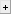

# Analyze data
{: .no_toc }

Follow this procedure to process your single molecule videos (SMVs) or trajectories and characterize the molecule dynamics in your sample.

**Note:** *Skip step 1 if already in possession of intensity-time traces files (ASCII or 
[mash project](../../output-files/mash-mash-project)).*



---



In this step, bright spots are first localized in the average image of the single molecule video, coordinates are transformed in other channels and respective intensity-time traces are then calculated.

1. TOC
{:toc}

---

## Setup working area

During your analysis, several files will be automatically or manually exported.
For organisation purpose, we recommend to create one root folder per video file and to place the video file in this folder.

To prepare the working area for analysis:

{: .procedure }
1. Create a root folder and name it after your video file for instance  
     
1. Set the root folder by pressing 
    in the main 
   [tool bar](../../Getting_started.html#interface) and selecting your root folder  
     
1. Select module 
   [Video processing](../../video-processing.html) by pressing 
    in the main 
   [tool bar](../../Getting_started.html#interface)

---

## Fill in experiment settings

MASH-FRET is compatible with various experiment settings. 
The functionalities adapts automatically to the number of channels, number of alternating lasers and fluorophore properties.

To inform the software about your experiment settings, in panel 
[Experiment Settings](../../video-processing/panels/panel-experiment-settings.html):

{: .procedure }
1. Set parameters:
     
   [Number of alternated lasers](../../video-processing/panels/panel-experiment-settings.html#number-of-alternated-lasers)  
   [Laser wavelengths](../../video-processing/panels/panel-experiment-settings.html#number-of-alternated-lasers)  
   [Number of video channels](../../video-processing/panels/panel-experiment-settings.html#number-of-alternated-lasers)  
   [Exposure time](../../video-processing/panels/panel-experiment-settings.html#number-of-alternated-lasers)  
     
1. Press 
    to open and set project options; please refer to 
   [Set project options](../../video-processing/functionalities/set-project-options.html) for help

---

## Create the transformation file

If already in possession of a transformation file or if processing a video with only one video channel, skip this step by going directly to 
[Localize bright spots](#localize-bright-spots).

The transformation file contains mathematical operations used to transpose positions from one video channel to all others. 
Operations are determined from a set of reference coordinates mapped and transposed by hand. 
The mapping is done on a **reference image**, where reference emitters (usually fluorescent beads) shine light in all video channels.

The transformation is specific to your setup. 
Create a new transformation file solely when your setup gets realigned.

To obtain the reference image from a reference video:

{: .procedure }
1. Press 
    in the 
   [Visualization area](../../video-processing/panels/area-visualization.html) and select the reference video file  
      
1. Press 
    to export a full-range average image, *i.e.*, from frame 1 to ending frame with a frame interval of 1, in 
   [Average image](../../video-processing/panels/panel-molecule-coordinates.html#average-image)

To map reference coordinates in 
[Coordinates transformation](../../video-processing/panels/panel-molecule-coordinates.html#coordinates-transformation):

{: .procedure }
1. Press 
    and select the reference image to open the mapping tool
     
1. Map at least 15 emitters in each channel and close the tool to export reference coordinates to a 
   [.map file](../../output-files/map-mapped-coordinates.html); please refer to 
   [Use the mapping tool](../../video-processing/functionalities/use-the-mapping-tool.html) for help

To create the transformation file in 
[Coordinates transformation](../../video-processing/panels/panel-molecule-coordinates.html#coordinates-transformation):

{: .procedure }
1. Set parameter 
   [Transformation type](../../video-processing/panels/panel-molecule-coordinates.html#transformation-types):  
      
   <u>default</u>: `Projective`  
     
1. Press 
    to calculate the transformation and save it to a 
   [.mat file](../../output-files/mat-transformation.html)  
     
1. Press 
    and select the reference image file to check the quality of transformation; if the green image is shifted from the red, go back to step 1 and use a more complex transformation type.
   If the shift persists, try mapping reference coordinates with more accuracy and repeat these three steps.

---

## Localize bright spots

Bright spot coordinates are the positions of emitters not yet co-localized in other detection channels.
They are determined by spot finding algorithms on the average frame of a **single molecule video** to minimize competitive background noise and prevent the variation of single molecule brightness in time.

To obtain the average SMV frame:

{: .procedure }
1. Press 
    in the 
   [Visualization area](../../video-processing/panels/area-visualization.html) and select the SMV file  
      
1. Press 
    to export a full-range average image, *i.e.*, from frame 1 to ending frame with a frame interval of 1, in 
   [Average image](../../video-processing/panels/panel-molecule-coordinates.html#average-image)

To localize and export bright spot coordinates:

{: .procedure }
1. Press
    in 
   [Average image](../../video-processing/panels/panel-molecule-coordinates.html#average-image) and select the average video frame file
     
1. Press 
    in the 
   [Visualization area](../../video-processing/panels/area-visualization.html) to activate the 
   [Create trace tool](../../video-processing/panels/area-visualization.html#create-trace-tool) and use it to determine background values in each channel
     
1. Set parameters in [Spotfinder](../../video-processing/panels/panel-molecule-coordinates.html#spotfinder) for each channel selected in menu **(a)**:
     
   <u>default</u>: method `in-series screening`  
   <u>default</u>: parameters **(g)** and **(h)** to 7 pixels  
   <u>default</u>: parameters **(d)** to background intensity  
   <u>default</u>: options **(b)** and **(i)** deactivated  
     
     
1. Press 
    to start spot finding; if the spot density is too high, increase the background intensities in **(k)**
   [Exclusion rules](../../video-processing/panels/panel-molecule-coordinates.html#exclusion-rules) until a satisfying density is reached
     
1. Press 
    to export coordinates to a 
   [.spots file](../../output-files/spots-spots-coordinates.html)

   
---

## Transform spots coordinates

If processing a video with only one video channel, skip this step by going directly to 
[Create and export intensity-time traces](#create-and-export-intensity-time-traces).

To obtain single molecule coordinates, spot coordinates must be transposed from one video channel to all others, or in other words, must be co-localized. 
Coordinates transformation is done by applying operations stored in a **transformation file** to spot coordinates.

To transform spot coordinates and export single molecule coordinates:

{: .procedure }
1. If not already done, import the transformation file in 
   [Coordinates transformation](../../video-processing/panels/panel-molecule-coordinates.html#coordinates-transformation) by pressing 
   
     
1. (optional) Press 
    and select the reference image recorded in parallel of the experiment; if the green image is shifted from the red, your setup alignment was modified and a new transformation file must be created; please refer to 
   [Create the transformation file](#create-the-transformation-file) for help  
     
1. Press 
    to transform and export coordinates to a 
   [.coord file](../../output-files/coord-transformed-coordinates.html)

---

## Create and export intensity-time traces

Intensity-time traces are created from the **single molecule video** using the co-localized single molecule coordinates.

To create and export intensity-time traces in panel 
[Intensity integration](../../video-processing/panels/panel-intensity-integration.html):

{: .procedure }
1. Press 
    in 
   [Input video](../../video-processing/panels/panel-intensity-integration.html#input-video) and select the video file  
     
1. Press 
    in 
   [Input coordinates](../../video-processing/panels/panel-intensity-integration.html#input-coordinates) and select the coordinates file  
     
1. Set
   [Integration parameters](../../video-processing/panels/panel-intensity-integration.html#integration-parameters):  
     
   <u>default</u>: parameter **(a)** to 5 pixels  
   <u>default</u>: parameter **(b)** to 8  
     
1. Press 
    to open and set export options; please refer to 
   [Set export options](../../trace-processing/functionalities/set-export-options.html) for help
     
1. Press 
    to start calculating time traces and export files; a 
   [mash project](../../output-files/mash-mash-project.html) file is automatically exported in the SMV folder

---


