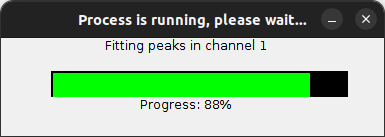

# Analyze data
{: .no_toc }

Follow this procedure to process your single molecule videos (SMVs) or trajectories and characterize the molecule dynamics in your sample.

**Note:** *Skip step 1 if already in possession of intensity-time traces (ASCII files or in a 
[mash project](../../output-files/mash-mash-project)).*



---



In this step, bright spots are first localized in the average image of the single molecule video, coordinates are transformed in other channels and respective intensity-time traces are then calculated.

1. TOC
{:toc}

---

## Setup working area

During your analysis, several files will be automatically or manually exported.
For organisation purpose, we recommend to create one root folder per video file and to place the video file in this folder.

To prepare the working area for analysis:

{: .procedure }
1. Create a root folder and name it after your video file for instance  
     
1. Move your video file into this folder.

---

## Create a video-based project

In MASH, your analysis data and parameters are saved in a file called the "project" file. 
To process and single molecule video, a video-based project must be created. 

As the functionalities of MASH-FRET adapts automatically to the number of video channels, alternating lasers and FRET pairs, you must inform the software about your particular experiment settings.

{: .procedure }
1. Press 
    in the 
   [project management area](../../Getting_started.html#poject-management-area); a window pops up:  
     
     
     
1. Select `import video` to open the experiment settings window and fill in the description of your experiment setup; please refer to 
   [Set experiment settings](../set-experiment-settings/import-video.html#option-2-video-based-project) for help
     
1. Set the default export destination by pressing 
    in the 
   [project management area](../../Getting_started.html#poject-management-area) and selecting your root folder  
     
1. Save modifications to a 
   [.mash file](../../output-files/mash-mash-project.html) by pressing 
    in the 
   [project management area](../../Getting_started#project-management-area).
     
1. Select module 
   [Video processing](../../video-processing.html) by pressing 
    in the main 
   [tool bar](../../Getting_started.html#interface)

---

## Create the transformation file

If already in possession of a transformation file or if processing a video with only one video channel, skip this step by going directly to 
[Localize bright spots](#localize-bright-spots).

The transformation file contains mathematical operations used to transpose positions from one video channel to all others. 
Operations are determined from a set of reference coordinates mapped and transposed by hand. 
The mapping is done on a **reference image**, where reference emitters (usually fluorescent beads) shine light in all video channels.

The transformation is specific to your setup. 
Create a new transformation file solely when your setup gets realigned.

To map reference coordinates in 
[Coordinates transformation](../../video-processing/components/panel-molecule-coordinates.html#coordinates-transformation):

{: .procedure }
1. Press 
    and select the reference video or image file
     
1. Map at least 4 emitters in each channel and close the tool to save reference coordinates; please refer to 
   [Use the mapping tool](../../video-processing/functionalities/use-the-mapping-tool.html) for help

To create the transformation file in 
[Coordinates transformation](../../video-processing/components/panel-molecule-coordinates.html#coordinates-transformation):

{: .procedure }
1. Press 
    to calculate the transformation 
     
1. Press 
    and select the reference image or video file to check the quality of transformation; the superposition of the base image with the transformed images is shown in the 
   [Transformed image](/video-processing/components/area-visualization.html#transformed-image) visualization tab.  
     
   If the transformed images (green for 2 channels, or green and blue for 3 channels) are shifted from the base image (in red), try to map a larger number of reference coordinates and repeat these three steps.  
     
1. Press 
    to save the transformation to a 
   [.mat file](../../output-files/mat-transformation.html) for later use

---

## Localize bright spots

Bright spot coordinates are the positions of emitters not yet co-localized in other detection channels.
They are determined by spot finding algorithms on the average frame of a **single molecule video** to minimize competitive background noise and prevent the variation of single molecule brightness in time.

To localize spots coordinates:

{: .procedure }
1. Select tab `Average image` in the 
   [Visualization area](../../video-processing/components/area-visualization.html) and use it to determine background values in each channel
     
1. Set parameters in [Spotfinder](../../video-processing/components/panel-molecule-coordinates.html#spotfinder) for each channel selected in menu **(a)**:   
     
   <u>default</u>: method `in-series screening`  
   <u>default</u>: parameters **(e)** and **(f)** to 9 pixels  
   <u>default</u>: parameters **(g)** and **(h)** to 7 pixels  
   <u>default</u>: parameters **(d)** to background intensity  
   <u>default</u>: options **(b)** activated  
     
1. Press 
    to start spot finding and gaussian fitting:  
     
   
     
1. If the spot density is too high, tune the [Exclusion rules](../../video-processing/components/panel-molecule-coordinates.html#exclusion-rules) until a satisfying density is reached:  
     
   increase the background intensities in **(j)**  
   increase minimum distance between spots in **(k)**  
   increase minimum spot width in **(m)**  
   decrease maximum spot width in **(n)**  

   
---

## Transform spots coordinates

If processing a video with only one video channel, skip this step by going directly to 
[Create and export intensity-time traces](#create-and-export-intensity-time-traces).

To obtain single molecule coordinates, spot coordinates must be transposed from one video channel to all others, or in other words, the spot must be co-localized in all video channels. 
Coordinates transformation is done by applying a combination of symmetrical operations specific to your setup to spot coordinates. 

To transform spot coordinates:

{: .procedure }
1. If step 3 was skipped, import the transformation file in 
   [Coordinates transformation](../../video-processing/components/panel-molecule-coordinates.html#coordinates-transformation) by pressing the corresponding 
    button and selecting the transformation file  
     
1. Press 
    to transform spots coordinates into the final single molecule coordinates.

---

## Create and export intensity-time traces

Intensity-time traces are created from the **single molecule video** using the co-localized single molecule coordinates.

To create and export intensity-time traces in panel 
[Intensity integration](../../video-processing/components/panel-intensity-integration.html):

{: .procedure }
1. Set
   [Integration parameters](../../video-processing/components/panel-intensity-integration.html#integration-parameters):  
     
   <u>default</u>: parameter **(a)** to 5 pixels  
   <u>default</u>: parameter **(b)** to 8  
     
1. Press 
    to start calculating time traces and making them available in modules 
   [Trace processing](../../trace-processing.html) and 
   [Histogram analysis](../../histogram-analysis.html).  
     
1. Save modifications to the 
   [.mash file](../../output-files/mash-mash-project.html) by pressing 
    in the 
   [project management area](../../Getting_started#project-management-area).

---


