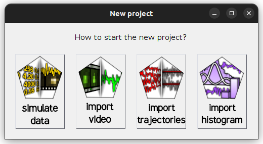

# Analyze data
{: .no_toc }

Follow this procedure to process your single molecule videos (SMVs) or trajectories and characterize the molecule dynamics in your sample.

**Note:** *Skip step 1 if already in possession of intensity-time traces (ASCII files or in a 
[mash project](../../output-files/mash-mash-project)).*



---



In this step, single molecules are sorted, intensity-time traces are corrected from experimental bias and state sequences are inferred for individual traces.

1. TOC
{:toc}

---

## Import trajectories

Intensity-time trace correction, sorting and discretization is done with module 
[Trace processing](../../assets/images/gui/trace-processing.html).
Traces can be read from a **MASH project** created in 
[Step 1](create-traces.html#steps) or from a **set of ASCII files**.

In the first case, you can skip this step and go to step 2.

To import trajectories from ASCII files:

{: .procedure }
1. Press 
    in the 
   [project management area](../../Getting_started.html#poject-management-area); a window pops up:  
     
     
     
1. Select `import trajectories` to open the experiment settings window and fill in the description of your experiment setup and the structure of your trajectory files; please refer to 
   [Set experiment settings](../set-experiment-settings/import-trajectories.html#option-2-trajectory-based-project) for help
     
1. Set the default export destination by pressing 
    in the 
   [project management area](../../Getting_started.html#poject-management-area) and selecting your root folder  
     
1. Save modifications to a 
   [.mash file](../../output-files/mash-mash-project.html) by pressing 
    in the 
   [project management area](../../Getting_started#project-management-area).
     
1. Select module 
   [Trace processing](../../trace-processing.html) by pressing 
    in the main 
   [tool bar](../../Getting_started.html#interface)

---
   
## Correct for experimental bias

Intensity-time traces must be corrected from experimental bias to obtain state trajectories that describe molecule dynamics the most accurately.

Experimental bias include shifts in molecule positions, background light and cross-talks between wavelength ranges used for emitter detection (bleedthrough) and excitation (direct excitation).

To adjust single molecule positions in panel 
[Sub-images](../../trace-processing/components/panel-subimage.html):

{: .procedure }
1. Select the shifted molecule in the 
   [Molecule list](../../trace-processing/components/panel-sample-management.html#molecule-list) of 
   [Sample management](../../trace-processing/components/panel-sample-management.html)  
     
1. Select donor excitation in menu **(a)** of 
   [Single molecule images](../../trace-processing/components/panel-subimage.html#single-molecule-images)  
     
1. Press 
    in 
   [Single molecule coordinates](../../trace-processing/components/panel-subimage.html#single-molecule-coordinates)  
     
1. Go back to step 1 until all shifted molecules are recentered

To correct intensities from background light:

{: .procedure }
1. Define 
   [Background correction settings](../../trace-processing/components/panel-background-correction.html#background-correction-settings) for each trace selected in menu **(a)**:  
     
   <u>default</u>: method `<N median values>`  
   <u>default</u>: parameter **(d)** to 20 pixels  
     
1. Activate option 
   [Apply background correction](../../trace-processing/components/panel-background-correction.html#apply-background-correction) for each trace selected in menu **(a)** of 
   [Background correction settings](../../trace-processing/components/panel-background-correction.html#background-correction-settings) if not already done.  
     
1. Press 
    to apply the same settings to all molecules

To correct intensities from cross-talks (if you are working with single detection channel and single laser illumination, ignore this step):

{: .procedure }
1. Set for each emitter selected in the 
    [Emitter list](../../trace-processing/components/panel-crosstalk-corrections.html#emitter-list):  
	  
   <u>default</u>: [Bleedthrough coefficients](../../trace-processing/components/panel-crosstalk-corrections.html#bleedthrough-coefficients) set to 0  
   <u>default</u>: [Direct excitation coefficients](../../trace-processing/components/panel-crosstalk-corrections.html#direct-excitation-coefficients) set to 0

---

## Sort time traces

Now that molecule positions and intensities are corrected, we can reliably exclude irrelevant intensity-time traces from the project, *e. g* incorrectly labelled species, and sort relevant traces into subgroups.

To remove incorrectly labelled species from the project, the molecule has first to be identified and tagged.
Then, Tagged molecules can be deselected and cleared from the project.

To tag species missing emitter label `[E]`:

{: .procedure }
1. Press 
    in 
   [Sample management](../../trace-processing/components/panel-sample-management.html) to open the Trace manager  
     
1. Select tool 
   [Overview](../../trace-processing/functionalities/tm-overview.html)  
     
1. In 
   [Molecule selection](../../trace-processing/functionalities/tm-overview.html#molecule-selection), add the default tag `no-[E]` by typing the tag name in **(b)**  
     
1. Select tool 
   [Automatic sorting](../../trace-processing/functionalities/tm-automatic-sorting.html)  
     
1. In panel 
   [Data](../../trace-processing/functionalities/tm-automatic-sorting.html#data), set menu **(a)** to `total [E] (at [W]nm)`, the total intensity of emitter `[E]` with `[W]` the emitter's specific excitation wavelength, menu **(f)** to `none`, and set parameters:  
     
   <u>default</u>: option `original time traces` in menu **(b)**  
   <u>default</u>: parameters **(c)** and **(d)** to minimum and maximum intensities respectively  
   <u>default</u>: parameter **(e)** to 50  
     
1. Define a range including the histogram peak centered on zero by clicking on the 
   [Histogram plot](../../trace-processing/functionalities/tm-automatic-sorting.html#histogram-plot) 
     
1. In panel 
   [Range](../../trace-processing/functionalities/tm-automatic-sorting.html#range), set parameters:  
     
   <u>defaut</u>: option `at least` in menu **(e)**  
   <u>defaut</u>: parameter **(f)** to 90%  
   <u>defaut</u>: option `percentage of the trace` in menu **(h)**  
     
1. Select the option `total [E] (at [W]nm)` in menu **(a)** of 
   [Concatenated trace plot](../../trace-processing/functionalities/tm-automatic-sorting.html#concatenated-trace-plot) and verify that selected traces are fluctuating around 0  
     
1. Press 
    in panel 
   [Range](../../trace-processing/functionalities/tm-automatic-sorting.html#range) to save range settings  
     
1. Select menu **(b)** to `no-[E]` in 
   [Tags](../../trace-processing/functionalities/tm-automatic-sorting.html#tags) and press 
    to assign this label to the selected range  
     
1. Press 
    to tag with `no-[E]` all molecules missing emitter `[E]` 

To clear species missing emitter `[E]` from the project:

{: .procedure }
1. Select tool 
   [Overview](../../trace-processing/functionalities/tm-overview.html)  
     
1. In 
   [Molecule selection](../../trace-processing/functionalities/tm-overview.html#molecule-selection), select option `remove no-[E]` in menu **(a)** to deselect all molecules carrying this tag  
     
1. Press 
    in 
   [Overall plots](../../trace-processing/functionalities/tm-overview.html#overall-plots) to close Trace manager and export the current selection to Trace processing  
     
1. Press 
    in 
   [Sample management](../../trace-processing/components/panel-sample-management.html) to delete deselected molecules from the project  

---

## Discretize time-traces

To obtain reliable state trajectories, photobleached or interrupted data must be ignored and ratio-time traces must be corrected prior applying the state finding algorithm.
This is done by splitting trajectories manually, automatically detecting and truncating the trace at dye photobleaching and setting/calculating global gamma and beta factors.

To split trajectories at intensity interruptions:

{: .procedure }
1. Define in 
   [Photobleaching](../../trace-processing/components/panel-photobleaching.html):  
     
   <u>default</u>: method `Manual`  
   <u>default</u>: parameter 
   [Photobleaching cutoff](../../trace-processing/components/panel-photobleaching.html#photobleaching-cutoff) to the ending position of the interruption    
   <u>default</u>: option `Cut` deactivated  
       
1. Press 
    to separate the left- and right-side of the splitting position to separate trajectories

To truncate trajectories at photobleaching:

{: .procedure }
1. Define in 
   [Photobleaching](../../trace-processing/components/panel-photobleaching.html):  
     
   <u>default</u>: method `Threshold`  
   <u>default</u>: data `all intensities`  
   <u>default</u>: parameters in
   [Automatic detection settings](../../trace-processing/components/panel-photobleaching.html#automatic-detection-settings) **(b)** to 0, **(c)** to 2 frames and **(d)** to 10 frames  
   <u>default</u>: option `Cut` activated  
       
1. Press 
    to apply the same settings to all molecules  
     
1. Press 
    in 
   [Sample management](../../trace-processing/components/panel-sample-management.html) to process all molecules in the project and visualize truncated trajectories
   
To automatically calculate gamma and beta factors (if you are working without FRET calculations, ignore this step):

{: .procedure }
1. For each FRET pair listed in the 
   [FRET pair list](../../trace-processing/components/panel-factor-corrections.html#fret-pair-list) in 
   [Factor corrections](../../trace-processing/components/panel-factor-corrections.html), define:  
     
   <u>default</u>: method `ES linear regression` (if you are working without stoichiometry calculations, use any other method)   
   <u>default</u>: in 
   [ES linear regression](../../trace-processing/components/panel-factor-corrections.html#es-linear-regression), **(b)** to `All molecules`, **(c)** to -0.2, **(d)** to 50, **(e)** to 1.2, **(f)** to 1, **(g)** to 50, **(h)** to 3
     
    and press 
    to calculate the ES histogram and perform linear regression, and 
    to save settings  
     
1. Press 
    to apply the same settings to all molecules  
     
1. Press 
    in the 
   [Control area](../../trace-processing/components/area-control.html) to process all molecules in the project
   
To obtain state trajectories:

{: .procedure }
1. Define in 
   [Find states](../../trace-processing/components/panel-find-states.html):  
     
   <u>default</u>: method `STaSI`  
   <u>default</u>: apply to `all`  
   <u>default</u>:
   [Method parameters](../../trace-processing/components/panel-find-states.html#method-parameters) **(b)** to 5 for each trace selected in menu **(a)**  
   <u>default</u>: no
   [Post-processing methods](../../trace-processing/components/panel-find-states.html#post-processing-methods) with **(b)** an **(c)** set to 0
       
1. Press 
    to apply the same settings to all molecules  
     
1. Press 
    in the 
   [Control area](../../trace-processing/components/area-control.html) to process all molecules in the project

---

## Save and export

Project modifications must be saved to the [.mash file](../../output-files/mash-mash-project) in order to perform 
[Step 3](identify-state-network.html) and 
[Step 4](determine-state-populations.html) with processed data.

Beside, various ASCII and image files containing processed data, data statistics and processing parameters can be exported for use in other software.

To save project modifications:

{: .procedure }
1. Press 
    in the 
   [project management area](../../Getting_started.html#project-management-area) and overwrite the current 
   [.mash file](../../output-files/mash-mash-project.html) or create another project file to keep a backup of unprocessed data

To export processed data to ASCII and image files:

{: .procedure }
1. Press 
    in the 
   [Control area](../../trace-processing/area-control.html) to open and set export options; please refer to 
   [Set export options](../../trace-processing/functionalities/set-export-options.html) for help  
     
1. Press 
    to start file export.

---

## Merge projects

After applying proper corrections to intensities and sorting out molecules, samples from different projects with identical experiment settings can be merged into one big data set. 
This prevents to repeat the following data analysis procedure on multiple mash files and allows to constitute a more representative sample of molecules.

To merge projects:

{: .procedure }
1. Select the multiple projects to merge in the 
   [Project list](../../Getting_started.html#project-list)  
     
1. Right-click in the 
   [Project list](../../Getting_started.html#project-list), choose the option `Merge projects` and press 
    to start the merging process  
      
   ***Note:** The merging process induces a loss of single molecule videos that were used in individual projects. 
   Make sure to perform all adjustments of molecule positions and background corrections prior merging*.

---


