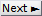

# Set experiment settings
{: .no_toc}

Follow the appropriate procedure to set the experiment settings of your new project. To create a new project, please refer to [First steps](../../Getting_started.html#first-steps).



---



In this section, experiment settings are set for projects starting with histogram import.

They are specific to each project and include the histogram file structure but also experimental conditions and colors used to plot data.

They are initially set when creating a new histogram-based project by pressing 
 in the  
[Project management area](../../Getting_started.html#project-management-area) and can be edited by pressing 
 in the same area.

Press 
 to navigate through the settings and 
 to complete the creation of the new project or immediately apply the modifications to the existing project.
1. TOC
{:toc}

---

## Import

Use this tab to import the histogram from a file.

To import an histogram file, press 
 and select the file in the browser.
Upon success, the imported histogram file name is shown in **(1)**.

Only one histogram can be imported from the histogram file. 
Histogram data are imported for 
[Histogram analysis](../../histogram-analysis.html) only, no additional processing/transformation will be performed.

The file structure must contain at least two columns:
* the <u>bin values</u>, 
* the <u>histogram counts</u>.

## File structure

Use this tab to define the structure of the histogram file.

Set parameters parameters **(1)** to **(4)** to define the structure of the histogram file. 
Use the 
[File preview](#file-preview) in **(5)** to verify the proper reading of file columns and histogram data when adjusting parameters. 

* **(1)** [Header lines](#header-lines)
* **(2)** [Column delimiter](#column-delimiter)
* **(3)** [Histogram bins](#histogram-bins)
* **(4)** [Histogram counts](#histogram-counts)
* **(5)** [File preview](#file-preview)

The structure define on the example above is used to import 
[Histogram files](../../output-files/hist-histograms.html) containing FRET data. 

### Header lines
{: .no_toc }

The number of header lines is the number of lines on top of the file that do not contain any histogram data. 
Header lines are represented with a gray-colored font in the 
[File preview](#file-preview).

### Column delimiter
{: .no_toc }

Column delimiters are characters written in the file that separate column data. 
Supported delimiters are:
* `blanks (tab,spaces)`: both tab and space characters
* `tab`: tab character (in most ASCII files exported from MASH)
* `,`: comma character
* `;`: semi-column character
* `space`: space character

You can ensure a proper column separation by using the 
[File preview](#file-preview).

***Note :** In later versions, the supported file structures will be extended with a custom delimiter and the .json format.*

### Histogram bins
{: .no_toc }

Define here the file column where histogram bin values are written.
  
Histogram bins are colored in pink in the 
[File preview](#file-preview) to ensure a proper reading of time columns.

### Histogram counts
{: .no_toc }

Define here the file column where histogram counts are written.
  
Histogram counts are colored in black in the 
[File preview](#file-preview) to ensure a proper reading of time columns.

### File preview
{: .no_toc }

The file preview shows the content of the histogram file using the current define structure. 
The file content is color-coded, where 
[Header lines](#header-lines) are grayed out, 
[Histogram bins](#histogram-bins) are colored in pink, and 
[Histogram counts](#histogram-counts) are colored in black. 

It can be used to verify the proper reading of file columns and histogram data when adjusting parameters **(1)**-**(4)**. 

## Divers

Use this tab to define the project's title, optional parameters, the video sampling time and plot colors.

* (1) [Project's title](#projects-title)
* (2) [Optional parameters](#optional-parameters)
* (3) [Video sampling time](#video-sampling-time)
* (4) [Plot colors](#plot-colors)

### Project's title
{: .no_toc }

The title is the name appearing in the 
[project list](../../Getting_started.html#interface). 
It is defined in **(1)**.
Leaving **(1)** empty will give the title "Project" to your project.

<u>default</u>: `histogram`

### Optional parameters
{: .no_toc }

Optional parameters include the name of the investigated molecule, set in **(a)**, and the experimental conditions set in **(b)**.

Experimental conditions can be added, modified and removed by simply editing the condition's name, value and units in the corresponding column of table **(b)**. 

Optional parameters solely act as project "tags" saved with the 
[MASH project file](../../output-files/mash-mash-project.html) and exported in
[Processing parameter files](../../output-files/log-processing-parameters.html).

<u>default</u>: `[Mg2+]` in `mM` (magnesium molar concentration) and `[K+]` in `mM` (potassium molar concentration).

### Video sampling time
{: .no_toc }

The video sampling time is shown in seconds in **(3)**.
For histogram-based projects, the sampling time must be set manually and is purely informative.

<u>default</u>: 1 second

### Plot colors
{: .no_toc }

Use this panel to define the colors used to plot the histogram.

The histogram is named `data` by default as shown in the list **(a)**.

To set the RGB plot color, press
 to open the color picker.

To use a predefined color, press 
.

<u>default</u>: green.

---


 
