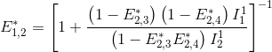

# Set experiment settings
{: .no_toc }

Follow the appropriate procedure to set the experiment settings of your new project. To create a new project, please refer to [First steps](../../Getting_started.html#first-steps).



---



In this section, experiment settings are set for projects starting with video import.

They are specific to each project and include video and channel information, emitter and laser configurations, FRET and stoichiometry calculations, but also experimental conditions and colors used to present data.

They are initially set when creating a new video-based project by pressing 
 in the  
[Project management area](../../Getting_started.html#project-management-area) and can be edited by pressing 
 in the same area.

Press 
 to navigate through the settings and 
 to complete the creation of the new project or immediately apply the modifications to the existing project.

1. TOC
{:toc}


---

## Import

Use this tab to import a single molecule video.

<a href="../../assets/images/gui/newproj-vid-expset1.png"></a>

It is possible to import one multi-channel video (where a video frame is spacially divided into a number of emission channels) or multiple single-channel videos recorded in parallel (where each video contains a single emission channel) by activating the option **(1)** or **(2)**, repsectively.

The interface **(3)** defines the video files to be imported and depends on the import type:

1. [Import of a multi-channel video](#import-of-a-multi-channel-video)
2. [Import of single-channel videos](#import-of-single-channel-videos)

<u>default</u>: multi-channel video.

After reading the necessary information from the video file, MASH calculates the channel- and laser-specific average images shown in 
tabs [Channels](#channels) and 
[Lasers](#lasers), respectively.


Once the import is completed, the 
[Video sampling time](#video-sampling-time) is automatically updated is tab
[Divers](#divers) and the channel- and laser-specific average images in tabs 
[Channels](#channels) and 
[Lasers](#lasers), respectively.

Supported file formats are:
* Olympus CellSense Format (*.<u>vsi</u> associated with *.<u>ets</u>)
* Source Input Format (<u>.sif</u>)
* [WinSpec CCD Capture format](http://www.mpi.stonybrook.edu/nsls/X17B2/support/camera.htm) (<u>.spe</u>)
* [Single data acquisition format](https://cplc.illinois.edu/research/tools) (<u>.pma</u>)
* Audio Video Interleave (<u>.avi</u>)
* Tagged Image File format (<u>.tif</u>)
* Graphics Interchange Format (<u>.gif</u>)
* [MASH video format](../../output-files/sira-mash-video.html) (<u>.sira</u>)
* Portable Network Graphics (<u>.png</u>)

New video formats can be added programmatically by updating the following functions in the source code:

```
MASH-FRET/source/mod_video_processing/graphic_files/getFrames.m
MASH-FRET/source/mod_video_processing/graphic_files/exportMovie.m
```

### Import of a multi-channel video
{: .no_toc }

<a href="../../assets/images/gui/newproj-vid-expset1-multichan.png"></a>

To import a multi-channel video or image, press 
 and select the corresponding file.

Once the import is completed, the multi-channel video file name is shown in **(a)**.


### Import of single-channel videos
{: .no_toc }

<a href="../../assets/images/gui/newproj-vid-expset1-singlechan.png"></a>

To import single-channel videos or images, set, first, the appropriate number of channels using the 
 or 
 button to add or remove channels, respectively.
The channel configuration is automatically updated in tab 
[Channels](#channels).

After the number of video channels is correctly set, import each single-channel video by pressing the appropriate 
 button and selecting the corresponding file.

Once the import is completed, single-channel video file names are shown in **(a)**-**(b)**.
 
 
## Channels

Use this tab to configure the emission channels.

<a href="../../assets/images/gui/newproj-vid-expset2.png"></a>

The number of emission channels in your experiment must be set in **(1)**.
Upon modification, the tab interface is automatically adjusted.

Channel plots in **(3)** show the portion of the average image that correspond to each emission channels.
They can be used to verify the proper division of the field of view when adjusting the number of channels in **(1)**. 
Indeed, when the number of channels is correctly set, the single molecule pattern becomes similar in all channel plots.

Each emission channel is associated to a particular emitter and must be labelled accordingly in **(2)**. 
These labels are later used to identify the corresponding trajectories.

<u>default</u>: 2 channels labelled `chan [c]`, with `[c]` the channel index.
 
 
## Lasers

Use this tab to configure the illumination setup.

<a href="../../assets/images/gui/newproj-vid-expset3.png"></a>

The number of alternated lasers with different wavelengths used in the experiment is set in **(1)**. 
For continuous-wavelength excitation, it must be set to 1.
Upon modification, the tab's interface is automatically adjusted.

Plots in **(4)** show the average images of the video frames recorded upon illumination of each laser, lasers being numbered following the chronological order in the video.
They can be used to verify the proper illumination of the field of view when adjusting the number of lasers in **(1)**, and to attribute the proper wavelength to the proper laser.
Indeed, when the number of lasers is correctly set, the single molecule signal becomes brighter in channels where the emitter is selectively excited by the laser, and darker or non-existent in other channels. 

Selective emitter excitation and laser wavelength must be defined for each laser by selecting the proper emitter in **(3)** and typing the the wavelength in nanometers in **(2)**. 
These two parameters are used to label data and sort emitters according to the red-shift of there absorption spectra, which is necessary in FRET and stoichiometry calculations; see 
[Calculations](#calculations) for more details.

<u>default</u>: one laser, wavelength: 532 nm, emitter: channel 1
 
 
## Calculations

Use this panel to define the FRET and stoichiometry ratios to be calculated and plotted.

<a href="../../assets/images/gui/newproj-vid-expset4.png"></a>

The FRET and Stoichiometry ratios are calculated according to 
[FRET calculations](#fret-calculations) and
[Stoichiometry calculations](#stoichiometry-calculations), respectively.

To activate the FRET calculation for a FRET pair in particular, selective laser excitation of the donor must be present in the experiment.
In this case, select the donor and acceptor channel labels in list **(1)** and **(2)**, respectively, and press 
. 
All FRET calculations are listed in **(3)** and can be removed any time by pressing 
.


To activate the stoichiometry calculation for a FRET pair in particular, the FRET pair must be listed in **(3)** and selective laser excitation of the acceptor must be present in the experiment. 
In this case, select the desired FRET pair in **(4)** and press 
. 
All stoichiometry calculations are listed in **(5)** and can be removed any time by pressing 
.

<u>default</u>: no calculations


### FRET calculations
{: .no_toc }

In a network composed of several emitters, quantities of energy absorbed by each of the emitters can be emitted as light or transferred via FRET to other emitters providing a non-negligible overlap of the donor emission spectrum with the absorption spectra of the acceptors. 

These energy movements can be represented on a scheme where:
- emitters are numbered according to the red shift of the absorption spectrum
- the energy quantity absorbed by emitter 
[*i*](){: .math_var } exclusively is noted 
[*q*<sub>0,*i*</sub>](){: .math_var }, 
- the quantity of energy emitted by emitter 
[*i*](){: .math_var } is noted 
[*q*<sub>*i*</sub>](){: .math_var },
- the energy quantity transferred by FRET from emitter 
[*i*](){: .math_var } to emitter 
[*j*](){: .math_var } is noted 
[*q*<sub>*i*,*j*</sub>](){: .math_var }.

For example, the energy movements in a FRET-pair network composed of four emitters with different absorption and emission properties are summarized in the following scheme.

<a class="plain" href="../../assets/images/figures/newproj-FRET-calculations-4-color-scheme.png"></a>

In an ideal system that includes radiative processes and energy transfers only, the law of conservation of energy supposed that:

{: .equation }
i}q_{i,j}"/>

The energy quantity 
[*q*<sub>*i*</sub>](){: .math_var} is comparable to the intensity detected in emission channel of emitter 
[*i*](){: .math_var} and corrected from background and cross-talks. 
Thus, 
[*q*<sub>*i*</sub>](){: .math_var} values are measured during the experiment.

The apparent efficiency 
[*E*\*<sub>*D*,*A*</sub>](){: .math_var} of an energy transfer from a donor 
[*D*](){: .math_var} to an acceptor 
[*A*](){: .math_var} is calculated as:

{: .equation }


To obtain the probability of energy transfer 
[*E*<sub>*D*,*A*</sub>](){: .math_var}, which is inversely proportional to the distance 
[*r*](){: .math_var} between the two dyes, 
[*E*\*<sub>*D*,*A*</sub>](){: .math_var} must later be corrected by considering (1) the different quantities of non-radiative energy lost during the process by both emitters 
[*D*](){: .math_var} and 
[*A*](){: .math_var} as well as (2) the different detection efficiencies of photons emitted by emitters
[*D*](){: .math_var} and 
[*A*](){: .math_var}; see 
[Correct ratio values](../../trace-processing/workflow.html#correct-ratio-values) for more information.

The energy quantity 
[*q*<sub>*i*,*j*</sub>](){: .math_var} is calculated from intensities measured upon different laser illuminations, <u>starting with specific excitation of the most red-shifted donor</u>. 
For the limiting case where the most red-shifted donor transfers energy to multiple acceptors, FRET efficiencies can not be analytically calculated.

Translated in a four-emitter network, the most red-shifted donor is the emitter 3, which can transfer energy to emitter 4 only. 
This comes down to a simple two-emitter network where energy movements can be depicted as in the following scheme.

<a class="plain" href="../../assets/images/figures/newproj-FRET-calculations-4-color-scheme-exc3.png"></a>

Using the law of conservation of energy and the definition of the apparent FRET efficiency of the donor-acceptor pair 3- 4, we can readily calculate 
[*E*\*<sub>3,4</sub>](){: .math_var} from measured intensities such as:

{: .equation }


The next most red-shifted donor is the emitter 2, which can transfer energy to emitters 3 and 4. 
This comes down to a three-emitter network where energy movements can be depicted as in the following scheme.
 
<a class="plain" href="../../assets/images/figures/newproj-FRET-calculations-4-color-scheme-exc2.png"></a>

Using the law of conservation of energy and the definition of the apparent FRET efficiencies of the donor-acceptor pairs 2- 3 and 2-4, we can express
[*E*\*<sub>2,3</sub>](){: .math_var} and
[*E*\*<sub>2,4</sub>](){: .math_var} in function of measured intensities and the quantity 
[*q*<sub>3,4</sub>](){: .math_var} such as:

{: .equation }
<br>


According to the definition of the apparent FRET efficiency, 
[*q*<sub>3,4</sub>](){: .math_var} can be expressed in function of measured intensities and the known 
[*E*\*<sub>3,4</sub>](){: .math_var}, such as:


Put together, these equations allow to calculate 
[*E*\*<sub>2,3</sub>](){: .math_var} and
[*E*\*<sub>2,4</sub>](){: .math_var} in function of measured intensities and the known 
[*E*\*<sub>3,4</sub>](){: .math_var}, such as:

<br>


The next most red-shifted donor is the emitter 1, which can transfer energy to emitters 1, 3 and 4. 
Energy movements can be depicted as in the following scheme:
 
<a class="plain" href="../../assets/images/figures/newproj-FRET-calculations-4-color-scheme-exc1.png"></a>

FRET efficiencies for the FRET pairs 1-2, 1-3 and 1-4 are determined using the same deductive path as presented above, giving:

{: .equation }
<br>
<br>


This demonstration can be generalized to a 
[*K*](){: .math_var }-emitter network with the apparent FRET efficiency 
[*E*\*<sub>*D*,*A*</sub>](){: .math_var} – of a donor-acceptor pair 
[*D*](){: .math_var }-[*A*](){: .math_var } with 
[*A*](){: .math_var }>[*D*](){: .math_var } – being calculated from intensities detected upon excitation of emitter 
[*D*](){: .math_var } and apparent FRET efficiencies obtained from more red-shifted FRET-pairs, such as:

A}\left (\frac{E_{A,i}^*}{1-E_{A,i}^*}\right )\right ] -\sum_{D<i<A}\left( \frac{E_{i,A}^*}{1-E_{i,A}^*}I_{i,em}^{D,ex}\right )}  \right \}^{-1}"/>

with 
[*I*<sub>*k*,em</sub><sup>*k'*,ex,\*\*\*</sup>](){: .math_var } the intensity collected in channel specific to emitter 
[*k*](){: .math_var }, upon laser illumination that specifically excites emitter 
[*k'*](){: .math_var }, and after background and cross-talk corrections.

To know more about how multi-color apparent FRET data are calculated, please refer to the respective functions in the source code:

```
MASH-FRET/source/mod-trace-processing/FRET/buildFretexpr.m
MASH-FRET/source/mod-trace-processing/FRET/calcFRET.m
```

### Stoichiometry calculations
{: .no_toc }

The stoichiometry of an emitter is usually used to estimate the ratio of different emitters attached to the single molecule under observation.

The apparent stoichiometry 
[*S*\*<sub>*D*,*A*</sub>](){: .math_var } for a FRET pair composed of donor emitter 
[*D*](){: .math_var } and an acceptor emitter 
[*A*](){: .math_var }, specifically excited by the respective illuminations 
[*D*<sub>ex</sub>](){: .math_var } and 
[*A*<sub>ex</sub>](){: .math_var } in a labelling scheme consisting of 
[*K*](){: .math_var } emitters, is calculated as:

{: .equation }


with 
[*I*<sub>*k*,em</sub><sup>*k'*,ex,\*\*\*</sup>](){: .math_var } the intensity collected in channel specific to emitter 
[*k*](){: .math_var }, upon laser illumination that specifically excites emitter 
[*k'*](){: .math_var }, and after background and cross-talk corrections.

To obtain the stoichiometry
[*S*<sub>*D*,*A*</sub>](){: .math_var}, which correspond to the ratio of different emitters attached to the single molecule under observation, 
[*S*\*<sub>*D*,*A*</sub>](){: .math_var} must later be corrected by considering the differences for emitters 
[*D*](){: .math_var} and 
[*A*](){: .math_var} in: (1) quantities of non-radiative energy lost during the process by the emitters, (2) camera detection efficiencies of emitter photons, (3) quantities of energy released by the emitter-specific illuminations, (4) quantities of energy absorbed by the emitters; see 
[Correct ratio values](../../trace-processing/workflow.html#correct-ratio-values) for more information.

A stoichiometry 
[*S*<sub>*D*,*A*</sub>](){: .math_var } = 0.5 means that half of the total number of 
[*D*](){: .math_var }  and 
[*A*](){: .math_var }  emitters attached to the molecule are  
[*D*](){: .math_var } emitters.

To know more about how multi-color Stoichiometry is calculated, please refer to the respective functions in the source code:

```
MASH-FRET/source/mod-trace-processing/FRET/buildSexpr.m
MASH-FRET/source/mod-trace-processing/FRET/calcS.m
```
 
 
## Divers

Use this tab to define the project's title, optional parameters, the video sampling time and plot colors.

<a href="../../assets/images/gui/newproj-vid-expset5.png"></a>

* (1) [Project's title](#projects-title)
* (2) [Optional parameters](#optional-parameters)
* (3) [Video sampling time](#video-sampling-time)
* (4) [Plot colors](#plot-colors)

### Project's title
{: .no_toc }

The title is the name appearing in the 
[project list](../../Getting_started.html#interface). 
It is defined in **(1)**.
Leaving **(1)** empty will give the title "Project" to your project.

<u>default</u>: `video`


### Optional parameters
{: .no_toc }

<a href="../../assets/images/gui/newproj-vid-expset5-expcond.png"></a>

Optional parameters include the name of the investigated molecule, set in **(a)**, and the experimental conditions set in **(b)**.

Experimental conditions can be added, modified and removed by simply editing the condition's name, value and units in the corresponding column of table **(b)**. 

Optional parameters solely act as project "tags" saved with the 
[MASH project file](../../output-files/mash-mash-project.html) and exported in
[Processing parameter files](../../output-files/log-processing-parameters.html).

<u>default</u>: `[Mg2+]` in `mM` (magnesium molar concentration) and `[K+]` in `mM` (potassium molar concentration).


### Video sampling time
{: .no_toc }

The video sampling time of the imported video is shown in seconds in **(3)**.
In the case the sampling time was successfully read from the video file, this property is read-only. 
If not, the sampling time must be set manually.

<u>default</u>: 1 second


### Plot colors
{: .no_toc }

Use this panel to define the colors used to plot and identify the time traces.

<a href="../../assets/images/gui/newproj-vid-expset5-plotclr.png"></a>

To set the RGB color of a specific trace, select the data in list **(a)** and press
 to open the color picker.

To use a predefined set of colors adapted to simulations, press 
.

<u>default</u>: from green to red for intensities, shades of black for FRET ratios and shades of blue for stoichiometry ratios.

---


 
