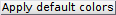

# Set experiment settings
{: .no_toc }

Follow the appropriate procedure to set the experiment settings of your new project. To create a new project, please refer to [First steps](../../Getting_started.html#first-steps).



---



In this section, experiment settings are set for projects starting with data simulation.

They are specific to each project and include experimental conditions and colors used to present data.

They are initially set when creating a new simulation-based project by pressing 
 in the  
[Project management area](../../Getting_started.html#project-management-area) and can be edited by pressing 
 in the same area.

Press 
 to complete the creation of the new project or to apply immediately the modifications to the existing project.

1. TOC
{:toc}

---

## Divers

Use this tab to define the project's title, optional parameters and plot colors.

* (1) [Project's title](#projects-title)
* (2) [Optional parameters](#optional-parameters)
* (3) [Video sampling time](#video-sampling-time)
* (4) [Plot colors](#plot-colors)

### Project's title
{: .no_toc }

The title is the name appearing in the 
[project list](../../Getting_started.html#interface). 
It is defined in **(1)**.
Leaving **(1)** empty will give the title "Project" to your project.

<u>default</u>: `simulation`

### Optional parameters
{: .no_toc }

Optional parameters include the name of the simulated molecule, set in **(a)**, and the simulated experimental conditions set in **(b)**.

Experimental conditions can be added, modified and removed by simply editing the condition's name, value and units in the corresponding column of table **(b)**. 

Optional parameters solely act as project "tags" saved with the 
[MASH project file](../../output-files/mash-mash-project.html) and exported in
[Processing parameter files](../../output-files/log-processing-parameters.html).

<u>default</u>: `[Mg2+]` in `mM` (magnesium molar concentration) and `[K+]` in `mM` (potassium molar concentration).

### Video sampling time
{: .no_toc }

The video sampling time used for data simulation is shown in seconds in **(3)**.
This property is read-only in the experimental settings but can be modified later under the 
[Frame rate](../../simulation/panels/panel-video-parameters.html#frame-rate) property in the 
[Video parameters](../../simulation/panels/panel-video-parameters.html) panel of the 
[Simulation](../../simulation.html) module.

<u>default</u>: 1 second

### Plot colors
{: .no_toc }

Use this panel to define the colors used to plot and identify the time traces.

To set the RGB color of a specific trace, select the data in list **(a)** and press
 to open the color picker.

To use a predefined set of colors adapted to simulations, press 
.

<u>default</u>: from green to red for intensities, shades of black for FRET ratios and shades of blue for stoichiometry ratios.

 
---


 
