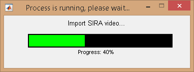
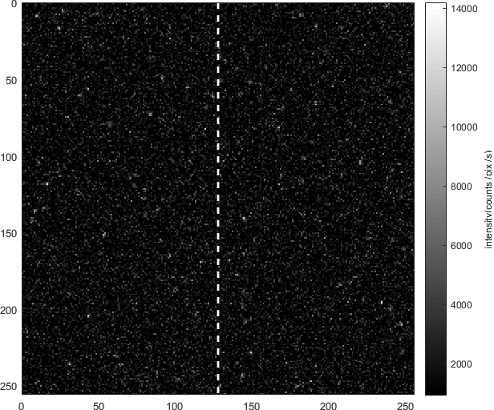
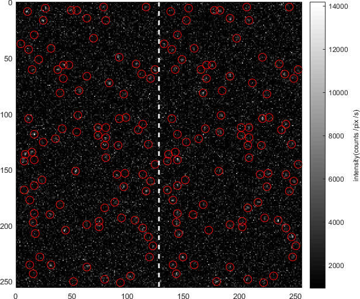
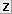

# Visualization area
{: .no_toc }

The visualization area is the main display of module Video processing.

Use this area to import and browse the single molecule video.

<a class="plain" href="../../assets/images/gui/VP-area-visu.png"></a>

## Area components
{: .no_toc .text-delta }

1. TOC
{:toc}


---

## Load video/image file

Use this interface to import a single molecule video or image for processing.

<a class="plain" href="../../assets/images/gui/VP-area-visu-loadvideo.png"></a>

To load a video or an image, press 
 and select the corresponding file in the browser.

Supported file formats are:
* Source Input Format (<u>.sif</u>)
* [WinSpec CCD Capture format](http://www.mpi.stonybrook.edu/nsls/X17B2/support/camera.htm) (<u>.spe</u>)
* [Single data acquisition format](https://cplc.illinois.edu/software/) (<u>.pma</u>)
* Audio Video Interleave (<u>.avi</u>)
* Tagged Image File format (<u>.tif</u>)
* Graphics Interchange Format (<u>.gif</u>)
* [MASH video format](../../output-files/sira-mash-video.html) (<u>.sira</u>)
* Portable Network Graphics (<u>.png</u>)

If enough free RAM is available, MASH-FRET will load the full-length video in memory, otherwise, the video file is browsed every time a frame is needed for use. 

In the former case, the loading time depends on the size of the video file and can require a bit of patience, but the computation times required for 
[Average image](panel-molecule-coordinates#average-image) calculation and 
[Intensity integration](panel-intensity-integration) are considerably reduced.



After import, the video file name is written in **(a)**, 
[Video information](#video-information) and 
[Exposure time](panel-experiment-settings.html#exposure-time) are automatically updated and the first video frame is displayed in 
[Video visualization](#video-visualization).

After completing video processing, it is recommended to free the memory from the video data by pressing 
. 
This will speed the general processing time up in MASH-FRET.

New video formats can be added programmatically by updating the following functions in the source code:

```
MASH-FRET/source/mod_video_processing/graphic_files/loadMovFile.m
MASH-FRET/source/mod_video_processing/graphic_files/getFrames.m
MASH-FRET/source/mod_video_processing/graphic_files/exportMovie.m
```

---

## Video visualization

Shows the current video frame and corresponding bright spot or molecule positions.

The current video frame is displayed with colors defined in the 
[Color map](panel-plot.html#color-map) and pixel intensities given by the color bar located on the right of the image with intensity units defined by 
[Pixel intensity units](panel-plot.html#pixel-intensity-units). 
Dotted white lines are plotted at channel splitting positions indicated in 
[Video information](#video-information)

To change the current video frame in display, use 
[Navigation](#navigation).

When bright spots are detected with the tool Spotfinder or when coordinates are transformed, corresponding coordinates are located on the display with red circles; see 
[Spotfinder](panel-molecule-coordinates.html#spotfinder) and 
[Coordinates transformation](panel-molecule-coordinates.html#coordinates-transformation) for more information about these two functionalities.

<a class="plain" href="../../assets/images/gui/VP-area-visu-display1.png"></a>
<a class="plain" href="../../assets/images/gui/VP-area-visu-display2.png"></a>

It is possible to zoom in the display and create intensity-time traces at specific positions with a simple click on the display, by using the
[Zoom tool](#zoom-tool) and 
[Create trace tool](#create-trace-tool) respectively.

Any graphics in MASH-FRET can be exported to an image file by right-clicking on the axes and selecting `Export graph`.


---

## Navigation

Use this bar to change the current frame in display.

Go to next or previous video frame using the left and right arrows or jump 10% of full video length by clicking on the bar's rail.

If bright spots were detected on all video frames with the tool Spotfinder, the corresponding coordinates are shown for each frame with red circles; see 
[Spotfinder](panel-molecule-coordinates.html#spotfinder) for more information.


---

## Zoom tool

Press 
 to activate the zoom cursor.

The zoom cursor allows to zoom in and out the 
[Video visualization](#video-visualization) like on regular MATLAB axes.


---

## Create trace tool

Press 
 to activate the create trace cursor.

The create trace cursor allows to generate and plot laser-specific intensity-time traces by simply clicking on a specific pixel in the 
[Video visualization](#video-visualization).

Intensity data can be exported to MATLAB's workspace by pressing 
 in the dialogue box; otherwise press 
.

<a class="plain" href="../../assets/images/gui/VP-area-visu-traces.png"></a>

Intensities are calculated as described in 
[Integration parameters](panel-intensity-integration.html#integration-parameters) and given according to the 
[Pixel intensity units](panel-plot.html#pixel-intensity-units).


---

## Video information

Shows information about the current frame index, video dimensions and channel splitting positions.

<a class="plain" href="../../assets/images/gui/VP-area-visu-info.png"></a>

The current frame index is shown in **(a)**, the video length in **(b)**, video dimensions (pixels) in x- and y-directions in **(c)** and channel splitting positions (pixels) in **(d)** considering equal channel widths.

Channel split positions are automatically updated whenever the 
[Number of video channels](panel-experiment-settings.html#number-of-video-channels) is changed.
